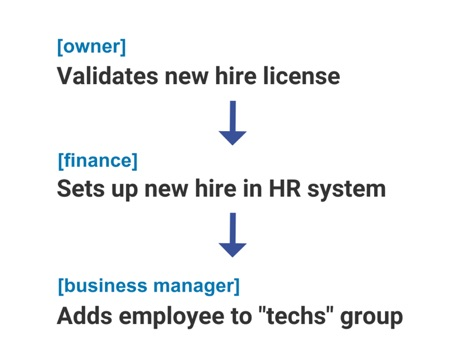
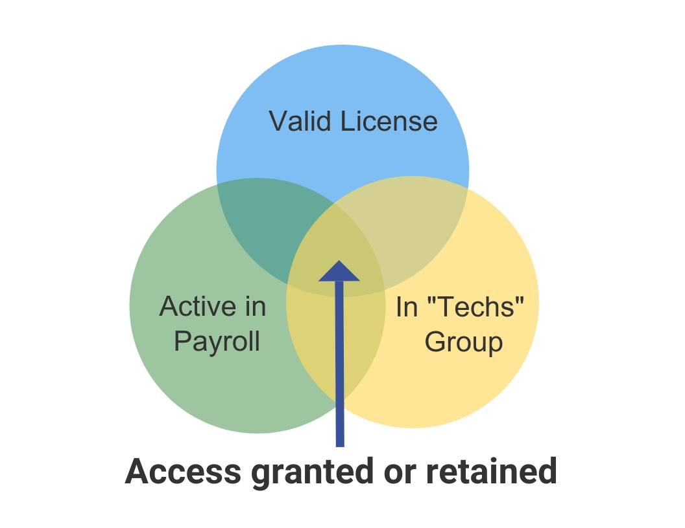

By Mary McKee

© 2021, 2022, 2023 IDPro, Mary McKee

*Please see André Koot’s [<u>Introduction to Access Control for a primer
on access controls</u>](https://bok.idpro.org/article/id/42/).*

*To comment on this article, please visit our [GitHub
repository](https://github.com/IDPros/bok) and [submit an
issue](https://docs.github.com/en/github/managing-your-work-on-github/opening-an-issue-from-code).*

Introduction  
To effectively secure resources, access control systems must be designed
to adapt to rapid shifts in technology, regulatory obligations, and
organizational structure. As organizations embrace more sophisticated
technology and seek protection from more sophisticated threats, access
management strategies are evolving to address modern concerns.

Most early access management systems utilize what we now refer to as
**Discretionary Access Control** (**DAC)**. With DAC systems (such as
access control lists), administrators manually assign privileges to
users according to their understanding of need, appropriate use, and
organizational rules. As DAC systems grow in users, resources,
administrators, and/or age, their reliance on ad hoc management leads to
inconsistencies in application and understanding of access. As
inappropriate access often goes unnoticed and insufficient access
creates visible business challenges, DAC administrators are increasingly
incentivized to be liberal with authorizations and conservative with
access cleanup. As a result, DAC is often too costly, too inconsistent,
and too inflexible for modern needs.

Contemporary access control systems aim to promote consistency and
efficiency by granting access to resources through structured rules.
Perhaps the best-known model for abstracting access control so that
permissions are based on rules is known as **Role-Based Access Control
(RBAC)**. Through RBAC, permissions are associated with “roles” assigned
to users. This model effectively ensures that users with the same
responsibilities are consistently granted the same permissions. It
encourages governance by requiring that roles and their associated
permissions be defined before they can be used.

Further, RBAC is suitable for use in federated authorization scenarios
where resource permissions depend on the information provided by an
external user authority. While these are improvements over DAC, RBAC
permissions are not resilient against shifts in responsibility structure
within an organization and are limited in how permissions can be
defined. These drawbacks, covered later in this article, make it
difficult for RBAC systems to ensure that users do not have more access
than they need to perform intended business functions (also known as the
*principle of least privilege*[1]).

**Policy-Based Access Control (PBAC)** is a more robust paradigm for
managing permissions through structured rules in federated or
non-federated contexts.  
  
While the RBAC model intentionally bundles permissions, PBAC builds on a
concept known as **Attribute-based Access Control (ABAC)** to automate
fine-grained, decoupled permissions. Leveraging ABAC’s approach of
calculating permissions based on user information such as a job code or
employment status, PBAC provides increased precision by supporting
appropriate access conditions (or context).

Terminology
-----------

-   **Access control system** – a structure that manages and helps
    enforce decisions about access within an organization.

-   **User** or **Subject** – a person or entity who may receive access
    within an access control system.

-   **Resource** or **Object** – an asset protected by access controls,
    such as an application, system, or door.

-   **Action** – a protected operation available for a resource, such as
    “view”, “edit”, or “submit”.

-   **Permission** – a statement of authorization for one or more
    subjects to perform one or more actions on one or more objects.

-   **Context** – conditions under which an action on a resource is
    authorized for a subject, such as time of access, location of
    access, or a compliance state.

-   **Federated access controls** – an access control architecture that
    accommodates the separation of user/subject authority and
    resource/object authority.

-   **Discretionary access control** – a pattern of access control
    system involving static, manual definitions of permissions assigned
    directly to users.

-   **Role-based access control** – a pattern of access control system
    involving sets of static, manual definitions of permissions assigned
    to “roles”, which can be consistently and repeatably associated with
    users with common access needs.

-   **Attribute-based access control (“ABAC”) / Claims-based access
    control (“CBAC”)** – a pattern of access control system involving
    dynamic definitions of permissions based on information
    (“attributes”, or “claims”), such as job code, department, or group
    membership.

-   **Policy-based access control** – a pattern of access control system
    involving dynamic definitions of access permissions based on user
    attributes (as in ABAC) and context variables for permitting or
    denying access.

-   **Principle of least privilege** – an information security best
    practice ensuring that users in an access control system do not have
    more access to resources than is necessary for their intended
    activities.

-   **Segment** – a grouping of subjects that may be useful for
    authorizations, such as full-time employees, undergraduate students,
    IT administrators, or clinicians.

-   **Abstraction** – the practice of identifying and isolating repeated
    aspects of operations or business logic so that they can be
    maintained in one place and referenced in many places.

PBAC vs. RBAC: A Comparison
===========================

To better understand PBAC structures, it may be helpful to examine how
they differ from RBAC.

While the primary focus of RBAC permissions is the user, the primary
focus for PBAC permissions is the resource.

RBAC asks, “What types of users do I have, and what may they do in my
environment?”. Controls are constructed with **subjects** (who is
getting access), **permissions** (what is being accessed or used), and
**roles** (what permissions can be assigned to a subject)[2]. This looks
like:

|             |     |          |     |                  |
|-------------|-----|----------|-----|------------------|
| **Subject** |     | **Role** |     | **Permission**   |
| Ada         | as  | Editor   | may | Modify Documents |

PBAC asks, “What types of resources do I have, and who/how may they be
used or managed?” Controls are constructed with **subjects** (who is
getting access), **actions** (what behavior is being discussed),
**objects** (what resource is being accessed or used), and **context**
(environmental or other parameters defining acceptable access)[3]. This
looks like: 

|            |        |            |     |                              |                    |
|------------|--------|------------|-----|------------------------------|--------------------|
| **Object** |        | **Action** |     | **Subject**                  | **Context**        |
| Documents  | may be | Modified   | by  | Those with “Editor” job code | On managed devices |

Both examples abstract subjects to ensure that all editors are granted
the necessary permission. In the RBAC example, Ada acquires the
permission because she has been assigned to the “Editor” role through a
manual or automated process. In the PBAC example, Ada acquires the
permission because the subject definition matches her employee record,
though the subject definition could also be a manual process, such as
the assignment of a group membership.  
  
To make the most apples-to-apples comparison, imagine that an RBAC
system adds Ada to an “Editor” role, and a PBAC system adds her to an
“Editor” group membership that is referenced in access policies. Though
these actions may seem nearly equivalent, the PBAC architecture offers
the following advantages: the flexibility to support different
situations (context), the ability to discretely handle changes without
impacting other permissions (modularity), and the capacity to handle
real-time permission evaluation (symmetry). Each of these factors
promotes an organizationally consistent and defensible approach to
access control, as illustrated by the following examples:

Context 
--------

Ada’s employer may be subject to legal or compliance concerns that
affect how resources may be accessed. For example, when national
security regulation (such as export controls) restricts access from
certain types of devices, relevant PBAC policies can be amended to
include this stipulation.

If the company requires some form of training before resources can be
accessed, this too can be articulated as context. A “certification
status” attribute can be maintained for Ada based on records referenced
from within or outside the authorizing organization. Ada’s permissions
can require that this status is current at the time of access. Instead
of laborious audit processes or managing infrastructure to revoke and
reassign permissions as compliance states change, Ada’s access is
automatically blocked when she is not compliant with training and
automatically restored when she re-certifies her training. Similarly, if
Ada must consent to terms and conditions for the access she has been
granted, PBAC context can ensure that this has occurred in advance of
any interaction with the resource.

For security reasons, Ada may be expected to only access company
resources from safe-listed network spaces or with multi-factor
authentication requirements that are more stringent than those of users
with lesser permissions. By codifying and enforcing these requirements
within the scope of the permission, Ada’s employer can easily reference,
manage, and adapt all access requirements in a single place.

Modularity
----------

Because permissions granted by PBAC policies are not inherently
interconnected as they are with RBAC, they are highly modular and easier
to manage with confidence. When an organization needs to add, remove, or
modify controls on a resource, policies for that resource can be adapted
exactly as needed without impacting other resources.

When permissions are bundled together, as in RBAC, accommodating new
business scenarios requires a broad analysis of existing permission
groupings. Often, administrators are forced to choose between a “close
enough” access bundle that carries unneeded permissions with it or
contributing to a proliferation of bundles that become increasingly
difficult to understand and maintain.

For example, if senior leadership at Ada’s company selected her to edit
sensitive briefings for their investors, it is likely that she would
need access atypical for editors. An RBAC system admin charged with
granting this access is likely to consider solutions such as:

-   Giving all editors the access Ada now needs, thus over-privileging
    > other editors.

-   Granting Ada a senior leadership role in addition to the editor
    > role, thus over-privileging Ada.

-   Creating a new role for permissions specific to this need, setting a
    > precedent of provisional role creation for ad hoc needs.

-   Re-engineering roles to offer a cleaner solution for this business
    > scenario, typically a costly exercise.

Organizations with evolving access needs will generally not find it
practical to redesign RBAC roles each time an access need is not
represented by an existing role. The alternatives – over-privileging or
over-complicating – promote an increasingly lackadaisical approach to
access management within the organization.

Symmetry
--------

When there is a divergence between the criteria for granting access and
criteria for revoking access in a system, it is common for the system to
accumulate permissions that were at one time appropriate but would not
be allowed under current policy. PBAC systems are not susceptible to
this permission spread because access control decisions are made in
real-time based on current attributes and context.

Since PBAC is an extension of ABAC, PBAC controls easily accommodate
fully or partially automated access based on attributes. An institution
may wish to automatically grant access to any current employee of a
company, any employee who works at Office X, or any employee who works
at Office Y and is not currently on personal leave.

Automating how access is assigned simplifies the tasks of automating
continuous monitoring of permission validity and revoking permissions
that are no longer allowable under current rules. This creates symmetry
between provisioning and deprovisioning of access, minimizing system
maintenance and remnant permissions.  
  
PBAC is Practical

PBAC scales well because it is adaptable, and this adaptability can make
it a practical option for organizations of any size. Time saved with
streamlined RBAC roles can be quickly lost if the business impact of
modifying a role (or its many associated permissions) is unclear. This
can disincentivize active and responsible management of access controls
and hamper growth in an organization of any size.

To illustrate how PBAC can be preferable even in a small organization,
consider the following scenario:

JE Plumbing starts as a small business comprised of five plumbers and an
owner who handles all administration.  
  
Thanks to an excellent reputation and growing customer base, the owner
is able to expand the staff to twenty plumbers, who are supported by a
business manager, three sales representatives, and two finance
specialists.

Over time, JE Plumbing sees an opportunity to expand the company’s
coverage area and offerings. To accomplish this, they set up two new
locations overseen by two new business managers (one of whom was an
internal promotion from a finance specialist position). They grow their
residential plumber staff to seventy-five and hire twenty-five
commercial plumbers. Finance and sales positions are replicated across
the two new offices, growing that team from two to six. A dedicated
marketing specialist is hired to cover all three sites.

An RBAC approach to this problem might start with two roles: an admin
role for the owner and a technician role for her staff. As the company
grows, a business manager might be trusted with the admin role, but new
roles would need to be created for the sales and finance specialists.
After doubling from two to four roles, the role count doubles again as
the company splits the technician role into commercial technician and
residential technician, splits the sales and marketing role into
distinct roles, formalizes roles for business managers and customer
service, and retains the original admin and finance roles.

Though this example looks at JE Plumbing’s development at three points
in time, it is unlikely that the company would implement such broad
shifts overnight. To preserve security through incremental shifts in
responsibility, a small business making strategic organizational
adjustments with limited working capital should consider the absence of
a role not included in this exercise: that of a full-time IT
professional available to perpetually re-engineer access management
structures and adapt each system utilizing them.

By contrast, a PBAC approach would start by looking at what resources JE
Plumbing needs to secure: work orders, customer information, invoices,
inventory, employee personal and licensing information, payroll data,
and expense reports. Though responsibility for these functions changes
as the company adds staff, the functions themselves remain the same. If
the company expanded the nature of its business in addition to the
scale, permissions could easily be added to support the new functions
without interfering with existing functions.

This simple shift from expressing access controls from user-focused to
resource-focused allows for access control complexity to grow linearly
rather than exponentially. As a result, JE Plumbing can adapt
permissions in step with organizational shifts without managing a
ballooning number of roles. 

In addition to being more sustainable, PBAC also creates opportunities
for the company to reduce risk by setting the context for access. For
example:

-   When technicians can see all customer information, customers are at
    risk of privacy violations, and the company is at risk of an
    employee exfiltrating that information to help them start their own
    competing company. Perhaps technicians need to see addresses to
    navigate to job sites but only need to see information associated
    with open jobs assigned to them. Customer service may need to see
    phone numbers and email addresses for all customers but may not need
    address information.

-   Only technicians making rounds need access to job information from
    out of the office, so restricting other users’ access to internal IP
    addresses is an easy way to reduce the cyberattack surface for the
    company’s systems.

-   Overexposure of work order information encourages employee
    speculation about how the business is being run, which can result in
    misunderstandings or inappropriate disclosures about operational
    practices.

-   When technicians can be assigned to jobs at a business manager’s
    discretion, there is a risk of a technician being sent on the job
    with a lapsed license. Policy-based permissioning can require valid
    licensing before a job assignment can occur.

Although organizations with modest access management needs may initially
choose to forgo PBAC features such as context limitations on access
policies, committing early to PBAC architecture for access controls
allows for an organic and natural maturation of access management rules
over time - whether it be to accommodate more users, more resources,
and/or a more sophisticated security or risk management posture.

When RBAC is Preferable
=======================

This article has primarily compared policy-based access controls to
role-based access controls due to the prominence of RBAC as an access
control strategy.

Some IAM professionals may be interested in implementing PBAC controls
but must work with systems that can only support RBAC. In these cases,
it is sometimes advantageous to rethink institutional roles in terms of
resources or specific work functions rather than permission bundles that
will be difficult to adapt over time. As long as an RBAC system
accommodates multiple roles for a user, it should be possible to achieve
some advantages of PBAC (like modularity) within that system.

When choosing between RBAC and PBAC, it may be helpful to consider that
PBAC can be constructed to behave like RBAC more reliably than the
reverse. For example, an organization that prefers to think in terms of
“roles” may choose to represent group memberships as such, assigning
those groups to many resource permissions to the same end effect - one
action results in the application of a defined set of permissions.
Conversely, options for applying a notion of context to RBAC permissions
are often limited.

While the increased flexibility and scalability of PBAC make it a strong
choice for protecting sensitive resources, it may be less approachable
for casual users of an access management system. Systems with
straightforward and fairly static access controls, especially those that
delegate access management to end users rather than administrators (such
as those where content creators can authorize collaborators), may find
that the intuitiveness of a system like RBAC is more advantageous than
the flexibility of PBAC.

Implementing PBAC
=================

The key to building a successful access control environment is
accommodating changing business requirements. To promote ease and
precision of access management, the system should be neither too rigid
nor too abstract.

To achieve this balance in a PBAC implementation, consider the following
guiding principles:

Build Reusable Components
-------------------------

Managing abstraction in PBAC means isolating parts of your policies that
may be applicable to other policies. The most obvious place where this
applies is with user segmentation.  
  
For example, if you are constructing a policy to say that:

|               |        |            |     |                   |                         |
|---------------|--------|------------|-----|-------------------|-------------------------|
| **Object**    |        | **Action** |     | **Subject**       | **Context**             |
| User profiles | may be | Updated    | by  | Business managers | For full-time employees |

“Business managers” and “full-time employees” are very likely to be used
again in other policies. Thus, creating a definition for these segments
that can be used by one or more policies is wise.

The ideal way to avoid these definitions becoming too granular and rigid
is through access management system implementations that allow for set
logic - particularly intersections (membership in set A AND set B),
unions (membership in set A OR set B), and complements (membership in
set A, BUT NOT set B).

To expand on the previous example, if the policy above requires the
following update:

<table>
<tbody>
<tr class="odd">
<td><strong>Object</strong></td>
<td></td>
<td><strong>Action</strong></td>
<td></td>
<td><strong>Subject</strong></td>
<td><strong>Context</strong></td>
</tr>
<tr class="even">
<td>User profiles</td>
<td>may be</td>
<td>Updated</td>
<td>by </td>
<td>Business managers 
at the Detroit office</td>
<td>For full-time employees 
<em><strong>at the Detroit office</strong></em></td>
</tr>
</tbody>
</table>

The best way to solve this problem is usually[4] to keep definitions of
“business managers” and “full-time employees” and add a third: “Detroit
office.”  The “Detroit office” definition can then be used to update the
subject of your policy (granting access to the intersection of “business
managers” and “Detroit office”) as well as a context variable (scoping
that access to the intersection of “full-time employees” and “Detroit
office”).

This approach makes it possible to achieve the same ease of assigning a
permission to a group of individuals as you might in RBAC, with the
benefits of avoiding interdependence between permissions, being able to
cleanly segment objects as well as subjects, and supporting specificity
through permission contexts (such as user groups, device identifiers, IP
address ranges, or document classifications).

Facilitate Governance and Audit
-------------------------------

A good access control system will allow auditors and business owners
engaged in access governance to understand existing precedents in
organizational access controls, analyze how they may need to be extended
or modified, and ascertain the business impact of proposed changes.

When designing a PBAC system, it is important to make sure that
subjects, actions, objects, and contexts are stored in a way that makes
it straightforward to report on access from any of these perspectives.
Business owners and auditors should have easy access to reports that
answer questions about access users have, users able to access resources
of interest, and allowable contexts for any actions defined for a
resource.

The expressiveness of PBAC permissions makes it realistic to define all
access considerations within policies. This flexibility is advantageous
over implementing additional security measures (such as IP restrictions)
outside of an organizational access control system. It allows for a
single source of truth about circumstances under which access is
allowed.

Being able to report on permissions in this way facilitates the
examination of current rules for access to a resource. Good reporting
may also include users who currently meet these criteria. Though PBAC is
often used in federated contexts where identity (and other contextual)
information for all potential users is not available to the resource
administrator, such user reports can be helpful for spot-checking,
especially in the context of a proposed change. Reports on who would
gain or lose access under a proposed policy support business owners and
auditors in refining controls to best facilitate organizational needs
and security.

**Embrace States over Events**  
  
Business processes are often developed with flowcharts, which are
focused on events. This often leads to access management systems that
are implemented on events that mimic flowcharts, such as assigning
access when a new employee is hired.  
  
Being based on observable attributes, PBAC policies tend to be more
focused on states, such as an employee’s current position. This offers
several advantages:

-   **Fewer states than events:** Access provisioning that is triggered
    when an employee first enters a position may need to account for
    nuances between external hires, internal transfers, and promotions.
    Unexpected events may occur, such as a canceled termination. Rather
    than tracking all potentially relevant business events, an access
    policy can simply apply to anyone currently holding the position.

-   **Local process changes:** Access management teams are much more
    likely to be informed of changes to relevant states (e.g.,
    employment, company policy, business functions) than to changes to
    events (e.g., how many processes can be used to hire staff, changes
    to the company network, infrastructure upgrades, etc.).  
      
    When departmental processes shift in ways that affect the detection
    of events driving access, access management teams become responsible
    for investigating the resulting inconsistencies and may not be
    confident that their systems are functioning as intended.

-   **States are more reconcilable:** Events occur at a point in time,
    which makes them more difficult to audit for appropriateness. For
    example, someone might have access through a legacy process that has
    since been revised (and should retain access) or because a
    deprovisioning was attempted (and should lose access) but was not
    completed. Without a current policy to compare against, it becomes
    very difficult to determine whether existing permissions are
    appropriate, further eroding trust in the system.  
      
    Because states are continuously observable, compliance with policies
    defined by state can be easily validated, and the impact of proposed
    changes to such policies can be easily measured.

To workshop access rules that can generate robust PBAC policies,
consider dropping the flowchart arrows and working only with circles
representing conditions. Arranging these circles as a Venn or Euler[5]
diagram allows for a discussion of acceptable conditions for access that
will result in cleaner and more robust policies.

<table>
<tbody>
<tr class="odd">
<td><strong>Event-based Permission Design</strong></td>
<td><strong>State-based Permission Design</strong></td>
</tr>
<tr class="even">
<td><strong> 
Looks like:</strong> Flowcharts 
 
<strong>Results in:</strong> Rigid and sequential workflows, point-in-time validation, complicated deprovisioning logic.</td>
<td>
<strong> 
Looks like:</strong> Overlapping circles

<strong>Results in:</strong> Flexible and parallel workflows, continuous validation, harmony between provisioning and deprovisioning.
</td>
</tr>
<tr class="odd">
<td></td>
<td></td>
</tr>
</tbody>
</table>

**Support Separation of Concerns**
----------------------------------

More advanced guidance around PBAC may include references to standards
such as OASIS’ eXtensible Access Control Markup Language (XACML)[6].
Such standards can be particularly useful when it is desirable to
maintain separation between components of a PBAC system, such as
federated systems, or when policies are based on sensitive data.  
  
Consider the example of a scientific instrument subject to federal law
requiring all users to be either a citizen or legal permanent resident
of their country, and additionally with a clean background check
performed within the last three years. To enforce this policy without
exposing sensitive information like citizenship, immigration status, and
background check results to the instrument, the managing organization
could implement a separation of policy evaluation and policy enforcement
such that the source systems for this data send the instrument a
compliance status rather than the raw information needed to make a local
access decision. In federated contexts, similar approaches are useful
for reducing sensitive data exchange across organizational boundaries.  
  
Conclusion

Access control systems promote and implement an organization’s access
control strategy as changes occur in users, personnel, responsibilities,
organizational structure, and legal obligations. Most failures with
access management are due to a system implementation that is too manual
to scale or too brittle to adapt to changing business needs without
costly and time-consuming re-architecture efforts.

While it is common to try to optimize access control systems for
efficiency in *granting* access, a truer measure of a robust access
control system is how reliably it can *revoke* access. Policy-based
access controls support the security principle of least privilege by
offering logical symmetry between access assignment and revocation.
Defining policy for access allows access to be dynamically evaluated for
validity and automatically revoked or reported as soon as that access
becomes invalid under current policy.

Developing access controls from a resource-first perspective and adding
a notion of context to these controls allows PBAC systems to maximize
resource security over convenience of access assignment. While these
systems can initially be more complex than other approaches, the atomic
nature of policies and their relative resilience against the buildup of
legacy permissions makes for a system that is much more maintainable
over time as compared to more limited rule-based access management
systems like RBAC.

 Author Bio
==========

Mary McKee began her career as a web application developer, eventually
specializing in and leading teams dedicated to maturing processes in
Identity Management and Cybersecurity. She now works as Senior Director
of Engineering at Cirrus Identity.

Acknowledgments  
The author would like to thank André Koot and Andrew Hindle for their
thoughtful responses to earlier versions of this article, and Heather
Flanagan, Christienna Fryar, Dave Wible, and Mary Ellen Wible for their
feedback and support with its development.

Change Log
==========

| Date       | Change                                                                                                                           |
|------------|----------------------------------------------------------------------------------------------------------------------------------|
| 2023-10-27 | V3 published; clarification to Embrace States over Events, Support Separation of Concerns, and author bio                        |
| 2022-06-03 | V2 published; Clarified scope as an introductory article; replaced section on static access controls; removed section on privacy |
| 2021-04-19 | V1 published                                                                                                                     |

[1] “Least Privilege,”
[<u>https://us-cert.cisa.gov/bsi/articles/knowledge/principles/least-privilege</u>](https://us-cert.cisa.gov/bsi/articles/knowledge/principles/least-privilege)
(accessed February 10, 2020)

[2] “Role-based access control,”
[<u>https://en.wikipedia.org/wiki/Role-based\_access\_control</u>](https://en.wikipedia.org/wiki/Role-based_access_control)
(accessed February 10, 2020)

[3] “Attribute-based access control,”
[<u>https://en.wikipedia.org/wiki/Attribute-based\_access\_control</u>](https://en.wikipedia.org/wiki/Attribute-based_access_control)
(accessed February 10, 2020)

[4] The examples in this section are meant to illustrate optimizing for
set math capability within a context where both the identity provider
(or user attribute store) and the service provider (or resource to be
protected) exist within a common environment, and does not extend to
federated contexts where a service provider may be interacting with one
or more externally controlled identity providers. It is, however, worth
noting that PBAC (/ABAC/CBAC) can easily accommodate these
externalities.

[5] “Euler diagram,”
[<u>https://en.wikipedia.org/wiki/Euler\_diagram</u>](https://en.wikipedia.org/wiki/Euler_diagram),
(accessed February 25, 2020)

[6] “eXtensible Access Control Markup Language (XACML) Version 3.0 Plus
Errata 01,”
<https://docs.oasis-open.org/xacml/3.0/errata01/os/xacml-3.0-core-spec-errata01-os-complete.pdf>
(accessed May 20, 2022)
