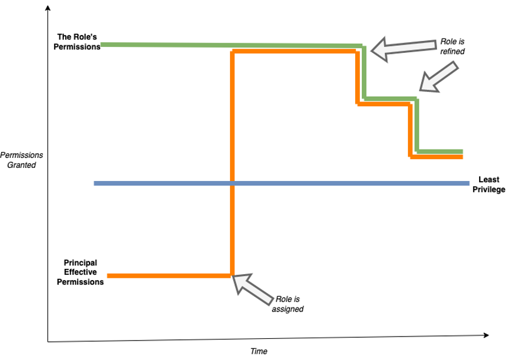
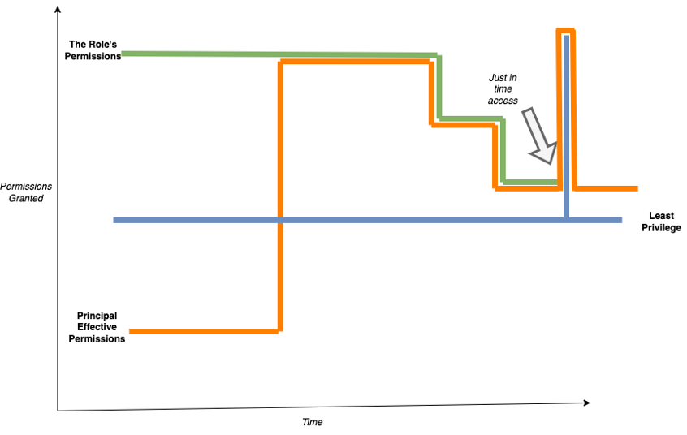

Matthew K. Carter

© 2022 IDPro, Matthew K. Carter

*To comment on this article, please visit our [GitHub
repository](https://github.com/IDPros/bok) and [submit an
issue](https://docs.github.com/en/github/managing-your-work-on-github/opening-an-issue-from-code).*

Introduction
============

Reducing excessive permissions is a continuous effort. Workforce members
accumulate permissions throughout their employment, and job requirements
change regularly. People take on temporary assignments, and
organizations are typically better at granting permissions than taking
them away. SaaS and IaaS providers are constantly changing the surface
area of permissions that customers need to manage. It is a challenging
balance to give employees, partners, and customers a sufficient level of
privilege to digital resources without leaving an organization open to
risk. The principle of *least privilege* is a hypothetical, best-case
scenario of a human or non-human actor having only the permissions
required to perform a task at the time it needs to be performed.
Understanding techniques to create and refine permissions can help you
approach least privilege and reduce the risk of an overly-permissive
posture.

This article will discuss least privilege in the context of identity
lifecycle and building policy for specific activities. We will examine
the advantages of long and short-term permission assignments,
considering techniques like just-in-time (JIT) permissions. We will
utilize roles as a way of grouping together permissions related to
identity and activities. This utilization is a natural extension of
Role-Based Access Control (RBAC), though not all organizations use roles
to model permissions in the same way. Roles provide a natural way to
encapsulate multiple permissions to reduce maintenance versus assigning
multiple permissions to a human or non-human principal. We will contrast
least privilege applied to RBAC and Policy-Based Access Control (PBAC),
but roles will be the primary mechanism for grouping permissions in this
article.

Terminology
-----------

**Least Privilege** - “The principle that a security architecture should
be designed so that each entity is granted the minimum system resources
and authorizations that the entity needs to perform its function.”
<a href="#fn1" id="fnref1" class="footnoteRef">1</a>

**Account Takeover** - Account takeover is a form of identity theft and
fraud, where a malicious third party successfully gains access to a
user’s account credentials.
<a href="#fn2" id="fnref2" class="footnoteRef">2</a>

**Access Certification** - Certification is the ongoing review of who
has which accesses (i.e., the business process to verify that access
rights are correct). 2

**Privileged Access Management** *-* A mechanism for managing temporary
access for accounts with high-risk permissions. PAM often involves
check-out and check-in of a credential generated for a single use.

**Just-in-time (JIT) access** - a technique where a credential or a
permission is granted to a principal for a temporary timeframe when they
need the permission to perform an activity. Access is revoked once the
activity is complete, limiting its usage.

**Zero Standing Privilege (ZSP)** - a state where JIT access is used for
all permissions and no long-standing permissions are assigned to
principals.

**Cloud Infrastructure Entitlement Management (CIEM)** - a
categorization of technologies focused on managing the granting,
verification, and refinement of permissions for cloud and hybrid
technologies. CIEM is often seen as a component of Identity Governance
and Administration (IGA).

**Infrastructure-as-code** - the process of managing and provisioning
computer data centers through machine-readable definition files rather
than physical hardware configuration or interactive configuration tools.
<a href="#fn3" id="fnref3" class="footnoteRef">3</a>

Least Privilege in the Identity Lifecycle
=========================================

Least privilege can be applied at every stage of the identity lifecycle.
[*Birthright entitlements*](https://bok.idpro.org/article/id/84/) should
be continuously refined to help new employees to the workforce (joiners)
<a href="#fn4" id="fnref4" class="footnoteRef">4</a> be more
productive on their first day while not giving excessive permissions
that an inexperienced employee could accidentally misuse. Employees who
change jobs (movers) inherit new permissions. They may require a ramp
down of their previous job’s permissions during their transition, which
can cause delays in permission revocation until the transition is
complete. These delays can put companies at risk of violating the
principle of separation of duties (SoD) if the new job permissions
create a toxic combination with the previous job role. Departing
employees (leavers) still need limited access to company assets, such as
access to paystubs and W-2s. Ensuring the former employee’s
post-employment credential has limited permissions may avoid damages.

One misconception is that striving for least privilege in the workforce
is due to a lack of trust in employees. Least privilege actually
protects employees and employers by limiting their respective exposure.
A new employee is often granted a set of birthright permissions based on
their job assignment. The permissions that are available to that
employee should be continually refined to add or remove permissions to
better align with employee needs as they progress in their tenure. A
surplus of permissions can result in exploitation. An employee is more
likely to notice an *account takeover* if they are actively using a
permission, as they are more likely to observe changes to the resource.

In order to align the assigned permissions with the ever-shifting target
of least privilege, organizations need to continually refine permissions
granted through birthright and access requests. If these birthright
permissions are managed through roles, the roles need to be analyzed for
excessive permissions. If the roles do not apply consistently to the
principals that the roles are assigned to, the roles should be
refactored so that a role is representative of the activities that the
principal needs to perform. A deficit of permissions will often cause
productivity loss, so the risk of each permission needs to be evaluated
to find the balance.

Self-service access requests can incorporate least privilege approaches
to ensure that temporary lifespans for entitlements are used for
one-time actions. Long-standing permissions granted through self-service
access requests are reviewed during access certification along with
birthright permissions to refine permission, regardless of when the
permission was granted. Temporary access might involve Privileged Access
Management (PAM) or JIT permission techniques described below.

During the *Access Certification* process, employees review who has
access to resources. One guiding concept is removing unnecessary
permissions that might create risk for an organization. This concept is
one dimension of least privilege, where human and non-human entities are
evaluated for what each has access to. Managers and application owners
are responsible for refining permissions to find the balance between
productivity and security. This risk evaluation is what Access
Governance solutions are built to achieve. *Cloud Infrastructure
Entitlement Management* (CIEM) solutions also provide tools to help
refine permissions for workforce employees.

Unused permissions do not equate to unneeded permissions. Some
activities are less frequent than a quarter, such as accessing tax
documents, so avoid refinement based on static periods. Some activities
may be less frequent than a year, such as activating a contingency plan,
though hopefully, your company is rehearsing your business continuity
planning.

Least Privilege for Activities
------------------------------

An activity, in this context, should be thought of as a set of resources
and actions to perform a task. As an example, say you need to manage
permissions for an *infrastructure-as-code* (IaC) process that creates
multiple digital assets of different resource types to create an
application. You also need to manage permissions to operate this new
application after deployment. The inclination to execute the IaC process
as “Admin”
<a href="#fn5" id="fnref5" class="footnoteRef">5</a> is
understandable, as introspecting and defining governing policies for an
unfamiliar set of resources and actions can be time-consuming. However,
the temptation to continually operate as a privileged user can result in
long-standing over-permission that can be targeted by unauthorized
privilege escalation.

An activity is often broken up into more granular actions and resources
that are governed by the authorization system. For our IaC example, the
process might contain create, modify, and delete actions for computing
and data sources to set up and tear down the application. We will only
consider the coarse-grained action-resource permissions in this article,
for example, “create-compute” or “modify-database.”
<a href="#fn6" id="fnref6" class="footnoteRef">6</a>

Two techniques for building least privilege roles for activities are
**fail-then-add** and **record-then-replace** . Each technique provides
a different balance between security and productivity by limiting the
usage of privileged access.

For the **fail-then-add** technique, the infrastructure-as-code (IaC)
process starts with no permissions. The IaC process is run, and when it
fails due to authorization, that permission is granted. This sequence is
repeated until the IaC process runs to completion. While this brute
force approach may seem inefficient, the artifact role that it produces
can be used for subsequent runs of the IaC process and reliably achieves
least privilege for this activity. In order for the technique to be
viable, you must have a clear feedback mechanism for the needed
permission and transactional rollback capability. This technique also
requires the practitioner to have a clear understanding of the required
activities. Loosely adding permissions without a good understanding of
the activities will lead to privilege creep, as revocation of
superfluous additions rarely occurs after getting things to work.

The preferable second technique is a **record-then-replace** approach,
where the IaC process starts with a privileged role like “Admin” that
allows all actions for every resource type in the IaC process. An event
is recorded for each action taken by the IaC process via a mechanism
like audit logs. Once the activity completes, you can extract the
actions from the recorded events and assign the necessary permissions to
a new “least privilege” role. Subsequent runs of the IaC process are
performed with the new least privilege role, replacing the privileged
“Admin” role. Using this new least privilege role gives you an
activity-specific role that can be used for other principals.

Basing least privilege on historical events like audit logs has a
potential downside of incorporating unrelated or unauthorized
permissions into the least privilege role if the unrelated or
unauthorized activity is ongoing with that principal when the recording
takes place. Check your recorded permissions to verify that extraneous
permissions haven’t crept into your least privilege role.

It’s important to separate out setup and destroy activity from
operational activity. Setup and destroy are activities that may include
privileged permissions that are excessive for human actors once the
non-human activity is complete. For our IaC example, creating the
compute and data storage, then modifying its policy may be a setup
activity, while running queries and mutations are operational activity.
Setup permissions are limited for the non-human IaC process. When
recording operations from your audit logs, stop the recording after
setup to define the setup role. This prevents the modify-policy
permission from being included in the operational role, leaving only
query-data and mutate-data. An operator with modify-policy could grant
themselves permissions, thereby violating the principle of least
privilege.

Work with your digital resource providers to set up notifications of
changes to permissions. If your role contains any kind of permission set
based on expressions like wildcards that allow new permissions to be
automatically included, a change in resource permissions could introduce
new risks and push you further away from least privilege.

Just-in-Time Permissions
------------------------

Let’s consider the time component of least privilege. In general, a user
principal having temporary access is more secure than long-standing
access for the same permission. You will approach least privilege by
only having the permission to execute an activity at the point-in-time
the activity needs to be performed. Concurrent refinement of unnecessary
permissions and a JIT approach to granting permissions bring us closer
to least privilege. Keep in mind, however, that the overhead of managing
temporary access and the productivity tax of having to ask each time may
not make JIT a fit for every organization.

In a long-standing model, even if the role permissions are refined over
time, the principal’s effective permissions track with the role’s
permissions. The principal has the permission when they need it as the
permission persists through the role assignment.

Figure 1:Long-standing Least Privilege Model

Least privilege is an activity that must be evaluated at specific points
in time when a principal must take an action or access protected
information. In a JIT model, permissions are granted only for the period
that they are needed to perform the activity, then are revoked. By
separating temporary privileged access from long-standing role
assignments and the permissions granted by the roles, there is less
creep of excessive permissions for those long-standing roles.

Figure 2: Just-in-time Least Privilege Model

This JIT approach is analogous to *Privileged Access Management* (PAM)
systems, which typically allows one to “check out” and “check in” a
credential used to access a shared (and often sensitive) system. Instead
of checking out a credential, though, the JIT approach enables the actor
to check out a permission to be granted to perform the action.
Alternatively, the JIT approach may allow the principal to check out the
ability to assume a role with the necessary permissions to perform the
activity. The permissions granted for that JIT access should also be
continually refined.

The risks with long-standing permissions or role assignments are related
to unauthorized privilege escalation. If a credential of the principal
is compromised or another principal is able to assume the role with the
permission, a privilege escalation breach occurs. A JIT approach can
mitigate the risk of the privilege escalation, as the principal of the
compromised credential would not have a long-standing permission. The
principal requires the additional step of checking out the role or
permission. This mitigation assumes that the same compromised credential
cannot be used for the “checking out” of the role or permission needed
to escalate privilege. Thus, best practice dictates that the JIT system
requires an additional authentication factor. For example, if typical
operations utilize a fingerprint biometric, the privilege escalation
might require a hardware device token.

There is a balance between security, productivity, and convenience to
consider when implementing least privilege. If the cost of building and
maintaining refinement and JIT exceeds the impact of privilege
escalation in your systems, you may choose to accept the risk of
long-standing or unneeded permissions granted to principals. There is a
productivity risk of being too surgical with permissions and
interrupting work. Employees that have to constantly check out
permissions to do their job may grow weary of the tax and find ways to
circumvent the control.

Least Privilege Relation to Policy-Based Access Control
-------------------------------------------------------

Typically, Policy-Based Access Control (PBAC)
<a href="#fn7" id="fnref7" class="footnoteRef">7</a> lends
itself well to least privilege as its rules tend to be more granular
than RBAC with the specification of specific resources and actions in.
For example, the following natural language statement is representative
of a PBAC rule:

*Allow read content if the reader’s clearance is higher than the
content’s classification*

This statement grants the read-content permission based on a conditional
comparison of an identity attribute, the reader’s clearance, to a
resource attribute, which is the classification of the content. This
rule could be updated to approach least privilege, perhaps by specifying
a smaller population of readers or specifying which instance of the
content server. However, this negates some of the value of PBAC as you
have to have rules for each enumerated instance of the content server.
Least privilege becomes a balance with the centralized policy decision
nature of PBAC and maintainability that comes from having rules that can
apply to multiple abstractions.

PBAC lends itself to modeling least privilege in various dimensions. For
example, to refine the content example toward least privilege, you might
add a network expression that adds additional constraints on where
readers can access content, or combine a risk engine score in a
deny-override rule.

> *Allow read content if the reader’s clearance is higher than the
> content’s classification* *and client.ip in a specified range*
>
> *AND*
>
> *Deny if read-content risk is greater than low*

Refining a policy-based approach to access control may inherently
require less refinement than an RBAC model over time. It does, however,
require rigor toward auditing PBAC rules that may grant unnecessary
access for a population or has a path that isn’t reachable. Access
governance is less mature in PBAC than in RBAC, so there may be less
choice from commercial offerings in this area.

Summary
=======

Least privilege is an ever-shifting target that can act as a “north
star” for your access governance teams to strive for in order to reduce
the risk of unauthorized privilege escalation. Continuously refining
permissions assigned during birthright, self-service access requests,
and specific activities can limit the accumulation of privileged access
that can be misused over time. Incorporating JIT strategies to grant
permissions for short durations to achieve a temporary task reduces
long-standing permissions. Organizations should consider the
productivity risk from the over-refinement of permissions or the
overhead of having to ask for permissions too frequently before
investing in tools or processes. Monitor your provider’s permission
model to ensure that newly introduced permissions do not introduce risk
from your policies that use wildcards. As you commit to a role-based or
policy-based access control model, your techniques for least privilege
will vary, but the concepts will be consistent. Continuously evaluating
these factors over the lifecycle of all identities and policies will
reduce the surface area that can be exploited.

Author Bio
==========

 Matt Carter
has worked in the identity and cloud security industry since
joining Netegrity in 2000. Mr. Carter has worked in several roles,
including product management, pre-sales, and implementation at companies
like Oracle, AWS, and Axiomatics. Currently, he is a CIAM sales
specialist at Okta. Matt has been active with IDPro as a certification
test item writer and serves on the Book of Knowledge committee.

Matt Carter lives in greater Boston with his wife, two dogs, two cats,
and has three kids in college. He is into pickleball, kayaking on the
Charles river, and science fiction. Fun fact: Matt once ran with the
bulls in Pamplona...in flip-flops.

------------------------------------------------------------------------

1.  

    NIST Information Technology Laboratory, “least priviledge,” Computer
    Security Resource Center glossary,
    <https://csrc.nist.gov/glossary/term/least_privilege> (accessed 6
    September 2022). [↩](#fnref1)

    

2.  

    Flanagan (Editor), H., (2021) “Terminology in the IDPro Body of
    Knowledge”, *IDPro Body of Knowledge* 1(8). doi:
    <https://doi.org/10.55621/idpro.41> . [↩](#fnref2)

    

3.  

    Wikipedia contributors, "Infrastructure as code," *Wikipedia, The
    Free Encyclopedia,*
    <https://en.wikipedia.org/w/index.php?title=Infrastructure_as_code&oldid=1100109083>
    (accessed September 6, 2022). [↩](#fnref3)

    

4.  

    More on Joiner, Mover, and Leaver is available in Cameron, A. &
    Grewe, O. (2022) “An Overview of the Digital Identity Lifecycle
    (v2)”, IDPro Body of Knowledge 1(7). doi:
    [*https://doi.org/10.55621/idpro.31*](https://doi.org/10.55621/idpro.31)
    . [↩](#fnref4)

    

5.  

    “Admin” - shorthand term for a privileged user or role that has full
    control over a digital environment. The scope of “Admin” may vary,
    but represents a set of permissions that would allow a person
    controlling it to manipulate or damage assets and should be tightly
    controlled. [↩](#fnref5)

    

6.  

    An organization’s constraints for provisioning a resource like
    compute can be very specific in terms of policy. For instance, an
    organization may only want to allow a database to be created in a
    particular region, of a certain size, and with specific features
    enabled. [↩](#fnref6)

    

7.  

    More on Policy-Based Access Controls is available Mary K McKee,
    “Introduction to Policy-Based Access Controls (v2)” IDPro Body of
    Knowledge 1(8). doi:https://bok.idpro.org/article/id/61/
    [↩](#fnref7)

    

