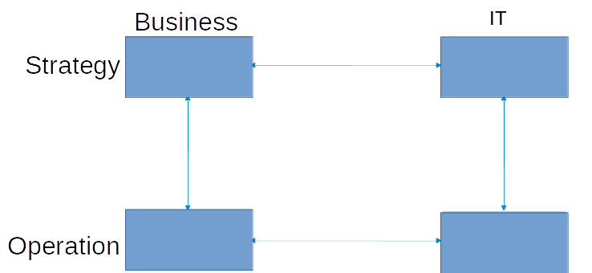
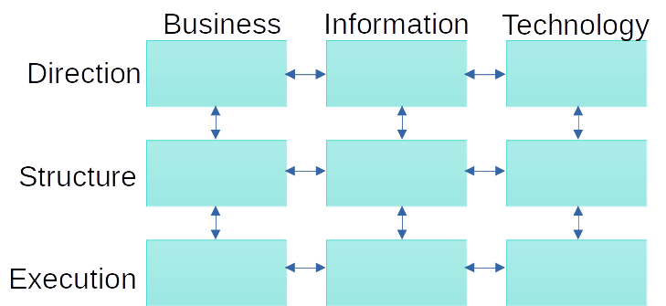
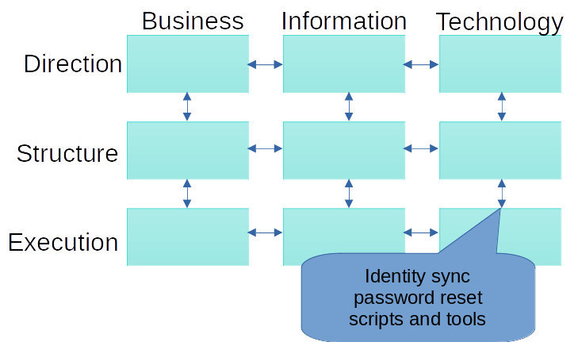
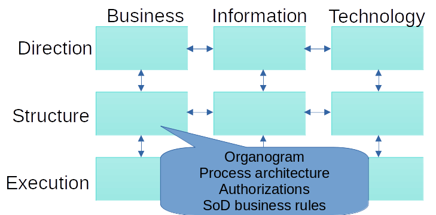
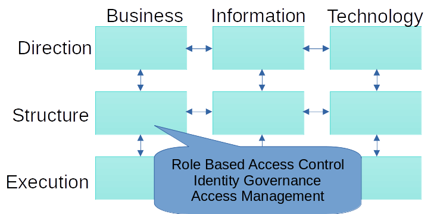
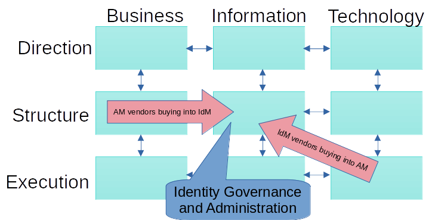
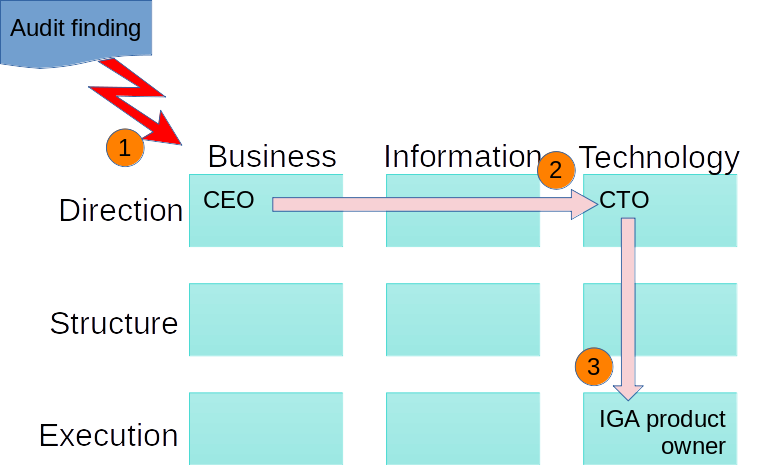
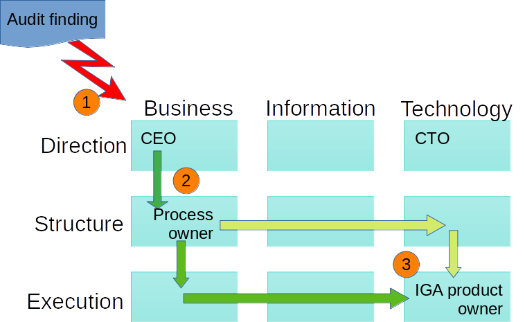

  Strategic
Alignment and Access

Governance

By André Koot

© 2022 IDPro, André Koot

To comment on this article, please visit our [GitHub
repository](https://github.com/IDPros/bok) and [submit an
issue](https://docs.github.com/en/github/managing-your-work-on-github/opening-an-issue-from-code).

Introduction
============

Many Information Technology (IT) departments are responsible for
implementing IAM systems to support an organization’s efforts to operate
efficiently and effectively. Identity management systems are designed to
automate the joiner, mover, and leaver processes (JML processes) for
employees.
<a href="#fn1" id="fnref1" class="footnoteRef">1</a> Access
management systems, in turn, are designed to make it possible to request
and grant authorizations in information systems and even physical access
to facilities such as buildings or data centers. For IT to support the
necessary processes and controls, they must understand the business
drivers for the organization. IT in general, and IAM in particular, must
serve the organization; strategic alignment is critically important and,
unfortunately, challenging. Different day-to-day languages, cultures,
and priorities obstruct the understanding on both sides regarding what
has to happen and why for the business to succeed.

Terminology
-----------

-   Alignment: the synchronization rate of processes and environments

-   CEO: Chief Executive Officer; CFO Chief Financial Officer; CRO Chief
    Risk Officer; CTO Chief Technology Officer; COO: Chief Operations
    Officer

-   Governance: making sure that accountable owners are in control and
    that they can show that they are

-   IGA: Identity Governance and Administration, a solution for
    automating user management and authorizations in target systems,
    building on the organization’s customer and human resource
    processes.

-   JML processes: joiner, mover, and leaver processes for onboarding,
    moving, and off-boarding workforce employees.

-   RBAC: Role-Based Access Control

Understanding Strategic Alignment
=================================

Business-to-IT Alignment, also known as Strategic Alignment, has been
studied since the 1980s. Following the Henderson and Venkatraman model,
strategic alignment brings together a dynamic integration of IT planning
and business development to shape or enable a holistic business
strategy.
<a href="#fn2" id="fnref2" class="footnoteRef">2</a>

Ideally, IT enables the business to perform efficiently and effectively.
IT can help solve business issues by providing logical, structured ways
of working, integrating solutions, and making access and application
integrations possible. For example, IT supports automating manual tasks,
keeping records, integrating different information processing components
and systems, and following security best practices. IT better
understands what problems need to be solved when aligned closely with
the organization’s business drivers. In general, businesses are more
successful when they incorporate the efficiencies IT can bring to the
table.

In order to reach the necessary levels of strategic alignment, we first
must consider the barriers. Often, the language used by the business to
identify what’s important is quite different than the language used in
IT.

|                                                                          |     |                                                                                                                       |
|--------------------------------------------------------------------------|-----|-----------------------------------------------------------------------------------------------------------------------|
| Business talks about                                                     |     | IT talks about                                                                                                        |
| Customer satisfaction                                                    |     | System service level agreements (e.g., 99.999% availability)                                                          |
| Return on Investment (ROI)                                               |     | Network architecture (e.g., hybrid, cloud, on-prem)                                                                   |
| Legal and regulatory requirements (e.g., GDPR, CCPA)                     |     | Common Vulnerability and Exposure (CVE) Announcements <a href="#fn3" id="fnref3" class="footnoteRef">3</a> |
| Market share                                                             |     | Latest container management technologies (e.g., Kubernetes)                                                           |
| Earnings before interest, taxes, depreciation, and amortization (EBITDA) |     | Access control mechanics (e.g., -rwxr-xr-x)                                                                           |
| Financial bottom line (i.e., General ledger)                             |     | Network capabilities (e.g., bits per second, database structures)BPS                                                  |
| Interest rates                                                           |     | Data Center architecture and computing clusters                                                                       |
| Consumer trust and business reputation                                   |     | P1 (Priority 1 incidents)                                                                                             |

(There is no implied horizontal correlation between the terms in the
left and right columns).

Alignment Models
----------------

There are different methodologies that describe the necessary points of
communication to support strategic alignment. Hendersen and Venkatraman,
two IBM fellows, came up with this model for strategic alignment in
1993: <a href="#fn4" id="fnref4" class="footnoteRef">4</a>

*Figure 1: Simple Model for Strategic Alignment*

This model suggests that business and IT stakeholders should communicate
on both the strategic and the operational levels. This multidirectional
communication ensures that the business processes are supported by
fitting IT solutions. By pairing strategic choices with operational
ones, the organization can minimize unnecessary changes in process and
technology. For this model to work, however, the organization must
address the fact that IT and the business often have different ways of
working, cultures, languages, and jargon. These differences make
strategic alignment difficult.

One critical characteristic of this model (and in the other models
presented) is that communication between domains/cells can only occur
across the horizontal and vertical lines, not diagonally. That means
communication can only happen in formalized relations to prevent
disrupting formal, mature procedures.

> *Case CEO:*
>
> *My old CEO was tempted to get a smartphone. All young marketers used
> those devices, so why not the CEO? But he also wanted to read his
> company email on the same smartphone. This expectation would not be a
> problem except for the fact that in 2008 enterprises were not
> supporting those devices in a standard way. The CEO directly ordered
> an IT engineer to make it possible: install the app, connect to the
> mail server, create a secure channel to the Internet, add
> certificates, etc. This non-standard change interrupted IT operations
> for three months.*

In the Amsterdam Information Model by Professor Rik Maes, Dr. Maes added
additional components to implement information management and structure.
<a href="#fn5" id="fnref5" class="footnoteRef">5</a> :

*Figure 2: the Amsterdam Information Model for Strategic Alignment*

The middle column, Information management, translates the business
requirements into IT solutions (left-to-right translation). It also
translates the features and functionality of IT components (platforms,
services, applications) into business opportunities (the right-to-left
translation). The information management function must overcome the
issues indicated above, such as language and cultural differences. The
information manager (or CIO) should understand and know how to converse
with businesspeople and IT personnel. The information manager should be
able to connect to the entire organization and act as the missing link
in business-to-IT alignment.

The added horizontal middle layer also has a specific ‘translation’
role:

This layer can be seen as the architecture layer. It translates
strategic concepts into day-to-day operations. Looking at the different
columns within this layer, from left to right, we can identify the
following architectural concepts:

-   Business architecture (organogram/org-chart and business processes
    models, including Segregation of Duties (SoD), abuse of information
    prevention controls, etc.).

-   Information architecture (data models, -flows, and interfaces).

-   The IT architecture (including servers and networking,
    containerization, cloud, and security architecture).

In this model, we can position the CEO, CFO, and COO in the top-left
area. These persons are accountable for defining the organization's
business strategy, direction, and course. The head of IT, or CTO (Chief
Technology Officer), would be positioned in the top-right area,
accountable for IT strategy, like sourcing strategy and IT vendor
management strategy. This assignment leaves the CIO in control of the
middle column, responsible for the business-to-IT alignment.

Governance, ownership of control, would, in this model, be owned by the
top-left area players.

IAM and Alignment
-----------------

So far in this article, we have focused on the IT/business relationship
in general. As IAM is traditionally considered part of IT, the
challenges of strategic alignment are at the core of most failures of
IAM projects. In many cases, IAM is very much an IT function. IAM
includes basic “techie” tasks such as password resets, account
management, user provisioning, and so on. IAM, however, is arguably more
closely tied to business needs than any other aspect of IT.
Authorization processes, in particular, regularly bridge the gap between
IT operations and business requirements.

*Figure 3: Amsterdam Information Model - IAM as an IT Function*

IAM started as an IT responsibility. Creating interfaces and connectors,
protocols, and adding certificates all fell in the realm of IAM and IT.
The trigger for all identity transactions was often the HR department,
but in daily operations, identity management belonged to IT as part of
the general task of automating business processes. That has not changed.
Most identity management in an organization is still seen as IT: bottom
right.

Authorization management, on the other hand, is not as easily plotted.
Authorization involves “determining a user’s rights to access
functionality with a computer application and the level at which that
access should be granted. In most cases, an ‘authority’ defines and
grants access, but in some cases, access is granted because of inherent
rights (like patient access to their own medical data).”
<a href="#fn6" id="fnref6" class="footnoteRef">6</a>
Authorization is directly tied to business practices, and yet the IAM
group generally implements them.

Using the Amsterdam Information Model *,* we can identify where
authorizations are most prominently defined. Authorizations are enablers
for performing tasks in an organization and so are critical to the
execution phases. Authorizations are derived from the organizational
structure and business processes. Implementing authorization management
must therefore be plotted on the Business Structure area in the model.
For example, SoD rules are defined in a business process: one person may
not be allowed to perform multiple successive tasks because that could
create a risk of fraud, abuse of permissions, or data breaches. Tasks
are defined in a process. That means a process owner, ‘mid-left,’ is
accountable for defining these specific access control policies.

*Figure 4: Amsterdam Information Model - Authorization as a Business
Function*

IT does not own or manage business structure authorizations. It’s the
responsibility of the ‘business’ owners, specifically the process
owners, line managers, or data owners.

Managing authorizations–defining, granting, and revoking them–is one of
the more challenging tasks for any organization. This task is where the
concept of RBAC became handy. The concept was created in the mainframe
era in solutions like IBM’s Resource Access Control Facility (RACF) and
the Access Control Facility 2 (ACF2) system. In the local area
networking era, RBAC became the solution for managing this authorization
complexity. In the nineties, dedicated identity management solutions
started to appear, with authorization solutions exploring the concept of
RBAC coming into existence at the turn of the century. These solutions
evolved over time, eventually offering identity governance by adding
attestation/recertification processes.

*Figure 5: Amsterdam Information Model - RBAC and Identity Governance*

These days, we see vendors moving to a spot in the center. Traditional
Identity Management software vendors add authorization management
solutions and traditional identity governance vendors add identity and
workflow management capabilities. There are also ‘new’ entrants in the
market, offering cloud-based solutions such as Identity Governance and
Administration offerings.

*Figure 6: Amsterdam Information Model - IGA*

When evaluating Attribute Based Access Control and Policy Based Access
Control models, the same strategic alignment change of responsibility
can be seen. Several IT-oriented access control policies exist, such as
the requirement to use TLS certificates and zero-trust networking. But
other access policies are business oriented. Policies like SoD or
privacy-related consent management have a clear relation to the business
structure sector in the model.

An Extended Case Study
----------------------

Information systems were generally developed to support the identity
management process and to support authorization management; the current
generation of IGA solutions performs their role admirably by supporting
the business with reliable identities (based on the HR identity
lifecycle) with reliable authorizations. And yet, there still is the
issue, IAM is still seen as an IT responsibility. Let me explain this in
a case:

> *Case Study - Accountability vs. Responsibility*
>
> *A financial institution supports its identity governance and RBAC
> requirements by using a modern IGA solution. The system is integrated
> within the IT landscape and connects several business applications for
> provisioning and reconciliation.*
>
> *An external auditor reported a high-risk issue concerning
> authorizations in the financial accounting system to the CEO.*
>
> *The CEO (Top-left) forwarded the findings to the CTO (Top-right), as
> the finding was about a system, and so the CEO believed IT had to
> solve the issue. The CTO forwarded the finding about the
> authorizations to the IGA product owner in the IT Service delivery
> department (Bottom-right). Unfortunately, the product owner cannot
> solve the issue.*
>
> *What went wrong?*
>
> 
>
> *Figure 7: Amsterdam Information Model - default IAM communication*
>
> *The product owner is responsible for the IGA system but not for the
> authorization decisions themselves; the product owner cannot fix the
> issues found by the auditor. In short, the product owner is
> responsible but not accountable for authorizations. Instead, the
> process owner for the financial business process should be tasked with
> resolving the issue.*
>
> *Note that, based on the Amsterdam Information Model, there is no
> direct communication between the IGA product owner, who works at the
> operational level within IT (bottom-right), and the business process
> owner (center-left) in the business architecture layer. That
> communication would be a diagonal link and would interfere with
> regular, well-structured operations.*
>
> *The advice was for the product owner to escalate back vertically to
> the CTO on the basis of lacking accountability. The CTO should then
> advise the CEO to assign the issue to a business process owner:*
>
> 
>
> *Figure 8: Amsterdam Information Model - Correct Communications Path*
>
> *(Different paths for the necessary communication could be followed to
> make the required adaptations to the authorization model in the IGA
> system.)*

The Way Forward
===============

How do these models solve the issue of lack of stakeholdership in
organizations? Does the alignment strategy solve the governance
challenge?

First and foremost, the theory can demonstrate that access control, or
authorization management, is not an IT responsibility. The ‘business’ is
accountable for structuring and implementing authorization models and
authorization management. IT can, at best, only support the business by
implementing the tools that might help.

This makes the implementation of IAM a new challenge. Implementation is
not just an IT project. Implementing an identity management solution can
be done in an IT project style, but authorization management is not a
project. Authorization management is the never-ending responsibility of
managers and (business) owners.

And that leads to this conclusion: An IAM project cannot exist as an IT
project. Implementing authorization management results in or requires
organizational change and is therefore related to regular governance and
control of business responsibilities.

Access Governance is what connects the business governance and control
challenge to the IT solutions that are used to enable the organization
to execute its mission. The easiest way to activate the business is to
find someone who makes a decision on the topic of SoD or find someone
who is a stakeholder in the approval process for access requests.

> *Case Study: SoD rules*
>
> *A financial institution is using a modern IGA solution to manage
> accounts and authorizations in Active Directory and miscellaneous
> information systems. This system depends on the concept of SoD. Using
> the SoD controls, it is impossible to assign two or more conflicting
> roles to the same employee. There are over 1200 SoD rules in the IGA
> system.*
>
> *When asked who had defined those SoD rules, the product owner in the
> IT department had no idea. While the product owner is responsible for
> making sure the system runs as expected, holding them accountable for
> the SoD rules is outside their area of responsibility; they may not
> even know all the parties involved in making those decisions.*
>
> *In an ideal world, the SoD rules would not be applied without an
> accountable business owner clearly identified. In this case, the
> financial institution has a large business project ahead of them to
> ensure the appropriate process owners have reviewed each rule.*

A good practice would be only to create roles and (business) rules if a
person in the business domain can be assigned as the accountable
stakeholder for the role or rule. Governance is not just relying on IT
departments to solve issues but having someone accountable for managing
the business and implementing the controls to manage the business.

Conclusion
==========

In today’s digital age, for an organization to succeed, it must have a
strong IT function. That IT function will not be at its best, however,
if it is missing a close partnership with the business components of the
organization. The different parts must pull in the same direction to
succeed.

IAM projects can only succeed with a strong business-to-IT alignment. As
evidenced by the challenges associated with the organization-wide
responsibilities around authorization management, IAM, perhaps more than
any other IT-related function, must understand the needs of the business
and enable those requirements in the identity systems.

Both parties are responsible for ensuring strategic alignment across the
organization, being aware of and working to overcome the barriers of
different cultures and jargon in each group.

Acknowledgments
===============

The author wishes to thank IDPro Principal Editor Heather Flanagan for
turning the original, hardly English language, text fragments into
readable text.

Author Bio
==========

 André Koot is
Principal Consultant at SonicBee in Amsterdam, The Netherlands. He is a
member of the BoK committee of IDPro.

André has over 30 years of experience in information security and over
20 years of experience in Identity and Access Management. He has a
background in financial accountancy and business economics.

------------------------------------------------------------------------

1.  

    Cameron, A. & Grewe, O., (2022) “An Overview of the Digital Identity
    Lifecycle (v2)”, *IDPro Body of Knowledge* 1(7). doi:
    [*https://doi.org/10.55621/idpro.31*](https://doi.org/10.55621/idpro.31)
    [↩](#fnref1)

    

2.  

    <https://cve.mitre.org/> [↩](#fnref2)

    

3.  

    Henderson, John C., and N. Venkatraman. "Strategic alignment: a
    process model for integrating information technology and business
    strategies." (1989),
    <https://dspace.mit.edu/bitstream/handle/1721.1/49138/strategicalignme1989hend.pdf>
    , and Dampney, C. N. G., & Andrews, T. B. (1989). Striving for
    sustained competitive advantage: the growing alignment of
    information systems and business. CSIRO Australia Division of
    Information Technology. [↩](#fnref3)

    

4.  

    Strategic alignment, Henderson and Venkatraman, 1993, reprint at

    [*https://www.researchgate.net/figure/The-Henderson-and-Venkatraman-strategic-alignment-model-Reprinted-from-Henderson-JC\_fig2\_220220710*](https://www.researchgate.net/figure/The-Henderson-and-Venkatraman-strategic-alignment-model-Reprinted-from-Henderson-JC_fig2_220220710)
    [↩](#fnref4)

    

5.  

    Amsterdam Information Model, 1999, reprint at
    [*https://www.researchgate.net/publication/242321998\_A\_Generic\_Framework\_for\_Information\_Management*](https://www.researchgate.net/publication/242321998_A_Generic_Framework_for_Information_Management)
    [↩](#fnref5)

    

6.  

    Flanagan (Editor), H., (2022) “Terminology in the IDPro Body of
    Knowledge”, IDPro Body of Knowledge 1(9). doi:
    [*https://doi.org/10.55621/idpro.41*](https://doi.org/10.55621/idpro.41)
    . [↩](#fnref6)

    

