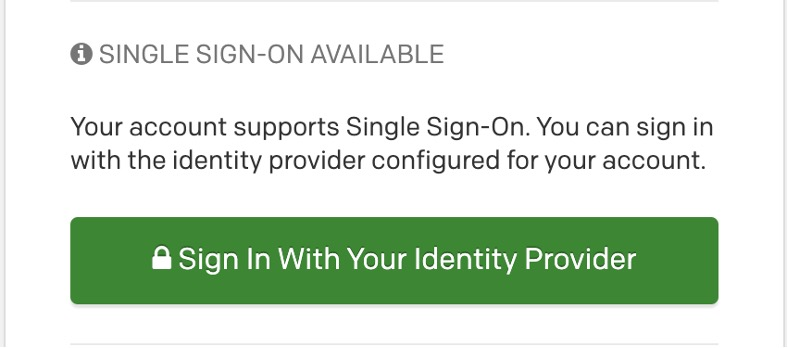
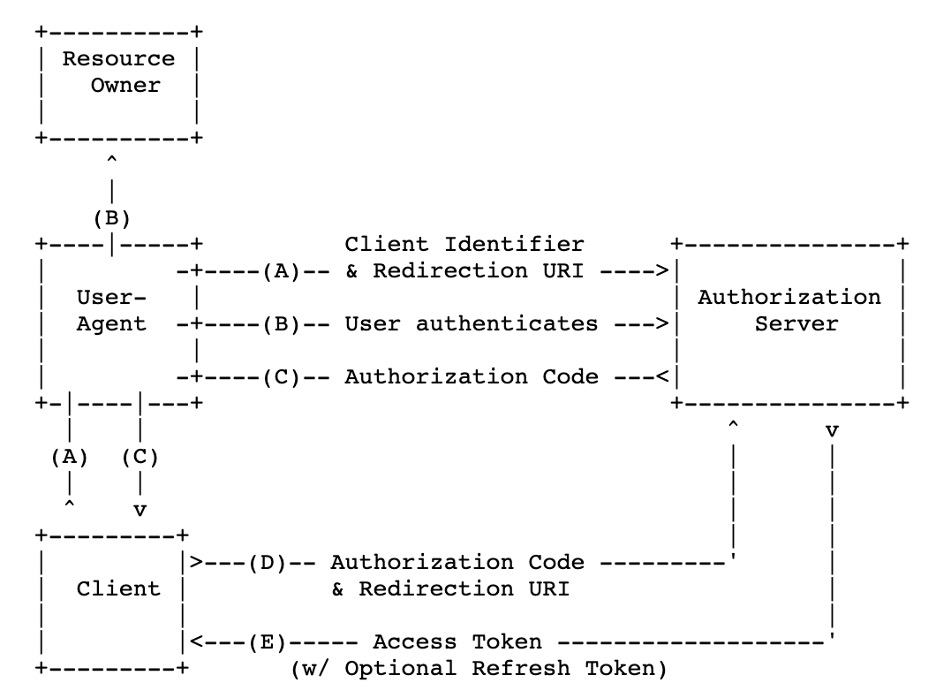

Federation Simplified
=============================
Patrick Lunney, Product Owner - Single Sign-On & Multi Factor
Authentication

Capital One

© 2021 IDPro, Patrick Lunney

*To comment on this article, please visit our [GitHub
repository](https://github.com/IDPros/bok) and [submit an
issue](https://docs.github.com/en/github/managing-your-work-on-github/opening-an-issue-from-code).*

# Introduction

This article describes identity federation in the context of single
sign-on in enterprises and outlines some use cases for enterprise
federation integrations. Enterprises have various ways to manage
federation connections: the connections may be full service within the
enterprise, self-service with controls in place for governance, or
manual integrations. Each integration model has its strengths and
weaknesses, which will be discussed in turn below.

Terminology
-----------

<table>
<colgroup>
<col style="width: 50%" />
<col style="width: 50%" />
</colgroup>
<tbody>
<tr class="odd">
<td>Term</td>
<td>Definition</td>
</tr>
<tr class="even">
<td>Identity Federation</td>
<td>
An identity federation is a group of computing or network providers that agree to operate using standard protocols and trust agreements. In a <strong>Single Sign-On (SSO)</strong> scenario, identity federation occurs when an <strong>Identity Provider (IdP)</strong> and <strong>Service Provider (SP)</strong> agree to communicate via a specific, standard protocol. The enterprise user will log into the application using their credentials from the enterprise rather than creating new, specific credentials within the application. By using one set of credentials, users need to manage only one credential, credential issues (such as password resets) can be managed in one location, and applications can rely on the appropriate enterprise systems (such as the HR system) to be the source of truth for a user’s status and affiliation.

Identity federations can take several forms. In academia, <strong>multilateral federations</strong>, where a trusted third party manages the metadata of multiple IdPs and SPs, are fairly common.<a href="#fn1" id="fnref1" class="footnote-ref">1</a> This article focuses, however, on the enterprise use case where <strong>bilateral federation</strong> arrangements, where the agreements are one-to-one between an IdP and an SP, are the most common form of identity federation in use today.
</td>
</tr>
<tr class="odd">
<td>Bilateral Federation</td>
<td>A bilateral federation is one that consists of only two entities: one <strong>Identity Provider (IdP)</strong> and one <strong>Service Provider (SP)</strong>. This is the most common model for an enterprise identity federation.</td>
</tr>
<tr class="even">
<td>Identity Provider (IdP)</td>
<td>An Identity Provider (IdP) performs a service that sends information about a user to an application. This information is typically held in a user store, so an identity provider will often take that information and transform it to be able to be passed to the service providers, AKA apps. The OASIS organization, which is responsible for the SAML specifications, defines an IdP as “A kind of SP that creates, maintains, and manages identity information for principals and provides principal authentication to other SPs within a federation, such as with web browser profiles.” <a href="#fn2" id="fnref2" class="footnote-ref">2</a></td>
</tr>
<tr class="odd">
<td>Multilateral Federation</td>
<td>A federation that consists of multiple entities that have agreed to a specific trust framework. There are several forms of multilateral federations, including hub-and-spoke and mesh. Multilateral federations are the most common model for academic identity federations.</td>
</tr>
<tr class="even">
<td>OAuth 2.0</td>
<td>OAuth 2.0 is an open-source protocol that allows Resource Owners such as applications to share data with clients by facilitating communication with an Authorization Server.<a href="#fn3" id="fnref3" class="footnote-ref">3</a> That data takes the form of credentials given to applications to obtain information/data from other applications. The Authorization Server is usually the Identity Provider (IdP). The Authorization Server (AS) may provide authorization directly or indirectly. For example, the AS may supply attributes or profile data of the Resource Owner or provide access to data that can later be used for authorization purposes, such as entitlements from an Identity Management or Governance Solution.</td>
</tr>
<tr class="odd">
<td>OpenID Connect</td>
<td>OpenID Connectis a simple identity layer on top of the OAuth 2.0 protocol. It enables Clients to verify the identity of the End-User based on the authentication performed by an Authorization Server, as well as to obtain basic profile information about the End-User in an interoperable and REST-like manner.</td>
</tr>
<tr class="even">
<td>Security Assertion Markup Language (SAML)</td>
<td>SAML is an XML-based communication protocol between SPs and IdPs.<a href="#fn4" id="fnref4" class="footnote-ref">4</a> Usually, the enterprise hosts the IdP, whereas applications (including cloud services) are the SPs.</td>
</tr>
<tr class="odd">
<td>Service Provider (SP)</td>
<td>Defined by the OASIS organization, which is responsible for the SAML specification, as “A role donned by a system entity where the system entity provides services to principals or other system entities.” This usually takes the form of an application that offers services requiring authentication and authorization to a user.</td>
</tr>
<tr class="even">
<td>Single Sign-On</td>
<td>Single Sign-On is a centralized portal that enables SPs to verify the identities of <strong>End Users</strong> by facilitating communication with IdPs. SSO acts as a bridge to decouple SPs and IdPs. This can happen via numerous protocols such as agent-based integrations, direct LDAP integration, SAML, and OpenID Connect, to name a few.</td>
</tr>
</tbody>
</table>

Exploring Identity Federation in the Enterprise
-----------------------------------------------

There are several common scenarios where an identity practitioner is
likely to encounter identity federation in an enterprise context. This
section explores the most common protocols, OpenID Connect, and SAML.

Use Case 1: SAML
----------------

*Figure 1 - Example of a Single Sign-On User Interface*

SAML is most often found in SaaS (Software as a Service) applications.
An application is purchased or created by an enterprise to do
"something" and employees need to log into the application. The
application will need to exchange information with the enterprise to
form this federation. Usually, an IdP (the enterprise) and an SP (the
app) will exchange metadata, allowing them to set up the connections in
the SSO system. Metadata exchange can be done manually, but that often
takes time and can cause headaches for IdPs and SPs.

See Appendix Item 1 for an example of a metadata file from an IdP. In
that example, the IdP operator will give this metadata to the SP
operator. The SP can then input this information manually (or import it,
depending on their SSO platform) into their SSO system to allow the
enterprise's users to sign in to the application using their SSO
accounts. The IdP operator will need to do the same, either by importing
an SP metadata file or manually updating the configuration of the IdP.

An IdP metadata file contains the enterprise's entityID, the various
URLs used in SAML, and the attributes that will be passed in the SAML
assertion (the data that is passed to the app). An entity ID is a unique
name for a SAML entity, both an IdP and an SP. No two IdPs or SPs can
share the same entityID.

Think of a SAML assertion as a voucher or ticket. The IdP gives the user
a voucher to the user to get into the SP, and the SP is validating the
voucher using certificate validation. After the voucher is validated,
the SP will look at the attributes to see what the user can do. For
example, in Appendix Item 2, you can see a user's username and email
address were passed to this SP.

For more information on the details of SAML assertions and components,
see the SAML specification and associated supporting
documents.<a href="#fn5" id="fnref5" class="footnote-ref">5</a>

One last piece of information regarding enterprise SAML federations:
there are two different types of URLs for applications. Sometimes it is
the SP’s URL, for example, ‘https://myhrapp.com/enterprise’. This is
known as an SP-initiated request. Other times, the IdP will initiate the
request. For example, ‘https://authn.enterprise.com/idp/SAML20=myhrapp’.
In both cases, the user will be logging into the same app tenant for the
enterprise. Some applications only support IdP-initiated login requests. 
Some applications only support SP-initiated requests.

Here is a diagram flow of a standard SAML authentication:

*Figure 2 - SAML Authentication Flow*

It should be noted that the *authentication* of the user is completed at
step 5; the IdP has validated the user's credentials and is now passing
the SAML assertion back to the browser. Federation is completed at step
7; the browser forwards the assertion to the application so that the
application can know the user has been authenticated and create a
session for that user. In steps 8 and 9, that is where *authorization*
takes place. Based on the information provided by the IdP, the
application will allow or deny the user access to certain parts of the
application.

Use Case 2: OpenID Connect
--------------------------

Another common type of identity federation is internal to the
enterprise. Previously, enterprises would use "agents," which they would
install on web servers hosting applications. The agents would
communicate with something called a policy server to determine what a
user could do, if anything at all. That agent/policy server technology
is old and not used as much in enterprises anymore.

Instead, a popular protocol that is increasingly being used is OpenID
Connect. OpenID Connect is newer than SAML and based on the OAuth2.0
protocol; most in-house enterprise apps are based on APIs and
microservices, which is why OIDC is
favored.<a href="#fn6" id="fnref6" class="footnote-ref">6</a>
It should be noted that some SaaS applications do support OpenID
Connect.

OpenID Connect uses the authorization\_code grant type of OAuth2.0. It
is important to note that OpenID Connect is meant to share user
attributes, so it will be the only part of OAuth2.0 in this document.
There are many other grant\_types in OAuth2.0 which authenticate users
or clients in different ways but are not part of user *authentication*
and *authorization* and are outside the scope of this document.

### Authorization\_Code Flow

The authorization\_code grant type is explained in the OAuth2.0
spec.<a href="#fn7" id="fnref7" class="footnote-ref">7</a>
OpenID Connect 1.0 is based on this flow. An important consideration to
note involves the scopes in OpenID Connect: they must contain openid
(and most often include profile). Here is a diagram of that
authorization\_code
flow:<a href="#fn8" id="fnref8" class="footnote-ref">8</a>

*Figure 3 - OAuth 2.0 authorization\_grant Flow*

In this diagram, we can see that the user will first go to a browser
(user agent) and initiate a request against the authorization server.
The authorization server will then prompt the user to enter their
credentials (B). After collecting the credentials, the browser will send
that information to the authorization server, which then will respond
with a code to the browser (C). The backend of the application (Client,
C) will take that code and exchange it for an access token (D, E). In
OpenID Connect, there is an optional step F in which the client may
request additional information about the user (attributes) by making an
API request against a ‘userinfo’ endpoint. With this API request, the AS
will return the user's information allowing the client to *authorize*
the user.

To see the API calls, please see Appendix Item 3.

Challenges in Enterprise Federations
====================================

When to Use SAML versus OpenID Connect
--------------------------------------

The short answer to this question is: it depends. Sometimes there are
limitations as to what SPs can do, as well as IdPs. There are pros and
cons to both integrations, so it really is just a matter of choice (or
limitation) between the IdPs and
SPs.<a href="#fn9" id="fnref9" class="footnote-ref">9</a>

The IDPro Body of Knowledge article “[<u>Introduction to Identity - Part
2: Access Management</u>](https://bok.idpro.org/article/id/45/)” by
Pamela Dingle offers an interesting view of the evolution of
authentication and access control
tools.<a href="#fn10" id="fnref10" class="footnote-ref">10</a>
In particular, the section ‘Mobile & API Innovation Gave Us OAuth &
Delegated Authorization Frameworks’ offers some interesting insights
into the evolution that led to the development of OAuth despite the
existence of SAML.

Attributes - Data and Formatting
--------------------------------

Applications require different names for attributes. Sometimes an
attribute must be called firstname, where other applications may need
firstName, or perhaps even givenName. This can cause issues, as the
application might not be able to pick up the attribute in the SAML
Assertion / userinfo endpoint it needs to authorize the user. This is
where the IdP and SP need to collaborate to determine how the attributes
should be sent. In some enterprises, the attribute names do not change;
the enterprise forces the application to adopt its formatting of the
attribute. Other times, the application forces the IdP to change the
attributes. There is also something called attribute mapping which can
take place. Most SAML and OpenID Connect plugins allow this to take
place in attribute mapping files, like
Shibboleth.<a href="#fn11" id="fnref11" class="footnote-ref">11</a>
The IdP will send attributes, and upon receiving them, the SP can
transform them into the correct format.

Assertion Sizing
----------------

Quite a bit of information can be passed to SPs, and the assertion can
become so large that it will break the SP. This is somewhat common when
applications authorize users via Active Directory or LDAP groups (also
known as SID bloat, essentially a large data blob of information about
the user), and the IdP sends an array of all Active Directory groups.
The SAML assertion will contain so much information that the SP will not
be able to parse it out, and the user will not be able to get into the
application. Resolving this issue often requires custom integrations,
where there needs to be a special configuration within the IdP to manage
assertions for that single application. Additionally, assertion sizes
can be limited based on web servers, browsers, and even proxies. This
problem can be alleviated via identity governance processes that limit
the number of Active Directory groups and removes memberships no longer
required.

Cross-Origin Resource Sharing (CORS)
------------------------------------

Cross-Origin Resource Sharing, commonly known as CORS, causes issues in
many enterprises. CORS is a standard that allows a server to relax the
same-origin
policy.<a href="#fn12" id="fnref12" class="footnote-ref">12</a>
Usually, an API call from one application cannot be returned to a
separate application. For example, if I make a request to
application1.com/api, I would expect the request to come back to me and
not be sent to application2.com/api. These are two different domains and
application1.com could potentially be sending malicious data to
application2.com.

CORS is used to explicitly allow some cross-origin requests while
rejecting others. For example, if a site offers an embeddable service,
it may be necessary to relax certain restrictions. If I attempt to load
application1.com, and that application requires resources from
application2.com, my browser will make that request through
application1.com into application2.com, thus making it a cross-domain
API call. CORS allows the request to pass through and retrieve
information so I can visit the application.

Setting up such a CORS configuration is a challenge. It is also
potentially not secure. What most IdPs can do is relax their policies to
allow sharing between top-level domains, for example, \*.enterprise.com
or \*.partner.com. This way, there will be no restrictions on the origin
of
requests.<a href="#fn13" id="fnref13" class="footnote-ref">13</a>

 

Conclusion
==========

This document is a high-level review of application federations in the
enterprise. The most common protocols used are SAML and OpenID Connect.
Both are widely used today in the enterprise world as well as the
consumer world as well. When you see this screen:

*Figure 4 - Sample Social Login Screen*

you are actually selecting the IdP you'd like to sign into the SP with.
You also have the ability (in most cases) to sign up in the app
directly. One thing to note, when you do sign in to an application using
an Identity Provider such as social media sites, you are passing
information about yourself, the same way your enterprise passes
information about you to SPs in the enterprise. On social networks, it
is important to understand the terms and conditions of what can be done
with this data. In enterprise applications, this is usually done by
legal teams to ensure there will be no data exfiltration.

With more and more applications becoming SaaS applications, enterprises
are creating more and more federations. With that, there will continue
to be innovations in the single sign-on community to make them safer,
such as adding multifactor authentication into the flow.

 

 

Author Bio
==========

My name is Patrick Lunney. I have managed/owned identity providers in
two fortune 50 companies over the past eight years. In that time, I've
worked with 100s of SaaS applications as well as in-house applications
to ensure federations are set up securely and properly. Currently, I am
the product owner for Capital One's internal workforce Single Sign-On
and Multi Factor Authentication products. All applications in our
enterprise must use either OpenID Connect or SAML for SSO, with very few
exceptions. I have held this role since July of 2019.

 

Appendix:
=========

Item 1: SAML Request
--------------------

&lt;md:EntityDescriptor xmlns:md="urn:oasis:names:tc:SAML:2.0:metadata"
ID="mzWO1kVu-dAmFIdmN.08s9bOaCH" cacheDuration="PT1440M"
entityID="IdProvider"&gt;

> &lt;md:IdPSSODescriptor
> protocolSupportEnumeration="urn:oasis:names:tc:SAML:2.0:protocol"
> WantAuthnRequestsSigned="false"&gt;
>
> &lt;md:KeyDescriptor use="signing"&gt;
>
> &lt;ds:KeyInfo xmlns:ds="http://www.w3.org/2000/09/xmldsig\#"&gt;
>
> &lt;ds:X509Data&gt;
>
> &lt;ds:X509Certificate&gt;
>
> &lt;/ds:X509Certificate&gt;
>
> &lt;/ds:X509Data&gt;
>
> &lt;/ds:KeyInfo&gt;
>
> &lt;/md:KeyDescriptor&gt;
>
> &lt;md:NameIDFormat&gt;urn:oasis:names:tc:SAML:1.1:nameid-format:unspecified&lt;/md:NameIDFormat&gt;
>
> &lt;md:SingleSignOnService
> Binding="urn:oasis:names:tc:SAML:2.0:bindings:HTTP-POST"
> Location="https://authn.enterprise.com/idp/SSO.saml2"/&gt;
>
> &lt;md:SingleSignOnService
> Binding="urn:oasis:names:tc:SAML:2.0:bindings:HTTP-Redirect"
> Location="https://authn.enterprise.com/idp/SSO.saml2"/&gt;
>
> &lt;saml:Attribute xmlns:saml="urn:oasis:names:tc:SAML:2.0:assertion"
> Name="firstname"
> NameFormat="urn:oasis:names:tc:SAML:2.0:attrname-format:unspecified"/&gt;
>
> &lt;saml:Attribute xmlns:saml="urn:oasis:names:tc:SAML:2.0:assertion"
> Name="groups"
> NameFormat="urn:oasis:names:tc:SAML:2.0:attrname-format:unspecified"/&gt;
>
> &lt;saml:Attribute xmlns:saml="urn:oasis:names:tc:SAML:2.0:assertion"
> Name="lastname"
> NameFormat="urn:oasis:names:tc:SAML:2.0:attrname-format:unspecified"/&gt;
>
> &lt;saml:Attribute xmlns:saml="urn:oasis:names:tc:SAML:2.0:assertion"
> Name="userid"
> NameFormat="urn:oasis:names:tc:SAML:2.0:attrname-format:unspecified"/&gt;
>
> &lt;saml:Attribute xmlns:saml="urn:oasis:names:tc:SAML:2.0:assertion"
> Name="email"
> NameFormat="urn:oasis:names:tc:SAML:2.0:attrname-format:unspecified"/&gt;
>
> &lt;/md:IdPSSODescriptor&gt;
>
> &lt;md:ContactPerson contactType="administrative"/&gt;

&lt;/md:EntityDescriptor&gt;

Item 2: SAML Response
---------------------

&lt;samlp:Response Destination="https://serviceprovider.com/acs"

ID="HpiyLr\_zVMK.jxdUHXxRvjJ8Fwy"
IssueInstant="2020-11-24T01:53:06.809Z" Version="2.0"

xmlns:samlp="urn:oasis:names:tc:SAML:2.0:protocol"&gt;

&lt;saml:Issuer
xmlns:saml="urn:oasis:names:tc:SAML:2.0:assertion"&gt;IDprovider&lt;/saml:Issuer&gt;

&lt;ds:Signature xmlns:ds="http://www.w3.org/2000/09/xmldsig\#"&gt;

&lt;ds:SignedInfo&gt;

&lt;ds:CanonicalizationMethod
Algorithm="http://www.w3.org/2001/10/xml-exc-c14n\#"/&gt;

&lt;ds:SignatureMethod
Algorithm="http://www.w3.org/2001/04/xmldsig-more\#rsa-sha256"/&gt;

&lt;ds:Reference URI="\#HpiyLr\_zVMK.jxdUHXxRvjJ8Fwy"&gt;

&lt;ds:Transforms&gt;

&lt;ds:Transform
Algorithm="http://www.w3.org/2000/09/xmldsig\#enveloped-signature"/&gt;

&lt;ds:Transform
Algorithm="http://www.w3.org/2001/10/xml-exc-c14n\#"/&gt;

&lt;/ds:Transforms&gt;

&lt;ds:DigestMethod
Algorithm="http://www.w3.org/2001/04/xmlenc\#sha256"/&gt;

&lt;ds:DigestValue&gt;PwJICHFA1QIlML2p5MyJaRib5TDY4TWj5J7IEAjn1Yo=&lt;/ds:DigestValue&gt;

&lt;/ds:Reference&gt;

&lt;/ds:SignedInfo&gt;

&lt;ds:SignatureValue&gt; *Signature*

&lt;/ds:SignatureValue&gt;

&lt;ds:KeyInfo&gt;

&lt;ds:X509Data&gt;

&lt;ds:X509Certificate&gt;

&lt;/ds:X509Certificate&gt;

&lt;/ds:X509Data&gt;

&lt;ds:KeyValue&gt;

&lt;ds:RSAKeyValue&gt;

> &lt;ds:Modulus&gt;
>
> &lt;/ds:Modulus&gt;

&lt;ds:Exponent&gt;AQAB&lt;/ds:Exponent&gt;

&lt;/ds:RSAKeyValue&gt;

&lt;/ds:KeyValue&gt;

&lt;/ds:KeyInfo&gt;

&lt;/ds:Signature&gt;

&lt;samlp:Status&gt;&lt;samlp:StatusCode
Value="urn:oasis:names:tc:SAML:2.0:status:Success"/&gt;

&lt;/samlp:Status&gt;

&lt;saml:Assertion ID="bJUFiJZEXV0rDgdTh9HnF2CbrIq"
IssueInstant="2020-11-24T01:53:07.104Z"

Version="2.0" xmlns:saml="urn:oasis:names:tc:SAML:2.0:assertion"&gt;

&lt;saml:Issuer&gt;IDprovider&lt;/saml:Issuer&gt;

&lt;saml:Subject&gt;

&lt;saml:NameID
Format="urn:oasis:names:tc:SAML:2.0:nameid-format:entity"&gt;ztl593&lt;/saml:NameID&gt;

&lt;saml:SubjectConfirmation
Method="urn:oasis:names:tc:SAML:2.0:cm:bearer"&gt;&lt;saml:SubjectConfirmationData
NotOnOrAfter="2020-11-24T01:58:07.104Z"

Recipient="https://serviceprovider.com/acs"/&gt;&lt;/saml:SubjectConfirmation&gt;

&lt;/saml:Subject&gt;

&lt;saml:Conditions NotBefore="2020-11-24T01:48:07.104Z"
NotOnOrAfter="2020-11-24T01:58:07.104Z"&gt;

&lt;saml:AudienceRestriction&gt;

&lt;saml:Audience&gt;http://www.serviceprovider.com/&lt;/saml:Audience&gt;

&lt;/saml:AudienceRestriction&gt;

&lt;/saml:Conditions&gt;

&lt;saml:AuthnStatement AuthnInstant="2020-11-24T01:53:07.103Z"

SessionIndex="bJUFiJZEXV0rDgdTh9HnF2CbrIq"&gt;

&lt;saml:AuthnContext&gt;

&lt;saml:AuthnContextClassRef&gt;urn:oasis:names:tc:SAML:2.0:ac:classes:Telephony&lt;/saml:AuthnContextClassRef&gt;

&lt;/saml:AuthnContext&gt;

&lt;/saml:AuthnStatement&gt;

&lt;saml:AttributeStatement&gt;

&lt;saml:Attribute Name="mail"
NameFormat="urn:oasis:names:tc:SAML:2.0:attrname-format:basic"&gt;

&lt;saml:AttributeValue xmlns:xs="http://www.w3.org/2001/XMLSchema"

xmlns:xsi="http://www.w3.org/2001/XMLSchema-instance"
xsi:type="xs:string"&gt;Patrick.Lunney@idprovider.com&lt;/saml:AttributeValue&gt;

&lt;/saml:Attribute&gt;

&lt;/saml:AttributeStatement&gt;

&lt;/saml:Assertion&gt;

&lt;/samlp:Response&gt;

Item 3: OpenID Connect
----------------------

To begin the process the user agent will first make a GET request
against the authorization server, passing along information about the
application the user wishes to go to.

curl --request GET \\

--header ‘content-type: application/x-www-form-urlencoded' \\

--url
“${sso\_prefix}/authorization?response\_type=code&redirect\_uri=${redirect\_uri}&scope="openid
profile”&client\_id=${client\_id}

What will return from this request is the login page (assuming there is
no session), and a user will enter their credentials so the
authorization server can authenticate the user. Afterward, an
authorization\_code is sent to the application in the browser. The
application backend must take that authorization\_code and exchange it
for an access token.

To exchange the authorization\_code for the access token:

curl --request POST \\

--url “https://${sso\_prefix}/token” \\

--header 'content-type: application/x-www-form-urlencoded' \\

--header 'Authorization: Basic
base64(urlencode("${client\_id}:${client\_secret}))' \\

--data “code=${code}” \\

--data “grant\_type=authorization\_code” \\

--data “redirect\_uri=${redirect\_uri}” \\

--data 'scope=openid profile'

After this exchange, the application can then make a backend API call to
the authorization server to obtain additional information about the user
for further authorization.

curl --request GET \\

--header ‘content-type: application/x-www-form-urlencoded' \\

--header 'Authorization: Bearer ${token}

--url “${sso\_prefix}/userinfo

This will give applications information like this:

{

"sub" : "83692",

"name" : "Alice Adams",

"email" : "alice@example.com",

"department" : "Engineering",

"birthdate" : "1975-12-31"

}

------------------------------------------------------------------------

1.  

    “Multilateral federation,” InCommon Federation wiki, last updated 17
    February 2020,
    [<u>https://spaces.at.internet2.edu/display/federation/Multilateral+federation</u>](https://spaces.at.internet2.edu/display/federation/Multilateral+federation).<a href="#fnref1" class="footnote-back">↩︎</a>

    

2.  

    Hodges, Jeff, Rob Philpott, Eve Maler, eds. “Glossary for the OASIS
    Security Assertion Markup Language (SAML) V2.0,” OASIS Standard, 15
    March 2005,
    [<u>https://docs.oasis-open.org/security/saml/v2.0/saml-glossary-2.0-os.pdf</u>](https://docs.oasis-open.org/security/saml/v2.0/saml-glossary-2.0-os.pdf).<a href="#fnref2" class="footnote-back">↩︎</a>

    

3.  

    Hardt, D., Ed., "The OAuth 2.0 Authorization Framework", RFC 6749,
    DOI 10.17487/RFC6749, October 2012,
    &lt;https://www.rfc-editor.org/info/rfc6749&gt;.<a href="#fnref3" class="footnote-back">↩︎</a>

    

4.  

    Ragouzis, Nick, John Hughes, Rob Philpott, Eve Maler, Paul Madsen,
    Tom Scavo, eds. “Security Assertion Markup Language (SAML) V2.0
    Technical Overview,” OASIS Committee Draft, 25 March 2008,
    [<u>https://docs.oasis-open.org/security/saml/Post2.0/sstc-saml-tech-overview-2.0.pdf</u>](https://docs.oasis-open.org/security/saml/Post2.0/sstc-saml-tech-overview-2.0.pdf).<a href="#fnref4" class="footnote-back">↩︎</a>

    

5.  

    OASIS Standards landing page,
    [<u>https://www.oasis-open.org/standards/</u>](https://www.oasis-open.org/standards/).<a href="#fnref5" class="footnote-back">↩︎</a>

    

6.  

    Hardt, D., Ed., "The OAuth 2.0 Authorization Framework", RFC 6749,
    DOI 10.17487/RFC6749, October 2012,
    &lt;[<u>https://www.rfc-editor.org/info/rfc6749</u>](https://www.rfc-editor.org/info/rfc6749)&gt;.<a href="#fnref6" class="footnote-back">↩︎</a>

    

7.  

    Ibid, see Section 4.1.<a href="#fnref7" class="footnote-back">↩︎</a>

    

8.  

    Hardt, D., Ed., "The OAuth 2.0 Authorization Framework", RFC 6749,
    Section 4.1, DOI 10.17487/RFC6749, October 2012,
    &lt;<https://www.rfc-editor.org/info/rfc6749>&gt;.<a href="#fnref8" class="footnote-back">↩︎</a>

    

9.  

    For further discussion on the pros and cons between SAML and OAuth,
    see
    [<u>https://www.okta.com/identity-101/whats-the-difference-between-OAuth-openid-connect-and-saml/</u>](https://www.okta.com/identity-101/whats-the-difference-between-OAuth-openid-connect-and-saml/)
    or
    [<u>https://auth0.com/intro-to-iam/saml-vs-openid-connect-oidc/</u>](https://auth0.com/intro-to-iam/saml-vs-openid-connect-oidc/)<a href="#fnref9" class="footnote-back">↩︎</a>

    

10. 

    Dingle, Pamela, “Introduction to Identity – Part 2: Access
    Management,” IDPro Body of Knowledge, 17 June 2020,
    [<u>https://bok.idpro.org/article/id/45/</u>](https://bok.idpro.org/article/id/45/).<a href="#fnref10" class="footnote-back">↩︎</a>

    

11. 

    Shibboleth Consortium,
    [<u>https://www.shibboleth.net/</u>](https://www.shibboleth.net/).<a href="#fnref11" class="footnote-back">↩︎</a>

    

12. 

    “Same-origin Policy,” MDM Web Docs,
    [<u>https://developer.mozilla.org/en-US/docs/Web/Security/Same-origin\_policy</u>](https://developer.mozilla.org/en-US/docs/Web/Security/Same-origin_policy).<a href="#fnref12" class="footnote-back">↩︎</a>

    

13. 

    For additional information, see
    [<u>https://developer.mozilla.org/en-US/docs/Web/HTTP/CORS</u>](https://developer.mozilla.org/en-US/docs/Web/HTTP/CORS)
    and
    <u>https://web.dev/cross-origin-resource-sharing/</u>.<a href="#fnref13" class="footnote-back">↩︎</a>

    

