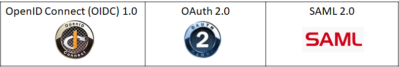

By Andrew Cameron and Graham Williamson

© 2020 Andrew Cameron, Graham Williamson, IDPro

*Note: the IDPro BoK does not endorse a particular architecture
framework. IAM practitioners will face many different approaches, and an
IAM practitioner will need to adopt the model that best suits their
organization.*

Introduction
============

Identity and Access Management (IAM) touches all aspects of an
organization's IT environment. Whether it is the human resources (HR)
system, email system, phone system, or corporate applications, each
system needs to interface to the IAM environment. IAM will always play a
role in making IT operations efficient and secure, by supporting the
enforcement of user provisioning rules, as an example, or validating the
access of non-corporate users. An architectural approach to developing
IAM systems will heighten the probability that the organization will
achieve a consistent and comprehensive IAM solution.

If the organization maintains an enterprise architecture (EA), any IAM
solution they deploy must adhere to the enterprise models and be
reflected in the organization's EA artifacts. This article provides a
basic approach for IAM professionals to consider whether or not there is
an EA in place.

Terminology
-----------

-   **Access Management** : use of identity information to provide
    access control to protected resources such as computer systems,
    databases, or physical spaces.

-   **Architecture** : Framework for the design, deployment, and
    operation of an information technology infrastructure. It provides a
    structure whereby an organization can standardize the technology it
    uses and align its IT infrastructure with digital transformation
    policy, IT development plans, and business goals.

-   **Architecture Overview** : Describes the architecture components
    required for supporting IAM across the enterprise.

-   **Architecture Patterns** : Identifies the essential patterns that
    categorize the IT infrastructure architecture in an organization and
    will guide the deployment choices for IAM solutions.

-   **Enterprise Architecture:** an architecture covering all components
    of the information technology (IT) environment

-   **Identity Governance and Administration (IGA):** includes the
    collection and use of identity information as well as the governance
    processes that ensure the right person has the right access to the
    right systems at the right time.

Acronyms
--------

-   BPMn -- Business Process Mapping notation

-   HTTP -- HyperText Transfer Protocol

-   JSON - file structure for the communication of data attributes

-   RESTful API - architecture for a programming interface defining how
    HTTP methods are to be used

-   SAML -- Security Assertion Markup Language

-   SCIM -- System for Cross-domain Identity Management

-   XML - eXtensible Markup Language - a file structure for the
    communication of data attributes

IAM Architecture Overview
=========================

IAM professionals must have a vision for the IAM environment that
satisfies corporate requirements. Each IAM project must build towards
the desired target state. An architectural approach will enable the IAM
professional to plan, design, and deploy IAM solutions that are both
coordinated and integrated; and combine to form a comprehensive IAM
environment that meets both current and projected needs of corporate
stakeholders.

Identity management within an enterprise touches virtually all systems
in use within the organization. Systems, in this context, comprise
computer systems that staff and business partners use in the performance
of their job responsibilities and physical access systems, such as a
requirement to show an identity pass to gain access to a restricted
area. Staff includes contractors; they are typically managed through a
different system (many HR systems only accommodate employees) but need
access to many of the same corporate systems as employees. Including
non-human accounts should also be considered; most organizations have
service accounts that they for machine access to systems. As more
automation is incorporated into company operations, providing access
control for sensors or bots should be incorporated in the IAM
environment. Including non-human entities in the architecture allows the
enterprise to manage their access control in a manner consistent with
all other accounts; IAM professionals should consider these entities
should during the system development planning process.

It is the task of an IAM practitioner to ensure that, wherever and
whenever identity information is used within an enterprise, the
information is collected and used in a properly designed environment
that ensures efficiency, protects privacy, and safeguards integrity.
Applying an architectural approach, i.e., developing project
requirements within a structured framework, will significantly raise the
likelihood that an IAM project will be completed consistently and
comprehensively with a controlled impact on stakeholders.

There are four levels that the IAM practitioner should consider when
developing a solution architecture:

{width="281" height="66"}

Figure 1 - Generic Enterprise Architecture Framework

Business System Architecture (BSA)
----------------------------------

Mapping business processes for the collection, usage, and eventual
deletion of identity data will greatly assist in understanding the
breadth of the IAM task. While BPMn is typically used for business
process mapping, the IAM practitioner should adopt whatever tool is
typically used in their company.

Considering IT architecture at the business level will facilitate a more
holistic approach that considers the identity requirements of all
connected systems and ensures consistency in naming conventions. It will
also reduce the probability of an IAM project running over-budget or
over-time (a common occurrence when a system owner, who has not
previously been consulted, hears about an IAM project and adds
unanticipated requirements).

Information Architecture
------------------------

It is important to map the identity data elements required by the
various applications to the IAM collection, management, and governance
systems. This mapping will ensure no application is 'left behind' when
the IAM systems are re-developed. A useful tool is an
'entity-relationship diagram' that maps each attribute collected to each
system that requires it. The Information Architecture (IA) should drive
consistency between connected systems (e.g., should Firstname, Middle
Initial, and Lastname be used, or should Common name, Lastname be used).
It should also help define roles (e.g., is this role for a Payroll Clerk
or a Financial Officer). The IA should nominate attribute authority
(e.g., which system is the authority for phone numbers). Best practice
is for the IAM system to be the 'source of truth' for identity
information in the company (sometimes called the 'book of record')
because it is typically bad practice for source systems (HR, PABx, etc.)
to be queried for data attribute lookups.

The IA becomes the vehicle for 'identity data orchestration.' It is the
master plan for the collection and use of identity data within an
enterprise.

Application Portfolio
---------------------

An inventory of applications to be included in the IAM project
[^1^](#fn1){#fnref1 .footnoteRef} should be conducted. How current are
they? Are any of the included applications under development? Will the
IAM project materially change how each application interacts with the
IAM environment? For instance, if an API gateway is being deployed for
access to IAM attributes, any application redevelopment should migrate
from existing authentication mechanisms to the gateway operation.

A company's Application Portfolio (AP) becomes an inventory of corporate
applications. The record for each application should identify the system
owner, type of application (web app, client-server, mainframe, etc.),
and its reliance on the IAM environment. Some applications will expect
the IAM system to pass authenticated sessions to it. In contrast, others
will require user attributes so that it can determine the authorization
that a user has to application functionality. The AP should identify the
level of integration between each relying application and the IAM
system. Web applications will likely pass user requests and responses
via HTTP headers. In other scenarios, client-server applications may use
an API, while cloud applications may use a SAML request or, if it
maintains its own data repository, the SCIM protocol.
[^2^](#fn2){#fnref2 .footnoteRef}

The AP becomes an important record for an organization because it
facilitates the planning required as applications are updated.

Technical Architecture
----------------------

The Technical Architecture (TA) describes, among other things, the
technical environment to be supported by the IAM environment. This
description will involve understanding the patterns used within the
company. Most organizations will have "n-tier" web services and hybrid
cloud patterns, but there might still be client-server patterns and
potentially mainframe hub-and-spoke patterns. Each additional pattern to
be supported will increase the complexity and cost of the project. Often
IAM environments with older infrastructure, such as RACF directories,
leave out support for legacy technology due to cost considerations, but
this fragments the IAM task. Properly constituted, a cost/benefit
analysis for the deployment of an RACF connector will typically be
successful.

The TA impacts the IAM environment because different solutions are
required for different patterns. For example, a web services pattern
will mandate a single sign-on (SSO) environment capable of supporting
RESTful APIs and SAML assertions and passing identity attributes in JSON
arrays or XML files. An on-premise Windows environment, as another
example, will typically use the Kerberos authentication protocol from an
AD infrastructure or an LDAP directory. A cloud environment will often
require a SAML operation or an IDaaS offering, whereas a RACF directory
should be supported via a connector from the IAM infrastructure.

Architectural Approach
======================

It is an unfortunate fact that many IAM (identity and access management)
projects exceed their scheduled time and budget. The usual reason for
this is a misunderstanding of the extent of the project and the systems
impacted. The project team tends to focus just on the task at hand,
e.g., the installation of the IAM software package, without realizing
that IAM systems within an enterprise touch virtually all other systems
in use within the organization. These other systems might include a
birthright system such as email, an administrative system such as the
Financial Management system, or an operational system such as an
Enterprise Resource Management system.

In some circumstances, the change caused by an IAM project will be
minimal, with a limited impact on resources. In other cases, the change
will be significant, impacting both infrastructure and personnel across
the organization. An architectural approach will ensure that a solution
architecture is developed for each IAM project to understand the extent
of the work required and effectively plan for the change it will
generate.

It is the task of an IAM practitioner to ensure that, wherever and
whenever identity information is used within an enterprise, the
information is collected and used in a properly designed environment
that ensures efficiency, protects privacy and safeguards integrity.

For organizations with an enterprise architecture, understanding how
information is collected and used should be quite easy, as is
fundamentally a part of how the systems are deployed. For other
organizations, the environment will be a "greenfield," allowing the IAM
practitioner to develop their own architectural approach.

Architecture Patterns
---------------------

At the Technical Architecture level, a "pattern" approach is useful to
understand the supported technology within an organization. For
instance: what is the predominant server infrastructure -- is it Linux
or Windows or both? What server operating system versions are supported?
Are VMs used? What is the support for cloud infrastructure -- public,
private, hybrid? Is AWS, Azure, or Google Cloud supported? Can the scale
required for customer IAM be accommodated? For IoT devices -- how does
the IoT platform integrate with the corporate environment?

The TA will define the computer system "patterns" to be supported by the
IAM environment within an organization. For young companies, this will
be web-based patterns, either "2-tier" or "n-tier." Increasingly managed
cloud environments are being engaged, potentially with a micro-services
approach. But for mature organizations, there will typically be legacy
applications with a client-server pattern, or even a mainframe 'hub and
spoke' pattern, with PCs running terminal emulator software.

The IAM environment must support the selected patterns and ensure a
managed approach that adheres to the organization's governance and
cybersecurity policy.

### Host

There are few mainframe systems left in service, with notable exceptions
in the banking industry and some government installations. The IAM
environment will often be required to synchronise to a RACF data store
to support a mainframe system.

{width="281" height="66"}

Figure 2 - Mainframe application accessed from a monitor

### Client-Server

Client-server environments can present a complex support requirement
since many such systems maintain their own identity database in order to
provide fine-grained access control to system functionality.
Redevelopment of a client-server application to externalise access
control decisions to an authentic authorization server can be a way to
harmonise access policies across an organization.

{width="272"
height="57"}

Figure 3 - Client application access a backend server

### 

### N-tier

The most common on-premise application environment these days is an
"n-tier" web services infrastructure. While there are many variants, a
user accessing the front-end web server will be redirected to an
authentication service, usually supporting SSO, with an authentication
token passed back to the application in an HTTP header. If the
application requires user authentication, the IAM system should set us
user entitlements as part of the initial provisioning activity when a
user joins the organization.

{width="438" height="70"}

Figure 4 - Common web-services model

### Hub & Spoke

Hub and spoke systems are typically only in large transaction processing
systems. Often the only IAM touchpoint is access control for DevOps
staff via a privileged access management system.

{width="325" height="148"}

Figure 5 - Common data service configuration

### Remote Access

Increasingly remote access to corporate systems must be supported. The
authentication server must accommodate the required access control
mechanisms used, from basic LDAP lookups for password accounts to
sophisticated MFA environments capable of elevating authentication
levels to suit application security requirements. The provisioning task
in such environments requires the maintenance of one or more identity
provider services within the enterprise.

{height="148" width="325"}

Figure 6 - Typical enterprise network access model

### 

### Cloud Environments

Most organizations employ cloud services these days and the IAM
environment must support the adopted pattern. In some cases it will be
100% cloud, in some cases it will be a hybrid cloud/on-premise
environment. In the cloud it might be private cloud infrastructure or
one of the public cloud platforms that are adopted. The IAM professional
must ensure the selected pattern is supported so that any relying
application is serviced by up-to-date identity data.

{width="577"
height="225"}

Figure 7 - Cloud-based architecture model

The architecture patterns supported by an organization directly affect
the cost of maintaining their Information and Communications Technology
(ICT) operations. Each additional pattern increases the overall cost.
The IAM environment must support the patterns in use and must
accommodate pattern rationalization as companies reduce the complexity
of their infrastructure. For instance, companies retiring mainframe
systems that typically use RACF for authentication will need an
alternate solution. IAM practitioner should be involved across ICT
development programs to ensure the IAM environment supports the
direction of the enterprise.

Applying an Architectural Approach
==================================

An architectural approach can be taken to an IAM project regardless of
whether it is in the collection and management of identity information
or access management, using identity information for access control to
protected resources.

Identity Governance and Administration
--------------------------------------

Identity Governance and Administration (IGA) covers the identity
management side of IAM, i.e., the 'admin-time' events that establish
user entitlements, as opposed to 'real-time' events that occur when
users request access to protected resources. IGA combines administration
and governance over the collection, use, and disposal of identity
information. It requires a governance facility that enables managers to
certify the entitlements that their staff have been granted. In
addition, IGA typically includes monitoring and reporting functions for
identity services that, in turn, support corporate requirements.

IGA systems support:

-   Administering accounts and credentials

-   Identity and account provisioning

-   Managing entitlements

-   Segregation of duties

-   Role management

-   Analytics and reporting

IGA systems provide additional functionality beyond standard IAM
systems. In particular, they help organizations meet compliance
requirements and enable them to audit access for compliance reporting.
They also automate workflows for tasks such as access approvals and
provisioning/deprovisioning.

### Identity Lifecycle

The business rules that tie these elements together are generally
referred to as the Identity Lifecycle. In the Identity Lifecycle, an
identity is created that defines who or what (human or non-human) needs
access to a protected resource. Every stage of the Identity Lifecycle
sees the activities of the identity managed to ensure business rules are
enforced according to the identity and security rules of the enterprise.

{width="624"
height="260"}

Figure 8 - Identity Lifecycle Categories

### IGA System Components

Identity governance and administration tools help facilitate identity
lifecycle management.

IGA systems generally include the following components for identity
administration:

-   **Password management** : Using tools like password vaults or, more
    often, SSO, IGAs ensure users don't have to remember many different
    passwords to access applications.

-   **Integration connectors** : These are used to integrate with
    directories and other systems that contain information about users
    and the applications and systems they have access to, as well as
    their authorization in those systems.

-   **Access request approval workflows** : These workflows support the
    automation of a user's request for access to applications and
    systems, and ensures all access is properly authorized.

-   **Automated de-provisioning** : This supports the removal of a
    user's entitlement to access an application when the user is no
    longer authorized to access a system.

-   **Attestation reporting** : This is used to periodically verify user
    entitlements in various applications (such as add, edit, view, or
    delete data) and is usually sent to a user's manager.

-   **Recertification of user entitlements** : Often a response to an
    attestation report, recertification of user entitlements involves
    recording a manager's approval of their staff's system access. If
    access is no longer required, this shifts to automatic
    de-provisioning.

-   **Segregation of duties** : An IGA system will often have rules that
    prevent risky sets of access from being granted to a person. For
    example, if a person has the ability to both view a corporate bank
    account and transfer funds to outside accounts, this might enable a
    user to transfer money to a personal account.

-   **Access reviews** : These reviews include tools that streamline the
    review and verification (or revocation) of a user's access to
    different apps and resources. Some IGA tools also provide discovery
    features that help identify entitlements that have been granted.

-   **Role-based management** : Also known as Role-based Access Control
    (RBAC), this includes defining and managing access through user
    roles.

-   **Analytics and reporting** : This includes tools that log
    activities, generate reports (including for compliance), and provide
    analytics to identify issues and optimizations.

### IGA Solution Architecture

An example of how an IGA solution could support and authentication
service is shown in Figure 8 (access management shown for context):

{width="624" height="382"}

Figure 9 - IAM Architecture Components

This architecture supports the following IAM Processes:

| Process | Description |
| --- | --- |
| Identity Provisioning | Creates identity records based on initiation from trusted identity sources (e.g., the HR System) |
| Account Provisioning | Creates accounts in Enterprise Directories based on birthright provisioning rules. Also supports creation of application accounts based on request / approval workflows. |
| Entitlement Management | Supports the workflow and administration requirements of enabling user to group/role mappings that enable access management rule creation. |

Access Management
-----------------

Access Management is the 'real-time' component of IAM. It encompasses
the processes that are critical in protecting corporate resources and
securing the digital business. Whether it is giving access to customers
to enable e-commerce or securing resources for partners to conduct
business securely, the Access Management architecture will control the
planning, design, and development of the enabling technology.

### Access Management Overview

An access management architecture will have components that enable only
those accounts that are authorized to perform an action on a protected
enterprise resource.

The key functions supported in an Access Management Architecture are:

-   User Authentication (staff, contractors, business partners)

-   Access Policy Management

-   Access Policy Decision making and enforcement

-   Authorization Control (Coarse / Fine-Grained)

-   Adaptive Access controls

-   Single Sign-On (SSO)

-   Authenticated Session Management

-   Security Token Services

-   Access Event Logging

-   User Behavior Analytics

### Access Management Solution Architecture

The two most common Access Management services supported in most
scenarios are:

-   Authentication -- logging into a computer system - typically
    role-based

-   Authorization -- accessing computer system functionality --
    typically attribute-based

Policy-based authorization is increasingly being deployed. It provides
access control to corporate resources in accordance with centrally
managed corporate policy rather than entitlements established on a
system-by-system basis.

An example of a fine-grained authorization environment is shown in
Figure 9. The components of the solution combine to control access to
corporate resources based on the policies in the Decision Point.

{width="624" height="386"}

Figure 10 - Typical Components of an Authorization Service

The architecture of an authorization service will typically contain the
key elements that are involved in the flow from an actor (person or
system) on a device (mobile or desktop) that accesses an application or
service (typically over the internet) that resides within an enterprise
boundary (behind network firewalls).

| | |
| --- | --- |
| Policy Administration Point (PAP) | responsible for creating policy statements that tie the user to a role or group and defines the type of access to a resource |
| Policy Enforcement Point (PEP) | responsible for protecting the resource, intercepts traffic to the resource and validates access with the PDP |
| Policy Decision Point (PDP) | determines access to a resource, uses policy to determine if a subject (user) has access to a resource, usually via an attribute value or role or group membership. |
| Policy Information Point (PIP) | typically a user or attribute store that provide information about managed users (i.e., Active Directory or LDAP directory) |

### Access Management Patterns

A well-crafted IAM architecture is able to both improve user experience
and increase security by combining the flow between architecture
components in a connected, orchestrated framework. Historically,
organizations have seen security and ease of use as tradeoffs, but with
the new identity technologies available today it is possible to have
both.

When combining these key components in a deployment blueprint (solution
configuration), an architecture pattern evolves to support most, if not
all, access management needs across the organization.

{width="624" height="309"}

Figure 11 - Access Management Patterns

| Pattern | Description |
| --- | --- |
| Browser to Web Application  | A user needs to sign in to a web application that is secured by an Authentication Service |
| Native App (also Single Page App) to Web API | A native application needs to authenticate a user to access resources from a web API that is secured by an Authentication Service |
| Server App to Web API | A server application with no web user interface needs to get resources from a web API secured by an Authentication Service |

Identity Standards
------------------

No IAM solution architecture is complete without addressing the
applicable standards. Because IAM touches virtually all corporate
systems, interfaces need to adhere to standards in order to minimize the
amount of customization that would otherwise be required. An IAM
Architecture should support a "pluggable" approach that facilitates
interconnection and ties together key security enablers that are built
on industry standards. There are several industry organizations
(standards bodies) like IETF, OASIS, Kantara Initiative, and the OpenID
Foundation.

The key standards that support modern identity and access management
today are:

{width="624" height="105"}

Figure 12 - Logos for OIDC[^3], OAuth2 [^4], SAML [^5]

Conclusion
==========

IAM practitioners should adopt the enterprise architecture approach used
within the organization in which they are working. In the absence of a
corporate approach to architecture, IAM practitioners should develop an
architectural approach that ensures their IAM projects consider all the
business systems that might be affected, the types of applications to be
supported, and the infrastructure on which IAM solutions are to be
deployed.

An IAM project that takes such an approach will have a significantly
better chance of being completed within schedule and budget constraints.
It will also be much more likely to satisfy users.

Authors
-------

Andrew Cameron

{width="111" height="116"} Andrew
Cameron is the Enterprise Architect for Identity and Access Management
at General Motors. His responsibilities include Defining the Strategy
and Implementation Roadmaps of their IAM technology platform and
ensuring architectural quality of the many initiatives that are driving
the GM digital business.

Graham Williamson

{width="112"
height="112"} Graham Williamson is an IAM consultant working with
commercial and government organizations for over 20 years with expertise
in identity management and access control, enterprise architecture and
services-oriented architecture, electronic commerce and public key
infrastructure, as well as ICT strategy development and project
management. Graham has undertaken major projects for commercial
organizations such as Cathay Pacific in Hong Kong and Sensis in
Melbourne, academic institutions in Australia such as Monash University
and Griffith University, and government agencies such as Queensland
Government CIO's office and the Northern Territory Government in
Australia and the Ministry of Home Affairs in Singapore.

------------------------------------------------------------------------

1.  Readers may find the IDPro BoK article "Introduction to Project
    Management for IAM Projects" of interest. See Williamson, Graham,
    and Corey Scholefield, "Introduction to Project Management for IAM
    Projects," IDPro Body of Knowledge, vol 1, issue 1, March 2020,
    <https://bok.idpro.org/article/id/25/>.

2.  "SCIM: System for Cross-domain Identity Management"
    <http://www.simplecloud.info/>. 

3.  OpenID Connect, website, OpenID Foundation,
    <https://openid.net/connect/>. 

4.  OAuth2, website, <https://oauth.net/2/>.

5.  "Security Assertion Markup Language (SAML) V2.0 Technical Overview,"
    OASIS,
    <http://docs.oasis-open.org/security/saml/Post2.0/sstc-saml-tech-overview-2.0.html>.

