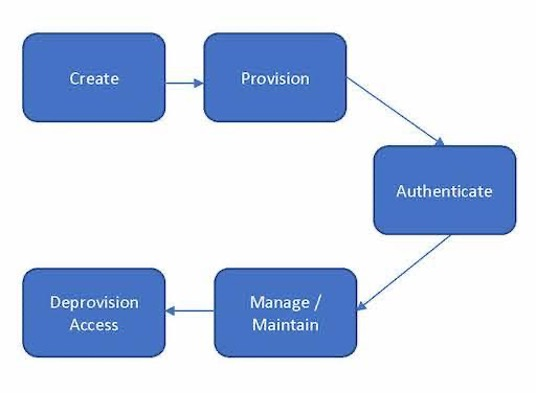

By Andrew Cameron and Olaf Grewe

© 2022 IDPro, Andrew Cameron, Olaf Grewe

Introduction to Digital Identity
================================

A digital identity, for the purpose of this document, is defined as the
combination of a unique identifier together with relevant attributes
that uniquely identifies an entity. Depending on the complexity of the
environment in which a digital identity is used, its lifecycle—from its
inception to its closure—can be significantly more complicated than a
simple create, read, update, and delete (CRUD)
lifecycle.<a href="#fn1" id="fnref1" class="footnote-ref">1</a>

Depending on the type of identity (human such as Workforce or Customer,
and non-human types such as System or Device), the lifecycle phases will
differ. Enterprise IAM has typically been a well-established set of
processes that provide the processes and governance capabilities to
ensure only the correct people (via their accounts) have access to only
the required applications (resources). Customer IAM has an entirely
different set of requirements that represent value to a business due to
the nature of its defining interactions with a customer. Poor or
inefficient interactions with customers can have severe negative effects
on a business. For these reasons, the different identity types will
require separate systems and processes supporting them:

|                   |                                                                                                                                                                                                                                                                                                                                                                  |
|-------------------|------------------------------------------------------------------------------------------------------------------------------------------------------------------------------------------------------------------------------------------------------------------------------------------------------------------------------------------------------------------|
| **Identity Type** | **Description**                                                                                                                                                                                                                                                                                                                                                  |
| Workforce         | A workforce identity is one created to function in an enterprise context, which may include a Business-to-Business (B2B) and/or Business-to-Employee (B2E). Examples of these identity types will be Employees, Suppliers, Contractors, or other human identities that support the corporate workforce.                                                          |
| Customer          | A customer identity type will usually function outside the enterprise context, enabling digital business between the owner of the customer identity and the enterprise. Typically, there will be multiple channels (Web, Mobile, IoT Device) of access to manage with a larger set of profile (identity attribute) data necessary to facilitate the interaction. |
| Device or System  | Device identities typically are used to provide identification and representation on a digital network. System identities are used to authenticate services (e.g., applications or server-based processes) to a network.                                                                                                                                         |

Terminology
-----------

-   Digital Identity – the combination of a unique identifier together
    with relevant attributes that uniquely identifies an entity.

-   Journey-based Creation – The process that guides a customer through
    a series of interactions prior to establishing a digital identity.
    For example, capturing the minimum basic information needed from a
    customer to enable creation of an identity.

-   Attributes - Key/value pairs relevant for the digital identity
    (username, first name, last name, etc.).

-   Inter-organizational (Federation): An organization relies on another
    organization’s digital identity and lifecycle management processes.

-   Intra-organizational (Single Sign-On): A central digital identity,
    such as an account in a directory, is linked by downstream systems
    as authoritative for authentication.

Identity Lifecycles
===================

For any lifecycle ‘create’ phase, a digital identity is created as a
unique identifier in a system of record. It can be created either as
part of a business process (workforce or device identity) or
transparently as part of a user journey (customer identity).

Throughout its lifecycle, a digital identity enables digital
transactions through all of its assigned accounts and the entitlements
assigned to those accounts. Although a lifecycle is outlined as a
continuum in this document, the reader should expect that:

-   The digital identity lifecycle could be distributed across multiple
    technical solutions in most organizations.

-   Some steps in the lifecycle (e.g., authenticate, use) will occur
    more frequently than others (e.g., merge, delete).

Workforce Identity
------------------

The workforce identity lifecycle is addressed through three principal
business processes: Joiner, Mover, or Leaver. The **Joiner** processes
cover all lifecycle phases that facilitate the creation of assets
(identities, accounts, group memberships, etc.) to enable identification
and access in an enterprise environment. The **Mover** process allows
for changes or updates to identity status while still engaged in the
enterprise environment and considers the necessary attestation processes
to verify access permissions and entitlements. The **Leaver** process
covers the series of steps that must occur when an identity is removed
from access to the enterprise environment.

Figure 1 depicts the workforce IAM phases in the process:

*Figure 1 –* *Core IAM Processes*

The following table describes the phases that support the workforce
identity lifecycle:

<table>
<colgroup>
<col style="width: 50%" />
<col style="width: 50%" />
</colgroup>
<tbody>
<tr class="odd">
<td><strong>Lifecycle Phase</strong></td>
<td><strong>Description</strong></td>
</tr>
<tr class="even">
<td>Create Identity</td>
<td>
The creation of a workforce identity as part of a business process (employees, suppliers, etc.) is frequently combined with the collection of proof to establish a minimum set of attributes to be associated with the identifier. The creation of a digital identity may be automated (e.g., synchronized with an HR system event), especially when digital identities are generated at scale for various purposes, such as a merger or acquisition.

Enrollment processes for workforce entities frequently involve other human entities (such as a line manager or delegated admin agent) validating the proof provided. In countries without an established national identity system (US, UK, AU, etc.), it can be required to provide multiple documents as proof (driver’s license, passport, utility bill, bank card/statement) in lieu of a national identity document.
</td>
</tr>
<tr class="odd">
<td>Provision Account</td>
<td>Create accounts in enterprise systems based on business rules and required access to resources.</td>
</tr>
<tr class="even">
<td>Provision Access</td>
<td>Create entitlements by associating user accounts to objects that enable access to corporate resources in the required systems. Entitlements are generally represented by attribute values, group memberships, or organizational alignment. Business rules will define access to a resource based on enterprise entitlements.</td>
</tr>
<tr class="odd">
<td>Authenticate</td>
<td>Require a user account to validate a credential before allowing access to a network or resource.</td>
</tr>
<tr class="even">
<td>Manage Access</td>
<td>
Validate that the access that has been assigned an account and approving continued access to corporate resources. Access certification is a process that validates all current access and can be used to remove no longer needed access. The attestation process for verifying and access is a critical and often underestimated component of a mature IAM system.

Digital identities are frequently subject to updates, primarily of their attributes. Less frequently, the identifier itself may change. An example is a digital identity for which the username is also used as the identifier (e.g., email address). A user may wish to change their username for various purposes, such as a name change due to a life event or a change of preferences. For an in-depth discussion, please refer to Ian Glazer’s article, “Identifiers and Usernames.”<a href="#fn2" id="fnref2" class="footnote-ref">2</a>

Frequently update the use cases describing workflow capabilities that address approval, step-up, or notification requirements. These are important controls to address identity take-over risks. Depending on the value of the digital identity for the organization, updates to digital identities may be subject to enrolment-type proofing.
</td>
</tr>
<tr class="odd">
<td>Deprovision Access</td>
<td>
Remove access to any or all corporate resources. The need to remove access could occur as a result of a Leaver process or a validation from an Access Certification. When a digital identity is not required anymore, it should be disabled in the system of record. This action implies not only disablement or deletion from a central directory but also downstream systems that maintain records associated with this digital identity as well as logging and auditing repositories. Only once the identifier used for this digital identity has been removed from all systems can a digital identity be considered genuinely deleted.

A detailed discussion on the importance of account disable or removal given current best practices can be found in Andrew Hindle’s article, “Impact of GDPR on Identity and Access Management.”<a href="#fn3" id="fnref3" class="footnote-ref">3</a>
</td>
</tr>
</tbody>
</table>

Customer Identity
-----------------

Customer IAM has evolved more recently to support the processes that
govern consumers’ User Experience as they interact with digital
business. CIAM solutions have developed to provide companies with added
value from the data they collect from customers as a result of the
customers’ experiences with corporate websites and services. Most
customer experiences are described as part of a “User Journey,” which
represents the interactions (Authentication, Registration, Profile
Update) that a customer has when engaging with digital resources such as
websites, mobile apps, or IoT interfaces.

The following diagram depicts the phases of the CIAM Lifecycle.

*Figure 2 – The Customer Identity Lifecycle*

The following table describes the phases that support the customer
identity lifecycle:

<table>
<colgroup>
<col style="width: 50%" />
<col style="width: 50%" />
</colgroup>
<tbody>
<tr class="odd">
<td><strong>Lifecycle Phase</strong></td>
<td><strong>Description</strong></td>
</tr>
<tr class="even">
<td>Register</td>
<td>
The first part of the user journey is the creation of a customer identity through a registration process. This registration typically happens where a digital identity is required to enable an experience. Information is captured from a user as part of a user journey, and the user is allowed to consent to usage of the data provided. Registration interactions are typically a one-time interaction with the customer that concludes with a confirmation of the purpose of the flow (i.e. “Your account has been created”). Registration interactions can also be transparent to the user if enabled thru a federated identity such as a social account sign-in (i.e., “Sign in with your Facebook account to get registered”).

Registration does not require mandatory attributes other than the linking steps in the user journey to the identifier. Depending on the nature of the digital transaction, customer identities may require assurance over several attributes. A key consideration here is the attributes used to establish ownership (or recovery) for a digital identity, either via human or non-human means.
</td>
</tr>
<tr class="odd">
<td>Manage Profile Data</td>
<td>
Each customer has a profile and managing the profile data involves a user experience that allows a customer to update their data across corporate resources (e.g., websites or mobile apps).

This phase primarily applies to user journey-based digital identities. In order to enable digital services to resume user journeys, it is necessary to enhance the digital identities with attributes that are specific to the way the user accesses the service. Two common techniques are cookies or device fingerprinting. For an illustration of the latter, see the EFFs Panopticlick site.<a href="#fn4" id="fnref4" class="footnote-ref">4</a>
</td>
</tr>
<tr class="even">
<td>Manage Privacy and Consent</td>
<td>The customer lifecycle must include a process that informs and enables the customer to invoke their rights around knowledge and consent of what can happen with their customer information.</td>
</tr>
<tr class="odd">
<td>Authenticate</td>
<td>As part of the workflow, the customer is required to validate their credential prior to accessing any customer services</td>
</tr>
<tr class="even">
<td>Manage Access</td>
<td>
The customer lifecycle will require managing access to business services based on customer interactions.

The user may also choose to provide additional attributes. The service would typically allow the user to create a username and password to login after their current session has expired. At this stage, a service may be able to combine multiple identifiers created by different devices (mobile, desktop, laptop, etc.). At this stage, the digital identity is considered pseudonymous as there is no assurance over the attributes provided by the user.
</td>
</tr>
<tr class="odd">
<td>Monitor</td>
<td>After the initial phases are complete, the customer lifecycle will move into monitoring, where the process of mining/collecting data about the customer and their experiences support a variety of business and consumer requirements occur. From a security perspective, monitoring data can be used to notify the customer of leaked credentials or other breaches of information. The business can also benefit by leveraging historical usage information of customer activity thru an analytics service.</td>
</tr>
<tr class="even">
<td>Remove Access</td>
<td>Removal of customer access is typically done as a result of a customer request or based on some amount of inactivity measure.</td>
</tr>
</tbody>
</table>

Device or System Identity
-------------------------

A device or system identity is an evolving area in that devices are
being enabled with increasing levels of technological capability, which
increases the need to identify and manage them through a lifecycle. For
example, cars have dozens of internal systems that require sophisticated
management capabilities over the life of the vehicle identity. On the
other end of the scale, some simple monitors can connect to a network
and only provide a temperature value or some other basic information.
All devices will need specific lifecycle phases to manage them based on
their capabilities.

*Figure 3 – The Device Identity Lifecycle*

The following table describes the phases in a simple model that support
the device identity lifecycle:

|                     |                                                                                                                                                                                                                                                                                                                                                  |
|---------------------|--------------------------------------------------------------------------------------------------------------------------------------------------------------------------------------------------------------------------------------------------------------------------------------------------------------------------------------------------|
| **Lifecycle Phase** | **Description**                                                                                                                                                                                                                                                                                                                                  |
| Create              | The first stage in the device or system lifecycle is to kick off the process of creating the identifier that will be assigned to the device or system.                                                                                                                                                                                           |
| Provision           | When the identifier is assigned, the process of enabling the device or system to be recognized, monitored, and managed. Device provisioning is typically done using some sort of certificate or PKI infrastructure to ensure that only known devices can interact with corporate resources.                                                      |
| Authenticate        | Device or system authentication typically is done using a PKI infrastructure that ensures that the connected device is known and allowed to interact with the network.                                                                                                                                                                           |
| Manage / Maintain   | Once the initial phases are complete, the device or system must be monitored to determine if any actions are needed to maintain the device. As an IT security best practice, credentials (passwords) associated with non-human identities should be rotated on a periodic basis to enable protection against brute force password-based attacks. |
| Deprovision Access  | When the device or system is no longer in use (which may require different processes than workforce or customer digital identities to determine), remove access of the device or system from the system of record, disabling any access to the corporate network.                                                                                |

Other Digital Identity Relationships
====================================

Some digital transactions require an organization to establish
relationships between digital identity issuers, also known as identity
providers. These relationships may be with external partners (e.g., a
B2B relationship) or across various enterprise applications (e.g., a
single sign-on environment). In addition, digital identities may be
related to other identities within an organization to establish
delegation authority or to manage dual-control requirements. In all
cases, relationships are typically managed either as attributes of the
digital identity (e.g., identifiers for the allowed services) or as
separate data points in a central directory (e.g., membership in an LDAP
group).

Common types of relationships are:

<table>
<colgroup>
<col style="width: 50%" />
<col style="width: 50%" />
</colgroup>
<tbody>
<tr class="odd">
<td>Inter-organizational (Federation)</td>
<td>

An organization relies on the digital identity and lifecycle management processes of another organization.
</td>
</tr>
<tr class="even">
<td>Intra-organizational (Single Sign-On)</td>
<td>

A central digital identity, such as an account in a directory, is linked by downstream systems as authoritative for the purpose of authentication.
</td>
</tr>
<tr class="odd">
<td>Inter-entity (Delegation)</td>
<td>

Delegation involves assigning a subset of authority from an identity in one business domain to an identity that resides in another business domain. In this example, business domain refers to defined boundaries that exist within or across an entity, which enables policy enforcement to occur. Examples of business domain include company, organization (within a company) or even work teams (within an organization). Authority is granted across domain boundaries for the purpose of enabling the transactions within the scope of a policy. Authority can be granted either explicitly or based on business rules (policies) defined at the domain level.
</td>
</tr>
<tr class="even">
<td>Intra-entity</td>
<td>

Either user-driven or out of organizational requirements, a relationship is established between multiple digital identities to identify a single human or non-human entity as the owner (see Enhance above).
</td>
</tr>
</tbody>
</table>

Conclusion
==========

The complexity of the digital identity lifecycle frequently becomes
apparent only after a number of years and as more functionality gets
added to systems. Therefore, it is advisable to approach life cycle
requirements with a longer-term horizon and ensure user management
capabilities are extensible.

Acknowledgements
================

The author would like to acknowledge Ian Glazer for articulating the
progression of an identity from anonymous to pseudonymous and known.
Dean Saxe contributed the classification of relationships. Jon Lehtinen,
and Heather Flanagan contributed encouragement and suffered through
early drafts of the article.

Change Log
==========

| Date       | Change                                                                                                                              |
|------------|-------------------------------------------------------------------------------------------------------------------------------------|
| 2022-02-28 | Updated definition of digital identity; clarified the use of the term ‘lifecycle’; updated diagrams; updated Delegation description |
| 2020-10-30 | V1 published                                                                                                                        |

------------------------------------------------------------------------

1.  

    “Create Read Update Delete” ldapwiki.com, paged last modified 19
    March 2020,
    [<u>https://ldapwiki.com/wiki/Create%20Read%20Update%20Delete</u>](https://ldapwiki.com/wiki/Create%20Read%20Update%20Delete).<a href="#fnref1" class="footnote-back">↩︎</a>

    

2.  

    Glazer, Ian, “Identifiers and Usernames,” IDPro Body of Knowledge,
    31 March 2020,
    [<u>https://bok.idpro.org/article/id/16/</u>](https://bok.idpro.org/article/id/16/).<a href="#fnref2" class="footnote-back">↩︎</a>

    

3.  

    Hindle, Andrew, “Impact of GDPR on Identity and Access Management,”
    IDPro Body of Knowledge, 31 March 2020,
    [<u>https://bok.idpro.org/article/id/24/</u>](https://bok.idpro.org/article/id/24/).<a href="#fnref3" class="footnote-back">↩︎</a>

    

4.  

    “Panopticlic 3.0,” Electronic Frontier Foundation, viewed 13 April
    2020,
    [<u>https://panopticlick.eff.org/</u>](https://panopticlick.eff.org/).<a href="#fnref4" class="footnote-back">↩︎</a>

    

