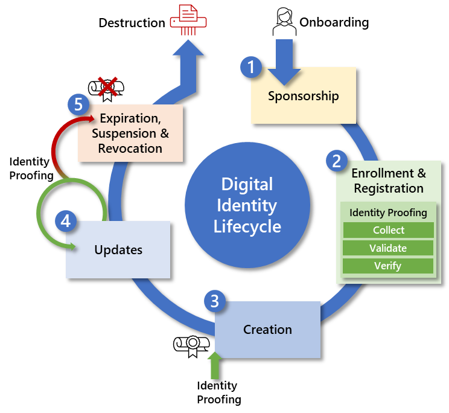

Russ Reopell, Sandy Christopher, and Lorrayne Auld

© 2023 IDPro, Russ Reopell, Sandy Christopher, and Lorrayne Auld

To comment on this article, please visit our [GitHub
repository](https://github.com/IDPros/bok) and submit an
[issue](https://docs.github.com/en/github/managing-your-work-on-github/opening-an-issue-from-code).

Abstract
========

Identity proofing, process by which a credential service provider
collects, validates, and verifies information about a person, is a
critical step for many identity systems. This article explores identity
proofing in general and why current practices are challenging. While the
article is largely informed by the identity proofing examples within the
United States, the concepts are globally applicable.

Introduction
============

Whether you’re purchasing merchandise online or requesting financial or
medical services from the federal government or health care providers,
being able to prove you are who you claim to be and are indeed entitled
to the goods and services you are attempting to access has become a
crucial and required fact of everyday life. This article helps readers
understand the difficulties and challenges they may face in registering
for online goods and services.

Terminology
-----------

**Applicant** : A subject undergoing the processes of enrollment and
identity proofing.

**Binding** : Associating an authenticator with an identity.

**Claimant** : A subject whose identity is to be verified by using one
or more authentication protocols.

**Claimed Identity** : An applicant’s declaration of unvalidated and
unverified personal attributes.

**Credential** : An object or data structure that authoritatively binds
an identity—via an identifier or identifiers—and (optionally) additional
attributes to at least one authenticator possessed and controlled by a
subscriber.

**Credential Service Provider (CSP)** : A trusted entity that issues or
registers subscriber authenticators and issues electronic credentials to
subscribers. A CSP may be an independent third party or may issue
credentials for its own use.

**Enrollment** : Also known as Registration. Enrollment is concerned
with the proofing and lifecycle aspects of the principal (or subject).
The entity that performs enrollment has sometimes been known as a
Registration Authority, but we (following NIST SP.800-63-3) will use the
term Credential Service Provider.

**Identity** : An attribute or set of attributes that uniquely describes
a subject within a given context.

**Identity Evidence** : Information or documentation the applicant
provides to support the claimed identity. Identity evidence may be
physical (e.g., a driver’s license) or digital (e.g., an assertion
generated and issued by a CSP based on the applicant successfully
authenticating to the CSP).

**Identity Proofing** : The process by which a CSP collects, validates,
and verifies information about a person.

**Identity Provider (IdP)** : The party that manages the subscriber’s
primary authentication credentials and issues assertions derived from
those credentials. This is commonly the CSP as discussed within this
article.

**Knowledge-Based Authentication (KBA)** : Identity-verification method
based on knowledge of private information associated with the claimed
identity. This is often referred to as knowledge-based verification
(KBV) or knowledge-based proofing (KBP).

**Registration** : See Enrollment.

**Remote** *: In the context of remote authentication or remote
transaction* , an information exchange between network-connected devices
where the information cannot be reliably protected end to end by a
single organization’s security controls.

**Subscriber** : A party enrolled in the CSP identity service.

Why do we need identity proofing?
=================================

Today, many companies and government agencies rely heavily on accurately
identifying, credentialing, monitoring, and managing user access to
information and information systems across their enterprise to ensure
they know who is accessing their data. One of the challenges of digital
identity is associating a set of online activities with a specific
entity. There are numerous situations where it is important to reliably
establish an association of a digital identity with a real-life subject.
Examples include obtaining health care and executing financial
transactions. There are also situations where the association is
required for regulatory reasons (e.g., the financial industry’s Know
Your Customer (KYC) requirements, established in the implementation of
the USA PATRIOT Act of 2001)
<a href="#fn1" id="fnref1" class="footnoteRef">1</a> or to
establish accountability for high-risk actions (e.g., changing the
release rate of water from a dam).

*Identity proofing* establishes that a person is who they say they are
based on the validity of one or more pieces of identity evidence. The
more due diligence incorporated into the identity-proofing process, the
higher the confidence that the applicant is who they claim to be. For
example, one would place little confidence in self-asserted identity (“I
say I am Santa Claus, therefore I am Santa Claus”). However, suppose I
claim to be Mother Nature and can provide written and corroborated
identity evidence proving I am Mother Nature. In that case, there is a
much higher level of confidence placed in that identity. If I provide
all that documentation to the CSP in person, you can be sure I am who I
claim to be.

What is identity proofing?
==========================

Identity proofing is the process used by a *credential service provider
(CSP)* to collect, validate, and verify the identity evidence provided
by an applicant to establish a subscriber’s digital identity. The
*identity provider (IdP)* manages the subscriber’s primary
authenticators and, in federation agreements, issues assertions derived
from the subscriber’s account. When an applicant is identity proofed,
the expected outcomes are:

-   The *claimed identity* (a set of unvalidated and unverified personal
    attributes) is resolved to a single, unique identity within the
    context of the population of users the IdP/CSP serves and has been
    validated to exist in the real world.

-   All supplied identity evidence is validated to be correct and
    genuine (e.g., not counterfeit or misappropriated).

-   The CSP/IdP verifies that the claimed identity is associated with
    the real person who supplied the identity evidence.

When conducting an online transaction, a digital identity represents the
person trying to access the digital service.

How is a Digital Identity created?
==================================

A digital *identity* is created based on a positive verification of an
applicant from the identity proofing process. Identity proofing starts
during the initial enrollment/registration process and may be updated at
various stages of the digital identity lifecycle where life events
warrant it. Figure 1 shows the Digital Identity Lifecycle and the events
that take place during the creation, ongoing maintenance, and the
suspension or expiration of a digital identity.
<a href="#fn2" id="fnref2" class="footnoteRef">2</a> Identity
proofing can be performed remotely via the Internet or in person at a
physical building with individuals hired and trained to perform proper
proofing.

Figure - Identity Proofing in the Digital Identity Life Cycle

Identity proofing is thought to be done once, at the time of
enrollment/registration. But that may not be the only case and may be
required at various stages of the digital identity lifecycle where life
events warrant it. As illustrated in Figure 1, the following are the
digital identity lifecycle processes:

1.  Sponsorship: The onboarding process to obtain a digital identity.
    This process may require the applicant to either have or create an
    account with the CSP prior to sponsorship. This is the first step in
    the digital identity lifecycle.

2.  Enrollment and Registration: The process through which an applicant
    applies to become a subscriber of the CSP and the CSP validates the
    applicant’s identity. This is generally done via an in-person or
    remote identity-proofing process.

3.  Creation: After a successful Identity Proofing event, the CSP
    provisions a credential by binding the credential to the
    subscriber’s digital identity.

4.  Updates: The act or process by which a requirement to be identity
    proofed after the initial digital identity is established. Examples
    of identity-proofing updates include:

    1.  Per policy, an organization may require identity proofing of
        their users every three years, such as a government employee who
        needs to renew the certificates on their smart card.

    2.  Change in name or gender may require the subscriber to be
        identity proofed again.

    3.  The subscriber may initially have been identity proofed at a
        lower assurance level but, based on required access to
        higher-risk transactions, the subscriber may be asked to be
        identity proofed at a higher level of assurance.

    4.  There are several scenarios, including times of emergency or
        transactions between strangers, when one may need to be identity
        proofed to ensure that that digital identity still belongs to
        that real-life person who was identity proofed at enrollment.

5.  Suspension/Revocation: Revocation is the process of permanently
    changing the status of a credential to invalid (e.g., the credential
    has been compromised or the status of the sponsor has changed).
    There may also be an expiration of the credential bound to the
    subscriber, which may either trigger another identity-proofing event
    to renew the credential or surrender the credential housed on a
    smart card to the CSP. Reasons for suspending or revoking a
    credential include:

    1.  Lost/stolen device.

    2.  Death of the subscriber.

What is the difference Between In-Person Proofing and Remote Proofing?
======================================================================

In-person identity proofing is when individuals are required to present
themselves and their documentation directly to a person. Remote identity
proofing is used when individuals are not expected to present themselves
or their documents in person and, instead, provide it online. In either
case, this traditionally involves validating and verifying presented
data against one or more corroborating authoritative sources of data.

Why is remote identity proofing hard and what are the challenges?
=================================================================

Historically, IdPs/CSPs who offered remote identity proofing services
typically relied on *knowledge-based authentication (KBA),* where
applicants were asked static questions about themselves and expected to
be the only ones to know the answers to such questions, such as job
history, credit report data or credit history, their mother’s maiden
name, their date of birth, etc. IDPs/CSPs used data collection
companies, such as the credit bureaus, Lexis/Nexis, SEON Technologies,
Silent Eight, and others, as authoritative sources of identity
information to verify the applicant’s responses. If applicants responded
correctly to these questions, the credit bureaus would provide a scoring
to indicate the assurance of that identity based upon the answers
provided. The CSPs, in turn, used those scores in determining the
acceptable level of assurance that the identity was verified. However,
due to recent data breaches, massive amounts of personally identifiable
information (PII) have been stolen and made available from multiple
sources, including those on the dark web. Reports of fraud activity
clearly show that significant amounts of PII have fallen into the hands
of criminals and are being used for identity-related crimes, such as
stealing services, assets, or benefits. The recent Twitter, LastPass,
and AT&T data breaches, as reported by the Identity Theft Resource
Center, are good examples of these types of compromised identity data.
<a href="#fn3" id="fnref3" class="footnoteRef">3</a> As a
result, solely relying on the use of KBA is insufficient for
corroborating an individual’s claimed identity.

Successful remote identity proofing is contingent on the user having
technical knowledge of the process and what is needed to accomplish it
successfully (e.g., the user has a smartphone and the ability to use it
to capture images/pictures and has valid identification that can be
verified with the issuing authority). Online remote identity proofing is
difficult because the validation and verification process can be
cumbersome and challenging. Identity documentation may not be available,
or the documentation provided by the applicant may be insufficient.
Further difficulties arise when not all applicants have a smartphone or
government-issued identification card that can be remotely validated.
Some may find the identity validation and verification process can be
too time-consuming or difficult. This increased user friction causes
applicants to get frustrated and abandon the service.

The U.S. Government Accountability Office (GAO) released a remote
identity proofing report that identified four out of six federal
agencies that are still relying on PII-related KBA.
<a href="#fn4" id="fnref4" class="footnoteRef">4</a> The GAO
report cites high costs and implementation challenges for certain
segments of the public as reasons why some agencies have not adopted
alternative identity-proofing methods to KBA. For example, the lack of a
mobile phone for some applicant populations was given as a key
implementation challenge. Organizations still using KBA should evaluate
the value of their KBA solutions and, where possible, replace them with
a more dynamic KBA. Additionally, the European Union Agency for
Cybersecurity, ENISA, which is dedicated to achieving a common
level-high of cybersecurity across Europe, also published a remote I.D.
proofing report in March 2021.
<a href="#fn5" id="fnref5" class="footnoteRef">5</a> In their
report, they’ve identified similar gaps with a lack of awareness and
understanding of the remote proofing process, the variation in quality
and completeness of identity evidence across the many European
countries, and the desire to use physical presence as the benchmark,
which, while tempting, cannot be reasonable when considering the
variables introduced in remote proofing.

Over the last few years, there have been multiple government efforts to
offer the public secure and private online access to participating
government programs both here in the U.S. and abroad. The goal was to
make managing government-provided benefits, services, and applications
easier and more secure for the populations they were designed to serve.
Whether agency applications and services would need to integrate with a
single government authentication service is still in question. A single
authentication entity for government services would require users to
first be redirected to this central authentication service via secure
protocols to register, be identity proofed, and assigned an
authenticator (either remotely or in-person). Once the user has been
identity proofed and acquired an authenticator, the authenticator could
be presented to any Government online application or service that
accepts them, provided they meet the required identity assurance level
of that application or service. Gaining consensus across multiple
agencies of the one government to use a common authentication service
has proven to be much more difficult than anticipated.

Another remote proofing challenge is that there are too many
misperceptions about why personal information, especially biometrics, is
being requested and used. Many citizens do not trust the government to
protect their personal information and question how it is being used. As
a result, many people are reluctant to share their personal information
for fear that the information will be used for more than the specified
purposes. By not carefully explaining why data is being collected, how
it is being used, and whether or not the data is stored or destroyed
after remote identity proofing is complete, individuals may not provide
the required information and will therefore fail remote identity
proofing.

According to concerns expressed by the GAO report, additional work is
needed to ensure that a fraudulent image, such as a photo of a mask, is
not being provided in lieu of a live image — a threat known as a
“presentation attack.” Keeping up with ever-evolving threats to remote
identity proofing and implementing the proper security controls to
mitigate those threats is an ongoing challenge.

Challenges with remote identity proofing extend to other countries as
well. The United Kingdom (U.K.) was among the first to try remote
identity proofing, but it has been plagued with performance issues. One
of their key problems was centered around the datasets used by the
identity providers when trying to confirm a user’s identity. Applicant
data used for verification did not match what was on the government’s
systems, resulting in the U.K. government not being able to create and
manage the system. Due to these problems, private industry is taking
over the effort with the first task addressing the issue of the
mismatched datasets used by the identity providers.

Summary
=======

Today, many organizations and government agencies rely heavily on being
able to accurately identify, credential, monitor, and manage user access
to information and information systems across their enterprise to ensure
they know who is accessing their data. There are numerous situations
where it is important to reliably establish an association of a digital
identity with a real-life subject. Identity proofing establishes that a
person is who they say they are based on the validity of one or more
pieces of identity evidence. The more due diligence incorporated into
the identity-proofing process, the higher the confidence that the
applicant is who they claim to be.

Historically, those who offered remote identity proofing services
typically relied on knowledge-based authentication (KBA), where
applicants were asked static questions about themselves (such as their
mother’s maiden name, the street they grew up on, or their father’s date
of birth) and expected to be the only one to know the answers to such
questions. However, vast amounts of data about an individual have been
stolen in data breaches and are readily available to purchase online.
This stolen data can be used by fraudsters to then obtain access to your
bank account, receive your stimulus check, or your tax returns. It is
due to this high increase in stolen identities that organizations are
finding that they no longer trust that digital identity and must improve
their remote identity-proofing efforts to more effectively thwart
fraudsters.

The use of online remote identity proofing services is difficult because
the validation and verification process can be cumbersome and
challenging. Identity documentation may not be available, or the
documentation provided by the applicant may be insufficient. Further
difficulties arise when not all applicants have a smartphone or
government-issued identity card that can be remotely validated. Some may
find the identity validation and verification process can be too
time-consuming or difficult. This increased user friction causes
applicants to get frustrated and abandon the service.

 

Authors
=======

**Lorrayne Auld**

**Principal Cybersecurity Engineer, MITRE Corporation**

Lorrayne has over 25 years of experience in the area of identity and
access management, secure web, portal, and Public Key Infrastructure
(PKI) technologies supporting the Federal Government. She has worked
both as a hands-on integrator and as a cybersecurity engineer providing
guidance to the government. She has helped multiple agencies with their
Identity, Credential, and Access Management (ICAM) strategies,
implementation guidance, and best practices.

Lorrayne serves as the focal point for researching, understanding, and
applying ICAM emerging technologies while ensuring ongoing growth within
this area. She also serves as the senior advisor to the ICAM capability
area as well as a mentor to junior staff. She has spoken at conferences
on higher assurance identity proofing and next-generation authentication
technologies. Lorrayne is a member of Kantara, IDPro, Women in Identity,
and the FIDO Alliance.

**Sandy Christopher**

**Senior Communications Advisor, MITRE Corporation**

Building on 20+ years of leading communication and change, Sandy
delivers holistic communication programs that measurably engage
stakeholders and achieve business goals. Throughout her career, Sandy
has worked with executive leadership to create strategic communication
plans that align employees with the priorities of the organization. She
is an innovative problem solver with extensive domestic and
international communication experience on a wide range of issues,
including organizational change, crisis communications, healthcare,
information technology, ethics, operational risk, quality, deregulation
of the utility industry, human resources, environmental, and financial
services.

**Russ Reopell**

**Principal Cybersecurity Engineer, MITRE Corporation**

With over 25 years of experience in identity and access management,
Public Key Infrastructure (PKI) technologies, and web services focused
on identity, authentication, and authorization, Mr. Reopell has
supported the Federal Government, Department of Defense, and
Telecommunication companies. He began his career as a programmer and
quickly became involved in the design, development, integration, and
testing of various Air Force and Naval support systems. In the early
80s, he began working on information security systems and helped deploy
security solutions in federal and commercial spaces until finally
focusing on Identity, Credential, and Access Management (ICAM)
strategies, implementation guidance, and best practices.

Russ worked closely with other MITRE staff and served as MITRE’s ICAM
Capability Area Lead for many years. Russ was the go-to person across
MITRE to assist with or guide staff in the design and integration of
ICAM capabilities to the many sponsors MITRE supports. He is responsible
for researching, understanding, and applying ICAM emerging technologies
and helped to grow work in this ever-evolving area. Russ is a member of
IDPro and enjoys mentoring junior staff to increase their knowledge as
well as pique their curiosity about the many exciting innovations in the
ICAM space.

------------------------------------------------------------------------

1.  

    Dow Jones, “Understanding the Steps of a “Know Your Customer”
    Process,” Risk and Compliance Glossary, n.d.,
    <https://www.dowjones.com/professional/risk/glossary/know-your-customer/>
    (accessed 27 March 2023). [↩](#fnref1)

    

2.  

    For more on the digital identity lifecycle, see Cameron, A. & Grewe,
    O., (2022) “An Overview of the Digital Identity Lifecycle (v2)”,
    *IDPro Body of Knowledge* 1(7). doi:
    <https://doi.org/10.55621/idpro.31> [↩](#fnref2)

    

3.  

    Identity Theft Resource Center, *2022 Data Breach Report* , January
    2023.
    <https://www.idtheftcenter.org/wp-content/uploads/2023/01/ITRC_2022-Data-Breach-Report_Final-1.pdf>
    (accessed 24 March 2023). [↩](#fnref3)

    

4.  

    U.S. Government Accountability Office (U.S. GAO), *DATA PROTECTION
    Federal Agencies Need to Strengthen Online Identity Verification
    Processes* , May 2019.
    <https://www.gao.gov/assets/gao-19-288-highlights.pdf> (accessed24
    March 2023). [↩](#fnref4)

    

5.  

    European Union Agency for Cybersecurity, *REMOTE ID PROOFING
    Analysis of methods to carry out identity proofing remotely,* March
    2021.
    <https://www.enisa.europa.eu/publications/enisa-report-remote-id-proofing>
    (accessed 24 March 2023). [↩](#fnref5)

    

