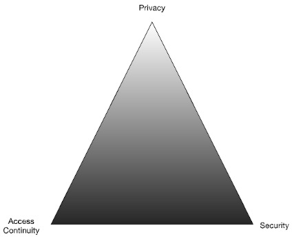

Dean H. Saxe, Sr. Security Engineer, Amazon Web Services

© 2021, 2022, 2023 IDPro, Dean Saxe

*To comment on this article, please visit our [<u>GitHub
repository</u>](https://github.com/IDPros/bok) and [<u>submit an
issue</u>](https://docs.github.com/en/github/managing-your-work-on-github/opening-an-issue-from-code).*

Terminology/Glossary
====================

-   **Account Owner –** An entity that “owns” or claims responsibility
    for an account. Generally, an account is issued in the name of the
    owner(s) or their delegate(s) in the case of enterprises.

-   **Account Recovery (AR) -** The process of returning account access
    to an account owner when they lose, forget, or cannot otherwise
    produce the account’s nominal credentials. This may be accomplished
    in person, remote, or in a hybrid format.

-   **Account Takeover -** Account takeover is a form of identity theft
    and fraud, where a malicious third party successfully gains access
    to a user’s account credentials.[1]

-   **Agent (also “Customer Service Agent”)** - The person responsible
    for communicating with and solving problems on behalf of your
    customer or end-user. 

-   **Credentials -** Any attribute or shared secret that can be used to
    authenticate a user.

-   **Knowledge-Based Authentication (KBA) -** A method of
    authentication that uses information known by both the end-user and
    the authentication service but is not necessarily a secret.

-   **Multi-Factor Authentication (MFA) -** An approach whereby a user’s
    identity is validated to the trust level required according to a
    security policy for a resource being accessed using more than one
    factor (something you know (e.g., password), something you have
    (e.g., smartphone), something you are (e.g., fingerprint).[2]

-   **Personal Data -** Personal data are any information which are
    related to an identified or identifiable natural person.[3]

-   **Social engineering -** Social engineering is a method of
    manipulating people so they give up confidential information, such
    as passwords or bank information, or grant access to their computer
    to secretly install malicious software.[4]

-   **Threat Modeling -** Threat modeling is an analysis technique used
    to help identify threats, attacks, vulnerabilities, and
    countermeasures that could impact an application or process.[5]

-   **Username -** An identifier unique to the authentication service
    used in conjunction with a credential such as a password or FIDO
    authenticator to authenticate a user.

Account Recovery
================

Defining AR
-----------

What is AR? You’ll see one definition above, but a fuller description
follows. AR is a mechanism or collection of mechanisms that are used to
maintain continuity of access to a user’s services. AR operates by
providing an *alternative authentication mechanism* to *reestablish
authentication credentials*, such as through re-identification of the
user*.* A key property of any AR mechanism is that it must meet or
exceed the security of the nominal authentication mechanism for the
account that it serves to recover. If this property is not met, users
may choose to execute the AR mechanism rather than remember their
credentials. This also opens the door to AR being used as an account
takeover mechanism.

A real example of the abuse of AR mechanisms happened to the author. Our
family had shares of an American company; the shares were managed
through an online portal. Each year I had to log in to collect the tax
forms, but I could never remember the password. The service’s AR process
required two pieces of readily available information: my mother-in-law’s
maiden name and my wife’s date of birth. Each year I would log in with
these pieces of known information, collect the documents I needed, and
logout. The password was not required, nor did the AR process require a
password reset or notify the account holder of the access!

### An Iron Triangle of Account Recovery

As an owner of a resource, I have to decide the balance of three
concerns - Privacy, Access Continuity, and Security - that meet my needs
within the constraints of the service I’m accessing. In an iron
triangle, I can move away from any vertex toward another to obtain
relatively more of one concern (e.g., privacy) at the cost of another
(e.g., security or access continuity).[6]  
  
In the stock example above, the system design focused on high access
continuity exclusively to the detriment of security - the account is
easy to access by malicious actors who could execute transactions - and
privacy - the account owner is fully identified by the stock service, as
is the nature for most financial systems.

In contrast, my current bank focuses on access continuity and security -
it is hard to gain access to my account online due to strong
authentication requirements, and (relatively) easy for me to regain
access to my account by visiting a branch in person with government
identification. The bank is obligated to identify me based on my
government-provided identity documents (e.g., passport, driver’s
license) for conducting certain transactions and uses this same
in-person authentication of my government-issued credentials to restore
access to my account if required. *This is an act of authentication!*
The driver’s license looks normal, unaltered, anti-fraud elements are in
place, the expiration date is valid, the image looks like the person
standing in the bank, the document is machine-readable and matches the
person, etc.; thus, I can conduct a transaction. (Note that this is not
a fraud-free mechanism of authentication. However, the risk of a
scalable attack in the physical world is significantly less than a
purely online service.)  
  
Finally, Reddit, a social news aggregation site, balances all three
concerns. My email was validated on signup by forcing me to close the
loop by clicking on a one-time use URL. Reddit allows me to use multiple
MFA devices, and I can recover my account through a backup code. But if
the backup codes are lost, the password unknown, and MFA devices are not
available, I’ll lose access to my account without recourse.

Which one is correct? Potentially all of them, depending on the threat
model.  
  
Given these constraints, how can we apply this iron triangle to
designing registration, authentication, and account recovery systems?
Below are three continuums representing each vertex; movement toward the
arrow is correlated with a higher score on the continuum toward the
vertex in the triangle (values are relative, not absolute).

*Figure 2: The three continuums of an Iron Triangle of Access
Continuity. Moving from left to right on each continuum leads closer to
the appropriate vertex of the triangle.*

In a nutshell, Identity architects can use the iron triangle to first
identify where in the triangle the use case is situated and second to
identify the trade-offs that are made to meet the needs of the use
case.[7] However, the devil is in the details, and those details will
differ wildly across different identity ecosystems.

Consumer AR
-----------

Consumer use cases are focused on end-users of commercial systems open
to the general public. Depending on the nature of the consumer
relationship, there may or may not be any in-person interactions, which
can limit the mechanisms used for reestablishing credentials for the
user.

The risk associated with consumer accounts varies widely depending on
the service. While both banking and social networking need to operate AR
mechanisms for their users, the risk of compromise of each account type
is significantly different. There is also a different set of information
available to these different consumer services to enable AR.

Enterprise AR
-------------

In the enterprise, the focus is usually on access continuity –
minimizing user downtime - and security for AR processes. AR is
generally straightforward for on-premises employees: Present yourself
and your enterprise or government identification to the IT Help Desk and
reset your credentials. This is a form of identity proofing for AR.
However, as more corporate employees work remotely, this in-person
mechanism may no longer work. In these cases, enterprises must look at
remote mechanisms, which could include remote identity proofing, using a
trusted intermediary (e.g., supervisor) to vouch for the employee, and
intermediate the process of AR, using a quorum of trusted intermediaries
to vouch for the employee, etc.

Education AR
------------

Similar to enterprises, the focus for education is on access continuity.
On-campus staff and students can use in-person services for account
recovery. Remote students and staff may use similar mechanisms to
enterprises, adapted to their unique environment.

Government AR
-------------

Due to the wide variations in government systems and services, there is
little consistency in this realm. Implementers should be observant of
local, national, and supranational laws, regulations, and cultural norms
when working with account recovery in this space.

AR Mechanisms
=============

Below we review common AR mechanisms. However, we would be remiss to not
include as the first and primary mechanism *Make Losing Access
Difficult.* In other words, if we do not first start with a focus on
maintaining access continuity for our users in the happy path, we will
see more requests for AR**. Identity architects must consider the AR use
cases as a primary concern when designing authentication systems and not
treat AR as a second-class use case.**

### Make Losing Access Difficult

How do services make access continuity easy and losing access difficult?
At the most basic level, services should
[<u>nudge</u>](https://www.amazon.com/Nudge-Improving-Decisions-Health-Happiness/dp/014311526X)
their users into making good decisions. This can include:

-   Baselining contact information – does the user have access to their
    email, phone, or other contact channels? If not, is there a backup
    mechanism to reach the user? Did your identity system close the
    loop, ensuring access to the primary contact information to complete
    account registration?

-   Baselining authentication mechanisms – Your users may have one or
    many devices used to authenticate to different services. Can the
    user access their authentication mechanism(s) such as FIDO
    authenticators, OTPs, and a phone number for SMS? Do the devices
    still work? Are the device and/or mechanisms still supported?

-   Back-Up Authentication – How will your users authenticate if the
    primary authenticator is unavailable? The canonical example is a
    user who is flying – they have internet access but may not have SMS
    messaging. How will these users authenticate if the service requires
    an SMS OTP? Best practices should include encouraging multiple
    authentication options per user, such as multiple OTPs, FIDO
    authenticators, and backup codes. The loss of one does not trigger
    an AR event or limit the availability of the service. Limiting users
    to a single MFA mechanism *ensures* that that user will need to
    execute AR if the device is lost, broken, or temporarily
    unavailable. *This is a user experience that should be avoided!*

-   Remind users to set up one or more AR mechanisms early in the
    account lifecycle, and nudge users to baseline those mechanisms
    regularly. *Users without an AR mechanism may not be able to recover
    accounts.* If the user has not configured AR, use significant
    changes (e.g., exceptional growth in usage of a cloud service),
    security checkups, or other dashboards to drive user actions.

-   Use synced passkeys. Synced passkeys enable the process of
    credential recovery in addition to the existing account recovery
    mechanisms. Credential recovery for synced passkeys, e.g., those
    synchronized to a platform such as Apple or Google, or a third-party
    passkey provider, such as 1Password or Dashlane, is facilitated by
    the user's passkey provider. Functionally, credential recovery
    operates by enabling the user to bootstrap a new device into the
    provider's ecosystem after losing all prior access. Mechanisms are
    non-standard and likely to vary between providers, therefore, the
    security of these mechanisms must be assessed on a
    provider-by-provider basis.

Identity providers should also guide their users to avoid single points
of failure on the user side. For example, if the user places their
credentials in a password safe and recovery codes are stored in the same
safe, loss of access to the password safe eliminates at least one
recovery pathway. Although we cannot always prevent users from shooting
themselves in the foot, we can try to limit the damage that the user can
do to themselves.

### User Notifications

Before diving into the mechanisms of AR, we must pause to talk about
user notifications as an important component of the AR process user
experience. All actions that impact the user’s ability to maintain
access continuity must be reported to the user. These include, but are
not limited to:

-   Changes to the account email address

-   Changes to the account phone number(s)

-   Changes to the account credentials including, but not limited to

    -   Passwords

    -   MFA devices / mechanisms

    -   Reset or re-issuance of recovery codes

-   Removal or addition of trusted intermediaries

-   Account recovery (success or failure)

Due to the time-sensitive nature of these messages, they should be
broadcast to all available channels which the use has consented to, such
as email, SMS, and push notifications. Notification should be sent to
the prior email address and/or phone number during a change request,
allowing the user an opportunity to identify a fraudulent change and
revert the change before further damage occurs.

### Bearer Tokens

Bearer tokens, when used for AR, can be thought about as paper tickets
to a concert or sports event. The tickets (or bearer tokens) are used
once to access a service in lieu of the user’s normal credentials.

These bearer tokens take a few forms:

-   Alphanumeric codes sent via email or SMS in response to an AR
    request

-   Magic links, a form of passwordless login, sent via email or SMS in
    response to an AR request

-   Recovery codes obtained prior to losing access and stored as
    physical or digital copies in a safe place, such as a fireproof
    safe.

-   Recovery code sent to the user via postal mail or private delivery
    service

Grouping these mechanisms as bearer tokens allows us to reason about
their usability and security together. The assurance level of a bearer
token is directly correlated to how it was delivered. Recovery codes
obtained in an authenticated session are generally higher assurance than
one-time codes or magic links; however, this is dependent upon how they
are stored by the user.

**Benefits**

-   An easy user experience that requires no specialized knowledge or
    hardware. After triggering an AR event, such as by entering a
    username into an AR workflow, the user cashes in the bearer token
    for the ability to reestablish credentials with the service.

**Threats and Mitigations**

-   Bearer tokens may be used by whoever bears them – this makes them
    easy to use and abuse, such as through phishing.

    -   Minimize the validity window of all bearer tokens.

    -   Keep state – is the user on the same device and same browser as
        when the request was triggered? Has the IP changed? What other
        data can be collected to ensure the user has not been phished
        for this information.

-   The risk of bearer tokens also encompasses the risk of the medium by
    which they are sent to the user. These threats cannot be mitigated
    by the identity provider.

    -   Email is subject to interception, such as by phishing, leading
        malicious actors to access the bearer tokens sent to the email
        address.

    -   SMS is subject to interception, such as through SIM swapping
        attacks and SS7 vulnerabilities.

    -   Email and SMS mechanisms are subject to threats against the
        providers and their infrastructure, as well.

-   Users fail to copy recovery codes, fail to store the recovery codes
    securely, or lose the recovery codes.

    -   Providers can recommend mechanisms for storage and management of
        codes, but the user may not follow the guidance.

-   Users lose access to their email or phone number or enter incorrect
    values which the user cannot access.

    -   Verify the user has access to the email or phone number when
        they are submitted to the IdP.

    -   Baseline the continued access to the email and phone number over
        time.

### Knowledge-Based Authentication / Security Questions

Both Knowledge-Based Authentication (KBA) and Security Questions are
used as recovery mechanisms by having the user “prove” they are the
legitimate owner by answering questions known only to the user.
Unfortunately, both KBA, based on public information databases or recent
user transactions, previous passwords, and security questions, based on
preconfigured questions and answers provided by the user, are relatively
weak recovery mechanisms.

KBA mechanisms often utilize information such as home addresses, loan
dates/amounts, and credit report data to weakly identify the human owner
of an account. However, due to numerous data breaches, this information
is insufficiently secret and should not be depended upon as a recovery
mechanism for accounts with any significant value.

Information used for KBA may often be available to family members or
other parties close to the user, reducing their efficacy.

Similarly, security questions often have predictable or easily
identifiable answers. Questions such as favorite color have low entropy
(according to
[<u>this</u>](https://www.huffpost.com/entry/house-beautiful-2012-color-report_n_1840383?guccounter=1#:~:text=According%20to%20House%20Beautiful's%20Color,purple%20tied%20at%208%20percent.)
study, 64% of Americans choose one of four favorite colors, blue (29%),
green (21%), purple (8%), and red (8%)), while questions about a
favorite sports team or high school mascot may be readily discoverable
through social media.

As a low assurance mechanism, KBA and security questions are only
recommended for the lowest-risk operations as a last resort.

**Benefits**

-   KBA and secret questions are easy to use, when they work.

**Threats and Mitigations**

-   KBA data may be obtained from breach corpuses, public databases.

    -   Don’t use KBA for account recovery.

-   Insufficient protection in cases of domestic violence or intimate
    partner violence where the KBA data may be known.

    -   Don’t use KBA for account recovery.

-   Customers may not remember details to answer KBA questions. A
    customer’s inability to remember details such as financial
    transactions will trigger false negative matches for legitimate
    customers. Conversely, a user who answers all questions correctly
    may be a fraudster.

    -   Don’t use KBA for account recovery.

-   Security questions and answers may be forgotten. Users may fail to
    recall the answers, misspell answers, misuse capitalization or
    punctuation, all of which could cause the user to fail
    authentication.

    -   Baselining of security questions and answers to ensure access
        continuity.

-   Security questions and answers are alternative passwords and suffer
    the same risks as any password authentication scheme.

    -   Users must never be asked to share KBA data or security
        questions and answers with CS agents to eliminate this risk.

    -   Follow password storage guidance for all security questions and
        answers.

### Identity Verification / Identity Proofing

In some use cases where privacy of the individual’s identity is not the
overriding concern, systems may use identity verification or identity
proofing to establish the real-world identity of a human, often based
upon government (driver’s license, passport), enterprise (employee
badge), or educational credentials (university or school ID) issued by a
trusted authority. Early in the account lifecycle, perhaps as a
requirement to establish the account, the user’s identity is verified,
binding the identity to the user account. This may take place in person
(e.g., at a bank, registering for a trusted traveler program, at a
university during registration, at an employer on the employee’s first
day), or remotely. Since these require in-person interactions, they
cannot easily be automated and provide a higher barrier to entry for
fraudulent access. In the remote use case, a common modality is to ask
the user to take an image of their identity document and a selfie or
short selfie-video. The identity documents are reviewed for signs of
tampering or other fraud markers. The image on the identity document is
compared with the selfie or video, which is usually tested for liveness
by asking the user to do certain behaviors such as look up, down, left,
right, before confirming that the human at the keyboard is the same
human on the identity document (to some level of certainty).

**Benefits**

-   Establishes a binding between the natural person and the user
    account that cannot be broken. Even if the user replaces their
    passport, identity verification can be re-executed to verify that
    the human is the “owner” of the account they are trying to recover
    (within certain confidence intervals).

-   Resistance to scalable fraudulent mechanisms, though this depends
    upon the specific mechanisms used.

-   May be highly automated with Artificial Intelligence/Machine
    Learning (AI/ML); however, many providers still use manual review of
    less common identity documents first before using them to train
    AI/ML systems.

**Threats and Mitigations**

-   Users are uncomfortable sharing identity documents with online
    services. For example, the United States Internal Revenue Service
    (IRS) used ID.me to provided Identity Proofing services in 2022,
    resulting in a [<u>significant
    backlash</u>](https://venturebeat.com/2022/04/15/the-irs-id-me-debacle-a-teaching-moment-for-tech/).[8]

    -   Provide clear information on how the data provided will be used
        and stored.

    -   Provide an alternative mechanism for users who are unwilling or
        unable to provide identity documents for remote ID Proofing.
        In-person, identity proofing, for example.

-   Fraudulent documents

    -   Today, there are no common criteria to assess identity document
        verification/proofing services against one another.

-   Presentation Attacks – presenting a static image or video of the
    real person, rather than the person attempting fraudulent identity
    verification

    -   Images and video selfies should use mechanisms of liveness
        detection to ensure the images are real and being captured in
        real-time.

### Trusted Intermediary

Common in corporate settings, users are able to recover access through a
trusted intermediary, such as the user’s manager. The general use case
is that when an employee loses access and needs to reset a password or
configure a new MFA device, the helpdesk or the user’s manager (or
skip-level, etc., though this brings diminishing returns) can
authenticate to a recovery service to help the user reestablish
corporate credentials. Individual processes may vary depending on the
familiarity of the user with the trusted intermediary. For example, a
direct report to a manager may have the manager mediate recovery without
presenting any identity information. The same user who approaches the
helpdesk for a password reset will have to present a corporate badge or
similar identity information before executing the reset. In a services
industry, a sales manager or technical account manager may be the
trusted intermediary for their customers if access is lost. The process
may be completed in person, over the phone, or via video conference.

Facebook uses a [<u>trusted contacts
model</u>](https://www.facebook.com/help/119897751441086?helpref=faq_content)
to create a self-service recovery mechanism.

Multiple intermediaries can be used, as well, in a quorum (*m* of *n*)
based solution. Quorums are useful for higher assurance use cases to
eliminate the threat of social engineering or a single malicious user
using the AR process to gain access to unauthorized accounts.

**Benefits**

-   Distributes the work of AR amongst many possible trusted users,
    allowing for a high level of access continuity.

**Threats and Mitigations**

-   Malicious “trusted” intermediary takes over a targeted account.

    -   Require quorums

    -   Don’t pass recovery tokens, URLs, etc., through the trusted
        intermediary. Allow the intermediary to trigger sending the
        token to the subject of the AR action via email, SMS, or other
        mechanisms. (Be careful, this could look like phishing!)

Possession Factor
-----------------

Similar to the bearer token discussed above, a possession factor – such
as the ability to sign a transaction with a specific private key – can
be used as a recovery factor. However, the average user should not be
expected to generate and manage their own keys securely. The addition of
FIDO2 security keys and passkeys creates a secure mechanism for creating
and managing account-specific key pairs. When used as a first-factor
device (e.g., the passwordless flow), a security key or passkey can be
registered as a “recovery key” for the account.[9] Only the owner in
possession of the key and with the biometric or PIN to unlock it can
recover the account. Applications on a mobile device can be used as a
possession factor when unlocked with the user’s biometric or PIN code.
This can be done using common protocols, such as FIDO passkeys, or using
a bespoke mechanism.

Last, self-sovereign identity (SSI) can use a similar mechanism. By
proving ownership of a specific private key associated with the user’s
DID document, the owner can conceivably recover an account.

**Benefits**

-   Ease of AR if the possession factor is registered early in the
    lifecycle and can be made available when needed by the user.

**Threats & Mitigations**

-   Loss of the cryptographic key or its storage medium.

    -   Implementers must consider the relative frequency of loss of a
        phone, for example, vs. a hardware key vs. a public key
        generated on the user’s disk. This may be mitigated through
        passkeys synced via a cloud service.

    -   Allow for multiple possession factors per account.

    -   Periodically remind users to check their ability to recover with
        the possession factor(s)

Customer Service
----------------

The final mechanism for AR is through a customer service mechanism, such
as customer service for an enterprise. Customer service may use one or
more of the mechanisms identified above to process an AR request. For
additional information on using CS for AR, see “Managing Identity in
Customer Service Operations” by Arynn Crow and JP Rowan.[10]

No Account Recovery
-------------------

In some scenarios, no account recovery may be the secure and private
option. While not recommended for most use cases, not supporting any
account recovery is seen in practice and may be the preferred option for
some high-security services in order to minimize the risk of account
takeover.

Conclusion
==========

Account recovery is a mechanism to support authentication for your
service. Building an AR service requires service owners to consider what
they, and their customers, value: access continuity, security, or
privacy, and build mechanisms to support AR that balance these three
concerns. Which AR mechanisms are chosen will additionally depend on the
support environment that the service is deploying into: education,
enterprise, government, etc. Each has different abilities available to
them that may enable stronger AR mechanisms. However, all AR mechanisms
share one thing in common: users must register for them implicitly or
explicitly if they are to regain access to lost accounts. Therefore, AR
is more than just a technical solution to be implemented; it is a user
experience and human behavior problem to be solved.

Acknowledgments
===============

-   Arynn Crow

-   JP Rowan

-   David Brossard

-   Paul Figura

Author Bio
==========

Dean H. Saxe is a Senior Security Engineer with the AWS Identity team
and a founding member of IDPro. He can be reached at
<u><dean@thesax.es></u> or on Twitter @n3rd1ty.

Change Log
==========

|            |                                                     |
|------------|-----------------------------------------------------|
| Date       | Change                                              |
| 2023-10-27 | V3 published; addition of info on passkey recovery  |
| 2022-06-03 | V2 published; clarifications added to AR mechanisms |
| 2021-04-19 | V1 published                                        |

[1] Flanagan (Editor), H., (2021) “Terminology in the IDPro Body of
Knowledge”, *IDPro Body of Knowledge* 1(7). doi:
[<u>https://doi.org/10.55621/idpro.41</u>](https://doi.org/10.55621/idpro.41)

[2] Ibid.

[3] Ibid.

[4] Ibid.

[5] Ibid.

[6] Caccamese, A. & Bragantini, D. (2012). “Beyond the iron triangle:
year zero.” Paper presented at PMI® Global Congress 2012—EMEA,
Marsailles, France. Newtown Square, PA: Project Management Institute,
[<u>https://www.pmi.org/learning/library/beyond-iron-triangle-year-zero-6381</u>](https://www.pmi.org/learning/library/beyond-iron-triangle-year-zero-6381)

[7] Bucci, Steven. “The Iron Triangle of Cybersecurity.” Security
Debrief. February 23, 2011.
<http://securitydebrief.com/2011/02/23/the-iron-triangle-of-cybersecurity/>.

[8] Thimot, Tom, “The IRS/ID.me debacle: A teaching moment for tech,”
Venture Beat post, 15 April 2022,
<https://venturebeat.com/2022/04/15/the-irs-id-me-debacle-a-teaching-moment-for-tech/>.

[9] The astute reader will note that this is the same mechanism proposed
by the FIDO Alliance for recovering from loss of a security key. At this
time, there is no way to backup a security key, therefore registering
multiple keys is the specified mechanism of account recovery.

[10] Crow, A. & Rowan, J. P., (2021) “Managing Identity in Customer
Service Operations”, IDPro Body of Knowledge 1(4). doi:
[<u>https://doi.org/10.55621/idpro.65</u>](https://doi.org/10.55621/idpro.65).
