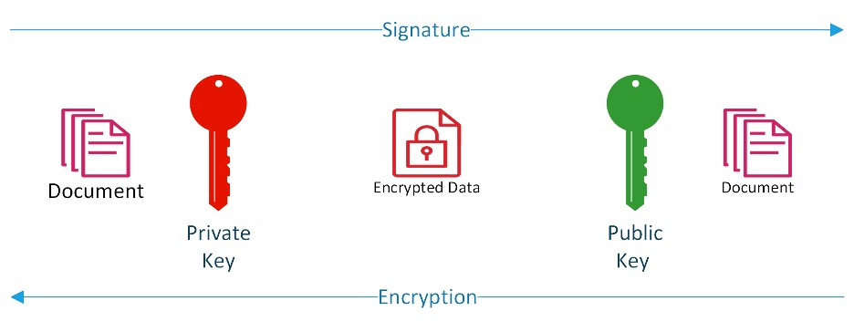

Practical Implications of Public Key Infrastructure for Identity
Professionals

By Robert Sherwood

© 2021 Robert Sherwood and IDPro

*To comment on this article, please visit our [GitHub
repository](https://github.com/IDPros/bok) and [submit an
issue](https://docs.github.com/en/github/managing-your-work-on-github/opening-an-issue-from-code).*

Introduction
============

In high-risk environments, where all participants must always know the
identity of an authentication subject to a high degree of assurance, PKI
is one of the oldest and most widely deployed authentication
technologies in use. There are significant challenges in the deployment
of PKI, which we discuss below, but for many years PKI was the only high
assurance
credential<a href="#fn1" id="fnref1" class="footnote-ref">1</a>
available in the broader market. It is still considered the gold
standard of credential assurance by many experts. Military and
government environments have used PKI to provide secure authentication
since the late 90s.

In commercial environments, PKI has not seen the same degree of success.
This article discusses some reasons for the lack of widespread adoption.
Despite the lack of broad deployment, PKI can be a feasible alternative
to passwords for some enterprises, thanks to Microsoft’s implementation
of Smartcard Login. Enterprises have taken a renewed interest in
smartcard login to eliminate passwords for specific environments and
scenarios.

This article includes analysis and guidance for the deployment of PKI
for both human users and machines.

Terminology
-----------

-   Asymmetric Cryptography: Any cryptographic algorithm which depends
    on pairs of keys for encryption and decryption. They are referred to
    as asymmetric because one key encrypts, and the other decrypts. And
    the keys are not shared between parties.

-   Automatic Certificate Management Environment (ACME): A communication
    protocol for automating interactions between Private Key Holders and
    Certificate Authorities. Based on JSON and HTTP, it is widely
    deployed to support the issuance of TLS certificates for web
    servers.

-   Certificate Authority Trust List (CTL): A list of Trusted
    Certificate Authorities maintained by a client.

-   Certificate Management System (CMS): A system that provides a
    management and reporting layer around certificate issuance and
    revocation. They can integrate with CA products from multiple
    vendors, as well as IGA and Service Desk systems.

-   Certificate Policy (CP): A document that defines the high-level
    policy requirement for a PKI. The outline for a CP is described RFC
    3647, which identifies the policy framework for PKI. A certificate
    policy is typically published to external parties so that they can
    determine whether to trust certificates issued by the CA publishing
    the CP.

-   Certification Practices Statement (CPS): A document using the RFC
    3647 format which identifies the Practices which implement the
    requirements documented in the CP. Unlike the CP, the CPS is rarely
    published in unredacted form.

-   Certificate Revocation List (CRL): A list of revoked certificates
    published by a Certificate Authority

-   Certificate Signing Request (CSR): When requesting a certificate,
    the requesting entity provides a copy of the public key along with
    their name and other information in a specially formatted binary
    object called a CSR. The CSR must be signed using the requesting entity's
    private key.

-   Classical Computer: A computer that uses binary encoding and Boolean
    logic to make calculations in a deterministic way. Classical
    Computers are usually contrasted with Quantum Computers.

-   Cryptographic Module Validation Program (CMVP): A program allowing
    cryptographic module developers to test their modules against the
    requirements defined in FIPS-140. Compliant modules are listed on a
    US government-run website.

-   Electronic Identification, Authentication and Trust Services
    (eIDAS): European legislation that gives legal standing to
    electronic signatures. This legislation also documents how to
    provide legally binding digital signatures with X.509 certificates
    to comply with Qualified Signature.

-   Elliptic Curve Cryptography (ECC): An asymmetric cryptosystem based
    on calculations of points along elliptic curves.

-   Encryption: Processing data using a cryptographic algorithm to
    provide confidentiality assurance.

-   Federal Agency Smart Credential Number (FASC-N): A unique identifier
    associated with a smart card. Used in the US Federal Government PIV
    standard to support Physical Access.

-   Federal Information Processing Standard **(**FIPS) 140: A NIST
    standard defining “Security Requirements for Cryptographic Modules.

-   Groups: A set of identities with defined permissions. In this
    specific context, a group contains many individuals, but the group
    identity is opaque, and no information is available regarding which
    group member took an individual action.

-   Hardware Security Modules (HSMs): A hardware device that generates
    and protects cryptographic keys.

-   Identifier: The way a system refers to a digital identity. PKI
    Certificates support both internal and external identifiers. See
    [<u>Ian Glazer’s article, “Identifiers and
    Usernames,”</u>](https://bok.idpro.org/article/id/16/) for a generic
    overview of
    identifiers.<a href="#fn2" id="fnref2" class="footnote-ref">2</a>

-   Internet Key Exchange (IKE): A subordinate standard under IPsec
    which specifies how to use X.509 certificates to establish symmetric
    keys for an IPsec tunnel.

-   Internet Protocol Security (IPsec): A standard for communication
    between two machines providing confidentiality and integrity over
    the Internet Protocol.

-   Key: In a cryptosystem, a Key is a piece of information used to
    encrypt or decrypt data in a cryptographic algorithm.

-   National Institute of Standards and Technology (NIST): A US
    Government agency that defines and publishes standards. One
    department within NIST, the Computer Security Resource Center
    (CSRC), publishes the Federal Information Processing Standards
    (FIPS) series. While these standards are only mandatory for US
    Government Agencies, they are widely recognized as de-facto
    standards globally.

-   Non-person entities: Any unique combination of hardware, software
    firmware (e.g., device) that utilizes the capabilities of other
    programs, devices, or services to perform a function. Non-person
    entities may either act independently or on behalf of an
    authenticated individual or
    NPE.<a href="#fn3" id="fnref3" class="footnote-ref">3</a>

-   Online Certificate Status Protocol (OCSP): A protocol that allows a
    client to query the Certificate Authority or a Validation Authority
    for the status of an individual certificate rather than downloading
    a CRL.

-   Path Discovery and Validation (PDVal): The process to determine
    whether a certificate is valid and trusted by the validator.

-   Personal Identification Number (PIN): A numeric secret commonly used
    to unlock a private key container in software or hardware.

-   Personal Identity Verification (PIV): A US Government program
    designed to enable strong authentication for all government
    employees and contractors, based on Public Key Infrastructure.

-   Private key: A key that is exclusively and privately controlled by a
    single entity. It corresponds to a public key that the entity may
    share for data encryption or signature verification.

-   Public key: A key that is publicly distributed by an entity that is
    used with the corresponding private key.

-   Public Key Certificate: A certificate containing a public key, one
    or more identifiers for the private key holder, an identifier for
    the Certificate Authority, and additional metadata to support
    security requirements.

-   Public Key Infrastructure: A set of tools, standards, and related
    policies designed to manage trust based on public/private key pairs
    and certificates.

-   Registration Authority (RA): An individual, system, or business
    function which provides registration and identity proofing for
    entities receiving certificates and manages the certificate issuance
    and renewal process. The most important responsibilities of an RA
    include identity proofing and binding of the private key to the
    identity.

-   Roles: An entity that defines a set of permissions. A role must be
    associated with an individual user, and the user gains the
    associated authorization during the time that they are associated
    with the role.

-   RSA: An asymmetric cryptosystem based on large prime numbers. The
    acronym RSA stands for the three principal inventors, Ron Rivest,
    Adi Shamir, and Len Adleman.

-   S/MIME: A standard for constructing and sending digitally signed or
    encrypted messages using asymmetric cryptography.

-   Secure Socket Layer (SSL): A deprecated standard for encrypting data
    in transit; it has been superseded by TLS.

-   Server-based Certificate Validation Protocol (SCVP): A protocol that
    allows a client to query a server to determine whether a certificate
    is valid and trusted. The server does not need to be associated with
    the issuing CA SCVP does two things; (1) it determines the path
    between the end-entity and the trusted root whereby the client
    doesn’t need to trust any intermediate CAs. (2) it also performs
    delegated path validation according to policy.

-   Signature: Processing data using a cryptographic algorithm to
    provide integrity assurance.

-   Subject Alternative Name: One or more identifiers for a certificate
    subject that can be used to carry application-specific identifiers
    such as email address or User Principle Name (UPN).

-   Subject Distinguished Name (Subject DN): A unique identifier for the
    Subject, within the scope of the Certificate Authority. Subject DN
    is structured like an LDAP entry name.

-   Transport Layer Security (TLS): A cryptographic protocol designed to
    provide confidentiality and integrity of communications between two
    endpoints.

-   X.509: An ISO standard from the X.500 series that defines the basic
    rules for encoding public key certificates.

-   Validator: An entity that verifies a certificate and confirms that
    the other party controls the private key in the transaction.

Basics of PKI for Identity Practitioners
========================================

What is PKI
-----------

*PKI* stands for “*Public Key Infrastructure*.” a set of interlocking
standards and technologies supporting the secure exchange of public keys
for *asymmetric cryptography* use cases.

Originally developed as part of the X.500 series of specifications for
electronic directory services, the *X.509* standard proposed a way to
link a public key into a universal, hierarchical directory designed to
support OSI networks.

OSI is, for all intents and purposes, dead. However, the X.500
specification lives on in simplified form as LDAP, and X.509
certificates are widely deployed for some critical use cases.

PKI lives on and is woven deeply into the fabric of the Internet. PKI
supports the following critical internet capabilities:

-   *TLS* as a general encryption layer for application protocols

-   *S/MIME* is a standard for Secure Email

-   *IPsec* is a for Virtual Private Networking, which supports PKI
    through the Internet Key Exchange (IKE) extension

-   Some commercial software or services, such as Adobe Acrobat,
    Microsoft Word, or Docusign, support electronic signatures for
    non-repudiation or integrity protection. In Europe, Qualified
    Signatures and Time Stamps have official legal standing, recognized
    in the Electronic Identification, Authentication and Trust Services
    (eIDAS) framework

This article is not a general primer on PKI. Interested readers are
referred to the References section at the end for more detail. This
article provides a minimal overview of PKI related to Identity
Management and identifies critical issues relevant to Identity
Practitioners.

Here are some excellent resources to learn more about PKI in general:

Books:

-   [<u>Applied Cryptography, by Bruce
    Schneier,</u>](https://www.schneier.com/books/applied-cryptography/)
    is a classic guide to the cryptographic technology underlying PKI
    and its applications. For those who want to know everything about
    this subject, this is the place to start.

Online Resources

-   The US Federal government has deployed PKI widely for both logical
    and physical access. IDManagement.gov maintains information about
    the Federal PKI here:
    [<u>https://playbooks.idmanagement.gov/fpki/</u>](https://playbooks.idmanagement.gov/fpki/)

-   Bruce Schneier, the author of Applied Cryptography, maintains a
    fascinating and helpful blog here: https://www.schneier.com/

Standards:

-   [<u>X.509</u>](https://www.itu.int/rec/T-REC-X.509-201910-I/en): The
    original specification for PKI certificates. This document must be
    purchased.

-   [<u>RFC 5280</u>](https://datatracker.ietf.org/doc/html/rfc5280):
    The Internet X.509 Public Key Infrastructure Certificate and
    Certificate Revocation List (CRL) Profile standard specifies a
    subset of the X.509 standard for use on the Internet.

How do a ‘Private Key’ and a ‘Public Key Certificate’ Provide Authentication Assurance
--------------------------------------------------------------------------------------

### Public and Private Keys

Private and *public keys* are random numbers, but not just any random
number.

-   In the *RSA* specification, keys are derived from a large prime
    number.

-   In *ECC*, keys are related to points along a particular elliptical
    curve.

By taking some data such as text or an image and plugging these inputs
into a specific equation with one of the numbers (keys), you create a
scrambled version of the data that only the other number (key) can
unscramble. This concept is the basis of asymmetric cryptography.

The *private key’s* owner must retain and closely guard it, but the
public key can be shared with anyone.

The sender of a message can scramble it using another user’s public key
to ensure that only the other user, with their private key, can
unscramble and read the
message.<a href="#fn4" id="fnref4" class="footnote-ref">4</a>

The sender of a message can scramble it using their private key, and a
recipient, who can unscramble the message with the public key, can be
sure that the message was sent by the owner of the private key and has
not been modified in
transit<a href="#fn5" id="fnref5" class="footnote-ref">5</a>.

In asymmetric cryptography, “*encryption*” refers to scrambling a
message with the public key, and “*signature*” refers to scrambling a
message with the private key.

In practice, signature and encryption are much more complicated,
involving cryptographic hashes or intermediate symmetric keys. For our
purposes, it is sufficient to understand that private keys sign, and
public keys encrypt.

In public-key cryptography, the user is whoever has control of the
private key. To authenticate someone in asymmetric cryptography is to
require them to use their private key.

The user can provide a signed message for the *validator* to decrypt.
Alternatively, the validator can choose and encrypt data that the user
must decrypt with the private key. In both scenarios, possession, and
control of the private key, demonstrated by the ability to use the
private key to encrypt or decrypt data, is sufficient to prove the
user’s identity.

### Public Key Certificates

Exchanges of “naked” public keys will not scale beyond the simplest of
closed systems in the context of business process support. They are used
in some contexts, notably in the SSH protocol, or “Web of Trust” based
systems like PGP. In an enterprise or government context, where a
central trusted authority vouches for identities according to a
documented process, public keys are typically exchanged in public key
certificates.

Business processes occur between named entities, such as companies,
employees, or systems. Supporting business applications with asymmetric
cryptography requires the named entity’s public key to be connected or
“bound” to the named entity’s *identifier*. Public key certificates are
the artifacts that provably connect a key and a named entity’s
identifier.

A *public key certificate* contains at least three critical pieces of
information:

-   A public key

-   One or more identifiers associated with a user

-   Information about the authority that vouches for the association
    between the key and the identifier.

The public key certificate is a file structured in a particular way,
defined by the X.509.3 standard, which contains the user’s public key
and their identifiers and some critical
metadata.<a href="#fn6" id="fnref6" class="footnote-ref">6</a>
The package is signed using the private key of a trusted third party,
called a “Certificate Authority.”

Who Can Get a Certificate
-------------------------

Any business process participant that can generate and store a private
key and associated public key may receive a certificate. The most common
recipients of certificates are listed here:

-   Humans: A human being can receive a public key certificate that
    names them individually.

-   *Non-person entities*: Examples of non-person entities include
    devices like routers, software services like web or email servers,
    IoT devices, or other non-human entities like software providers who
    digitally sign software packages.

-   *Roles*: Sometimes, a person may be acting in a role, such as
    “Software Release Manager” or “Doctor on call.” A certificate can be
    issued to someone acting in a role, which allows them to
    authenticate in the persona of their role. Role certificates are
    issued to individuals and contain a personal identifier for the
    person holding the private key to maintain individual
    accountability. Everyone with a role certificate has a unique
    private key.

-   *Groups*: In some cases, a private key must be shared by several
    people. In this case, a certificate can be issued to a group. The
    certificate will identify the group, and additional security
    precautions will be taken to ensure that only authorized group
    members use the private key.

How Are PKI Certificates Like Other Credentials, and How Are They Different?
----------------------------------------------------------------------------

Like other credentials, a user can use a private key and PKI certificate
to authenticate in an electronic transaction.

As with all electronic credentials, the overall assurance of the
credential depends on the security of the identity proofing and issuance
process. If the proofing and issuance processes are insecure,
authentication is insecure, regardless of how secure the credential
itself can be.

However, there are several differences between PKI and other
authentication credentials.

**A public key certificate file contains all the information necessary
to authenticate the Subject:** For most other credential types, each
authentication challenge requires the involvement of the credential
issuer. By contrast, a PKI authentication can occur without any direct
interaction with the issuing Certificate Authority. The user generally
provides a secret to activate the private key, such as a PIN or
password. This secret is input directly to the software or device
containing the private key; it is not provided to the Certificate
Authority.

**Public key certificates are long-life credentials:** Certificates may
be valid for a much longer-term than is typical for other credential
types. It is not unusual for a Public Key certificate to be issued to a
user with a three-year lifetime. This extended lifetime is acceptable
because the private key credential is not user-selected and is too long
to be easily memorized or copied by humans. This characteristic is
discussed in more detail in a later section.

**Key protection affects the overall security of the PKI credential**:
Like any other authentication secret, a private key must be protected
from third parties in order to prevent them from using the secret to
impersonate a user. Recall that in public-key cryptography, the user is
whoever controls the private key. For this reason, it is essential to
ensure that private keys cannot be copied or taken without a user’s
awareness and permission. Because private keys are usually very long and
appear random, they cannot be memorized and must be stored.

There are several technologies designed to protect private keys,
including *Hardware Security Modules (HSMs)* or personal tokens such as
the YubiKey Security Key or SafeNet eToken Smart Card. The United States
*National Institute of Standards and Technology (NIST)* has published a
standard, *Federal Information Processing Standard* *(FIPS) 140*, and
has implemented the *Cryptographic Module Validation Program (CMVP)* to
ensure that HSMs implement proper cryptographic algorithms and key
protections for private keys.

The security properties of PKI credentials mean that they can provide a
higher level of identity assurance than other kinds of credentials. The
highest levels of assurance defined by governments are usually reserved
for PKI certificates stored on smart cards. This security comes at a
cost, both in terms of direct costs and additional complexity.

**PKI credentials can support additional use cases beyond
authentication:** While passwords, OTP, and others are limited to
interactive authentication, PKI credentials can be used for additional
use cases where identity is important, but the transaction is not
immediate and interactive. One example is a digital signature, where the
identity of the signer must be established, but the entity verifying the
identity may be completely unknown to the signer. Encryption is another
case where the sender of the sensitive data must ensure that the
intended recipient is the only one who will have access, but the data
may be exchanged out-of-band and asynchronously.

Factors and Problems Limiting PKI Adoption
------------------------------------------

The roots of PKI extend back into the 1970s, and its use as the basis
for secure communication was cemented in the earliest versions of SSL
published in the mid-1990s. However, despite its maturity and widespread
use for some specific use cases, it has not seen broad adoption for
authentication of individuals, either for business to consumer or
business to employee use cases. There are many reasons why PKI has not
seen widespread adoption outside these narrow use cases, though the
technology and vendor support has improved. The following are some of
the most important areas of concern:

**Enterprise key management is challenging:** In order for PKI to be a
trustworthy and secure authentication approach, the private key must be
controlled by the authentication subject. As we said earlier, the user
is whoever controls the private key. There are two ways to ensure that
the intended user is the only one with access to the private key: The
authentication subject must generate their own private key within a
protected software environment, or the private key must be generated on
behalf of the Subject and then passed to the Subject using a secure
transfer mechanism. Both of these are complex processes that are
difficult to automate without extensive tooling.

Internet software providers have focused on providing automation for key
technical use cases, such as TLS for Web Servers. Protocols like
*Automatic Certificate Management Environment (ACME)* and services like
Let’s Encrypt are designed to provide zero-touch key management and
certificate rotation for web servers. These services are not designed
for the management of certificates issued to humans.

Vendors, meanwhile, have implemented sophisticated, proprietary
solutions for the automation of key management. Microsoft Active
Directory Certificate Services can provide key management and
certificate services for machines and human users in an Active Directory
environment. The Entrust Certificate Authority provides a client-side
tool that will manage key and certificate lifecycle for the clients with
the tool installed. These tools are designed to support a closed system.

Other providers, like KeyFactor or Venafi, can provide certificate
lifecycle services. However, the tools are proprietary, and significant
integration efforts may be required to implement these products.

**PKI has poor usability:** As discussed above, key management is a
complex organizational and technical issue with its share of challenges.
Unfortunately, many PKI implementations require end-users to manage a
lot of that complexity. Particularly, users must initiate the key
generation and request process. Once a private key is generated and a
certificate issued, each tool the user uses to authenticate with (web
browser, mail client, desktop environment, etc.) must be configured to
use the private key generated by the user and manage the list of trusted
issuers. Sophisticated enterprises with dedicated engineering teams
should be able to manage this complexity on behalf of the user
community, but this complexity is difficult to manage even in highly
controlled environments. For the vast majority of small business and
home users, this complexity is completely unmanageable.

One way to address this user challenge is to have a designated
administrator or security officer who assists users in generating their
private keys and initializing their tokens. This approach is very common
in large enterprises but can be feasible for smaller companies as well.
Individual assistance for users

In high-security environments, private keys are generated on a hardware
security module. This hardware requirement adds device driver
installation and management issues on top of all of the other issues
that confront users attempting to use PKI for authentication. Some
platform vendors have implemented platform-level API (e.g., Microsoft
CAPI), but support for this API is not universal, with some applications
implementing proprietary or platform-neutral key storage systems that do
not integrate with the host OS.

As is the case with many IDM technologies, the 80/20 rule should be
observed. IDM professionals should ensure that critical or widespread
user applications support your PKI implementation and accept alternative
credentials for critical legacy applications.

**Public key enablement of applications is hard:** So far, we have
discussed the difficulty of using PKI for authentication from the
perspective of Authentication Subjects. Enabling applications to consume
PKI credentials is even more challenging in some ways. First, the list
of trusted CA issuers must be maintained and synchronized across all
applications where the user may need to authenticate. Secondly,
certificates must be validated by the authenticating application, which
requires the application to access a public HTTP site or LDAP directory
to obtain Certificate Revocation information. Finally, a local user
profile must be created in the application based on an identifier
present in the certificate or obtained from the user via manual
registration. There is no concept of provisioning or deprovisioning
built into PKI by default, and so any such capability must be
implemented via a separate integration with the Registration Authority
(RA). Since it is common for users to authenticate with a site directly,
such a capability may not even be offered by the CA. Identity
professionals should investigate existing directory technologies such as
AD that can support user profiles for multiple applications.

For enterprise applications, an internal IGA system may manage these
aspects, but across enterprise boundaries or in a B2C context, this
additional complexity makes PKI credentials difficult and expensive
compared to other authentication options.

**Certificate trust path discovery and validation are hard, and existing
implementations have inconsistent behavior:** In the previous section,
we discussed the need for applications to validate the certificates.
This validation is complicated, even when certificates are issued from a
static Trust List of known good
issuers<a href="#fn7" id="fnref7" class="footnote-ref">7</a>.
However, PKI supports a form of federation through cross-certification,
discussed below in more detail. In this section, we will simply note
that the process of determining whether a certificate is issued by a
trusted partner in a federated, or cross-certified, environment is very
challenging.

*Path Discovery and Validation (PDVal)* is complex. Different vendors
implement it inconsistently. A certificate may be trusted by one service
but not another depending on the underlying certificate validation
library. Third-party solutions exist which support consistent PDVal
across products, but they must be implemented and integrated with each
endpoint. This burden has made enterprises leery of implementing PKI on
the server-side.

Unique Considerations for Identity Practitioners
================================================

Ensure that PKI is the Right Fit for Your Requirements
------------------------------------------------------

Deployment of PKI involves several complexities and difficulties that I
have outlined in this document. However, PKI is a powerful tool that can
offer strong authentication and support other use cases, such as email
signing/encryption, that are not possible with other strong
authentication credentials. When considering the deployment of PKI,
ensure that the use cases you can support justify the added complexity
for your environment and for your users.

For TLS and link encryption, PKI may be the best or only choice, but
that does not necessarily mean that you should implement your own local
PKI. Use of a third-party PKI service provider is a great alternative
for many organizations.

The Importance of Planning
--------------------------

If you determine that an internal PKI is the right option for your
organization, planning is critical for a successful PKI deployment.
While the need for planning is not unique to PKI, the complexity of a
PKI environment can make retroactive cleanup much more difficult than
careful up-front planning and deployment. As with any Identity
Management technology, planning is critical to success.

IGA and PKI
-----------

Enterprises that leverage Identity Governance and Administration tools
may need to expand their toolkit to accommodate PKI credentials.
Existing IGA tools can manage accounts and privileges but may not manage
PKI credentials associated with the managed accounts. It is important to
recall that a PKI certificate and private key represent a self-contained
credential that may be used even if the underlying account is
deactivated or deleted. Unless the certificate is revoked or has
expired, external applications may still accept a PKI credential as
valid.

In addition, certificates issued to NPEs may have a lifecycle that is
not managed in any existing tool. Yet these credentialed entities will
have access rights within the enterprise that must be managed.

Many CAs include management capabilities to address these challenges.
There are third-party CMS products that interact with multiple CA
products to provide a single pane of glass for certificate management in
a multi-vendor multi-CA environment. These products are discussed in
more detail in the next section but be aware that IGA and CMS products
may need to be integrated.

Lifecycle Management of PKI Certificates Compared to Other Credentials
----------------------------------------------------------------------

Cryptographic algorithms are designed to ensure that private keys cannot
be easily guessed. For example, a *classical (non-quantum) computer*
would need about 300 trillion years to break a 2048-bit RSA key, while
the same computer would require an average of five sextillion seven
hundred eighty-three quintillion + years to break a 128-bit ECC key.

However, the security of an overall system rarely depends exclusively on
math.

The overall security of a PKI system includes several variables,
including unreliable humans. Certificates are generally issued for a
relatively short time, such as 90 days for public SSL certs or three
years for human subscriber certificates. CA certificates may be valid
for as long as 20 years. This lifetime is much longer than a typical
password or other authenticator because the private key is never
directly presented during authentication. The CA certificates need to be
stored in a Hardware Security Module to ensure they are not stolen.

Because certificates are programmed to expire, key management can become
a significant challenge. A Certificate Management System (CMS) can be
used to monitor certificates and automate the renewal process or provide
notification when a renewal is required. Most CA products include a
rudimentary management console, but dedicated products are available
that provide a single pane of glass to manage multiple CA events from
different vendors. CMS systems can also provide Service Desk support
tools for assisting in smartcard registration and forgotten/locked PIN
issues.

As with any credential, it is possible that a credential may no longer
be trusted for security reasons or due to other circumstances. PKI
provides for revocation of public key certificates in this case. The
list for “no longer trusted” certificates is called the *Certificate
Revocation List (CRL)* and is published to a location that is identified
in the certificate. Alternative protocols such as the *Online
Certificate Status Protocol (OCSP)* offer other means of checking
whether a certificate is revoked.

In addition, most browsers have implemented proprietary revocation
checking techniques.

A third technology, called *Server-based Certificate Validation Protocol
(SCVP),* has been developed and documented in a standard but has not
been widely implemented. It is mentioned here for completeness but can
be disregarded.

Because a certificate can be passed between the Subject and a third
party without the original issuer of the certificate being involved, it
is imperative that applications correctly validate certificates and
check the revocation information.

Options for Identifiers in Public Key Certificates
--------------------------------------------------

The purpose of the certificate, as described above, is to link a public
key with a user identifier. Of course, a user may have several
identifiers for different use cases. Rather than issuing separate
certificates for users with different embedded identifiers, the PKI
specification supports including multiple identifiers in a single
certificate.

The primary user identifier in a certificate is the *Subject
Distinguished Name (Subject DN)*. The Subject DN must be structured like
a directory Distinguished Name. Typically, there will be a “Base DN”
shared by all certificates issued from a Certificate Authority and one
or more “Relative DNs” which identify distinct certificate subjects.
Common relative DNs include “Organization” and “Organizational Unit”.
Finally, a common specific Identifier for the user is known as the
“Common Name”. This identifier is usually the user’s Legal Name. In
large PKI deployments, users with frequently seen names may have other
identifiers embedded or appended to their names to distinguish between
users with the same legal name.

Common Name is not the only possible identifier for a user. UID can also
be used to identify a certificate subject in the Subject DN

Because the Subject DN mimics an LDAP Distinguished Name, it is fairly
limiting. For this reason, an additional field is often used instead.
The “*Subject Alternative Name*” field is a much more flexible option to
encode additional user identifiers. It allows multiple names to be
encoded and does not impose any structure. Common uses for Subject
Alternative Name include:

-   Email address to support S/MIME digital signature and encryption

-   UPN to support smart card login on the Windows platform

-   Hostname to support TLS connections

The Subject Alternative Name does not impose any constraints on the type
of identifiers that can be encoded, and so in addition to all of the
previously listed identifiers, private communities of interest will
insert identifiers that have strictly local meaning into this field. An
example is the *Federal Agency Smart Credential Number (FASC-N),* which
is part of the US Federal Government’s *Personal Identity Verification
(PIV)* standard.

Generally, Subject Alternative Names should be used for user
identifiers. The Subject DN must be unique but should not contain
multiple identifiers or non-standard ID types.

Machine Identities and Certificate Management Systems
-----------------------------------------------------

While PKI has not seen widespread adoption as a credential for people,
it is completely dominant as a credential for machines, thanks to its
use in TLS. TLS is

not only used to provide secure access to web servers in end-user
browsers; it is also widely used as a tunneling technology in
machine-to-machine or site-to-site communication.

With the spread of virtualization and containerization technologies and
the increased use of cloud architectures, the number of PKI-based
machine identities is exploding in most enterprises. Managing and
tracking the keys and associated certificates is becoming more
difficult.

A Certificate Management System is an increasingly critical tool for
enterprises to deploy in order to avoid service outages due to expired
certificates, especially for enterprises with hybrid-cloud-based
infrastructure or multi-vendor server environments.

Cross-certification for PKI
---------------------------

The key difference between cross-certification for PKI credentials vs.
other types of credentials is that the user may authenticate to an
external application without the issuer performing any runtime
validation. This action can potentially simplify authentication flows
but places a larger burden on end applications since they are expected
to validate the trust themselves.

Typically, trusted issues are explicitly added to a static *Certificate
Authority Trust List (CTL)*. The location of the trust list may vary
from product to product. Java maintains its own trust store, as does the
Windows Operating System and most web servers. Managing and maintaining
a trust list for an Enterprise using an internal PKI can be complicated,
whereas the complexity is greatly diminished if one obtains certificates
from commercial CAs whose CA certificates are trusted by browsers and
web servers.

Alternatively, it is possible to use cross-certificates between
independent Certificate Authorities to create a more complicated trust
fabric. In this case, enterprises manage a minimal set of certificates
in their trust list and allow the authenticating applications to
dynamically discover trust relationships between CAs using PDVal. Vendor
support for PDVal varies widely, and real-world deployments are not
straightforward and are prone to unexpected and difficult technical
issues due to differences in implementations between vendors. If your
application must do PDVal, then some third-party tools implement the
protocol and can be plugged into authenticating applications.

Finally, Identity Federation technologies can simplify the
implementation of cross-domain trust by providing assertions across
enterprise boundaries rather than relying directly on PDVal. The
certificate can be validated within enterprise boundaries, using
relatively simple processes, and a federated assertion can be provided
to external applications. It should be noted that this can address the
interactive authentication use case but will not solve the challenges
associated with other use cases that PKI can support, such as secure
email encryption and signature or digital signatures for documents.

Conclusion
==========

PKI is a powerful but complex tool for highly-secure authentication. It
is likely already in use within your environment for NPE or machine
identities, and Identity professionals should investigate the tools and
processes used by individual programs to minimize redundancy of effort
and cost.

Carefully weigh the benefits of the use cases within your own
environment before committing to deploying the technology to end-users.
If you choose to deploy PKI, avoid the temptation to introduce local or
proprietary extensions, and stick to widely supported standards.

If an enterprise identity management environment is needlessly complex,
it will complicate PKI deployment significantly. Before deploying PKI,
or any other complex authentication technology, ensure that identity
management tools and practices are rationalized and streamlined within
the enterprise environment.

If you do introduce PKI for end-users, consider deploying a Certificate
Management System to track the lifecycle of keys and certificates across
your entire domain.

Author Bio
==========

Robert Sherwood is the Principal Consultant at Credentive Security, a
boutique consulting firm focused on Identity Strategy and Architecture.

 

------------------------------------------------------------------------

1.  

    Note that credential assurance is distinct from identity assurance.
    Identity assurance measures how well you verified the identity of
    the account holder and how securely you connected the identity to
    the credential at the time of issuance. Credential assurance
    measures how confident you can be that the credential subject has
    maintained control over the credential, and that the credential has
    not been compromised.<a href="#fnref1" class="footnote-back">↩︎</a>

    

2.  

    Glazer, Ian, “Identifiers and Usernames,” IDPro Body of Knowledge,
    31 March 2020,
    [<u>https://bok.idpro.org/article/id/16/</u>](https://bok.idpro.org/article/id/16/).<a href="#fnref2" class="footnote-back">↩︎</a>

    

3.  

    Williamson, Graham, and André Koot, “Non-human Account Management,”
    IDPro Body of Knowledge, 30 October 2020,
    [<u>https://bok.idpro.org/article/id/52/</u>](https://bok.idpro.org/article/id/52/).<a href="#fnref3" class="footnote-back">↩︎</a>

    

4.  

    Technically, the sender generates a symmetric key, encrypts the
    message with the symmetric key, and then encrypts the symmetric key
    with the intended recipient’s public
    key.<a href="#fnref4" class="footnote-back">↩︎</a>

    

5.  

    Technically, digital signing appends a 'hash' to the document that
    can be deciphered by the sender's public key - ensuring the sender's
    identity.<a href="#fnref5" class="footnote-back">↩︎</a>

    

6.  

    International Telecommunications Union – Technology (ITU-T),
    *X.509 : Information technology - Open Systems Interconnection - The
    Directory: Public-key and attribute certificate frameworks*, October
    2019,
    <https://www.itu.int/rec/T-REC-X.509>.<a href="#fnref6" class="footnote-back">↩︎</a>

    

7.  

    For example, see this article on how browsers handle revocation
    checks:
    <https://www.ssl.com/blogs/how-do-browsers-handle-revoked-ssl-tls-certificates/>.<a href="#fnref7" class="footnote-back">↩︎</a>

    

