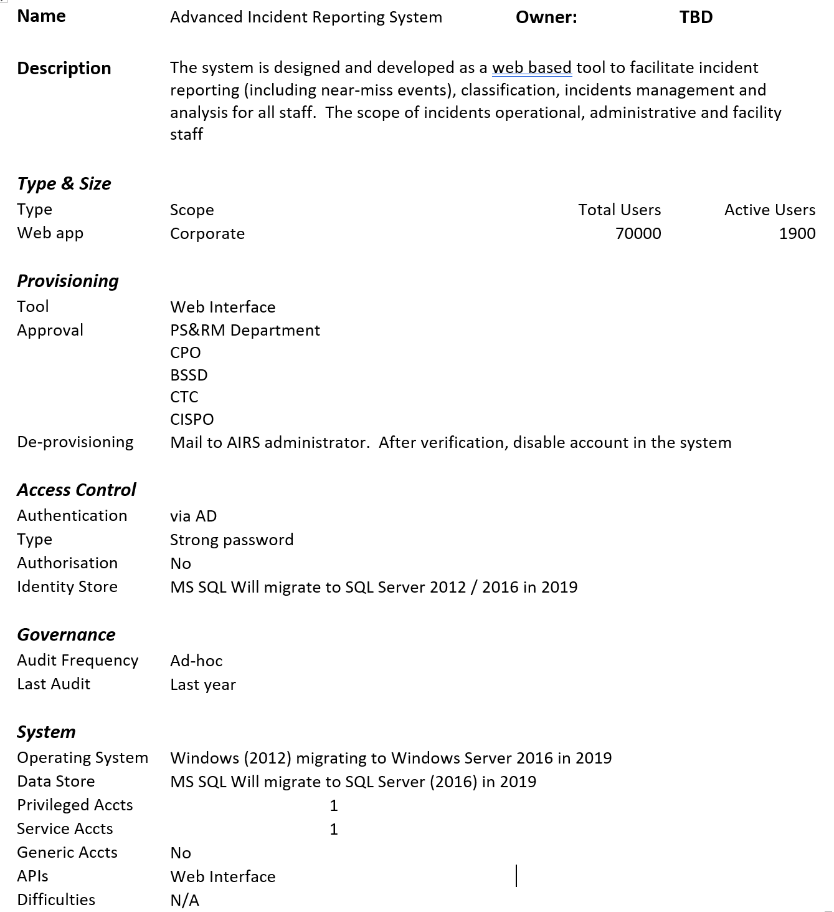

i### APIs

Defining the APIs to be supported within an organization is critical to
responsible management of information technology infrastructure. APIs
provide a way to manage information flow and maintain security. Without
defined APIs developers will construct communication links in the
absence of "rules" which is a recipe for disaster. A API definition must
select a protocol, establish the policies and define the attributes to
be communicated. Some of the more common protocols are:

#### HTTP

The most common type of API is a variant of HTTP. Most organizations
maintain large numbers of webservices applications and HTTP will
typically be used for access management.

Most developers prefer to use JSON arrays to communicate attributes via
a REST interface but this should be defined by the organization, some
mature IAM environments define XML tags for identity information.

Policies should define what HTTP commands can do. Controls are typically
placed on the HTTP PUT method.

#### S/LDAP

A common directory interface is LDAP. It is used to query a directory
via an LDAP filter that specifies the attributes to be returned. Secure
LDAP provides a way to protect an LDAP directory, only requests that
adhere to the encryption requirements of the interface will be actioned.
It is not a good idea to expose an LDAP directory to the internet.

#### RACF

If an organization has a legacy mainframe application it will typically
use a RACF identity provider service and the IAM environment should
support this i.e. provision to the RACF directory and remove entries for
exiting staff. In some cases organisations will mandate manual
administration of a RACF repository in which case the IAM environment
will use a service desk interface.

#### XACML

Organizations are increasingly adopting an attribute-based access
control approach to authorization and relying on an external decision
point. A standard protocol for the communication between the enforcement
point in the application to the decision point is ZACML.

### Example

The AP artifact is a reference document that indicates the type and
condition of each application used by an organization. It is constructed
via a survey of application owners and serves to advise the identity
professional on the type of infrastructure required to support each app.

Figure 5 - Application Portfolio extract

The AP should be aligned with the Technical Architecture to ensure
applications are operating on current OS versions and adhere to
supported patterns. As the enterprise architecture migrates to newer
versions or better technology the AP should be reviewed to prioritize
the application development program.

A separate entry should be created for all applications in use within
the organization.
