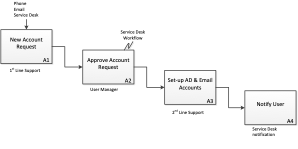

Business System Architecture
----------------------------

At the top level an identity management professional must understand the
business systems that are the target of the IAM environment. This will be
facilitated in organizations where there is an enterprise architecture in place.
Otherwise business people may not have a complete understanding of their
business processes. This means that the identity management professional must
spend time in understanding the applications to be supported by the IAM
environment. It is often necessary to restrict the number of applications to be
supported in any one deployment in order to keep the necessary workload to a
manageable level; with additional applications be added in subsequent deployment
projects.

### Business Processes

It is recommended that the identity professional understand:

-	The on-boarding systems – this will typically include the HR system and the
  current provisioning processes, both automated and manual.

-	Enterprise-wide systems such as email and enterprise resource planning
 	systems (financial management, production management, order processing etc.).
 	These systems typically maintain their own databases with identity
 	information.

-	Governance systems such as monitoring and reporting facilities and audit
  management procedures for periodic review of system access permissions.

Process maps are the artifact used at the Business System level. The main
processes used by the organization should be mapped using a standard
methodology. This will allow line-of-business managers to understand current
processes which will assist identity management professionals to develop an IAM
environment that suits the requirements.

At a minimum process maps are required for:

-   the provisioning process, showing the approval workflow for
    commencing staff (employees and contractors),

-   the movers process showing the procedures to be followed as staff
    change jobs,

-   the leavers workflow showing how staff are de-provisioned,

-   the governance process showing how periodic system account reviews
    and account re-certifications should occur.

Two common process mapping standards are:

Description | Pros | Cons
----------- | ---- | ----
BPMn - uses swim-lanes to show the actors involved in the process | Clearly delineates the business units that perform activities in the process | Complex processes can become difficult to understand
IDEF0 - Uses process diagrams that show sequence, agent and policies associated with each procedure in a process | Complex processes can be shown at different levels, i.e., high-level for an overview and separate pages for process components | Does not group processes by business unit

Note: when a process is first mapped it often becomes obvious that the
process can be optimized, i.e., remove redundant loops, reduce excessive
waiting times, etc. It is recommended that changes to the IAM
infrastructure be delayed until the process optimization exercise
completes. An IAM project should not try to automate a changing process.

==== Examples ====

Figure 2 - IDEF0 Example

Figure 3 - BPMn Example

==== Recertification of accounts ====

As noted above the re-certification process warrants specific attention. A
process map should be generated for it. Most IAM systems will incorporate an
“attestation” process that can be performed periodically. This usually involves
an email being sent to all managers in an organization listing their
subordinates and showing the systems access that each staff member has been
assigned. The manager then reviews the report and indicates any discrepancies.
If a manager indicates a particular staff member’s access is in error the system
will typically, remove that access immediately. Every time an attestation
process is performed the system will timestamp each user’s account access as
“re-certified”. This is part of the IAM governance process (see Governance and
Administration).

Note: some organizations prefer to assign recertification duties to system
managers, holding them accountable for access to their systems. This is not
ideal because system managers will not have intimate knowledge of staff
movements. It also renders the recertification less effective because it is
becomes a significant, time-consuming task for system managers who must
recertify hundreds of system users. It is preferable for a staff member’s
manager to recertify their access since they have more intimate knowledge of
their staff’ access requirements. It is noted that this does require an identity
repository with an accurate “manager is” attribute.
