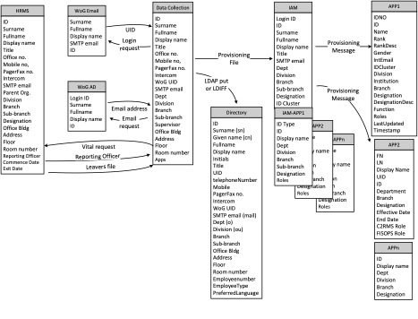

Information/Data Architecture
-----------------------------

The Information Architecture (IA) defines the data required to support
an organization's business systems. A comprehensive IA will ensure
sufficient data is collected and stored, and, that no data is collected
and stored that is not required by one or more business system.

This is particularly important for the IAM infrastructure. Privacy
legislation in most western jurisdictions prohibit the collection of
identity data that is not required for a business purpose. A good IA
significantly assists with legislation compliance.

The IA must document the structure of identity data storage within the IAM
environment. In many cases the IAM system will maintain its own data repository
of identity data. In this instance there will be interfaces to systems that are
the “authoritative source” for identity data, e.g., HR system for staff details,
phone system for contact numbers, etc. Interfaces, sometimes called connectors,
will be required to provision into relying applications that maintain identity
data records.

A typical way to document the data requirements for the IAM system and relying
applications is via an entity relationship diagram, see Figure 4 - Entity
Relationship Diagram that shows each identity data attribute that is collected
and used within the business. This will enable the identity management
professional to understand the usage and storage of identity data. Increasingly
organizations are seeking to maintain a directory that is the “source of truth”
for identity information within the organization with each application
maintaining a connector to this repository

While a central repository simplifies the IAM task, in some cases applications
are not designed to use an external directory, they maintain their own internal
databases of identity and account permission information. The IA must
accommodate the applications in the portfolio of programs being used by the
organization. It must show the data attributes to be provisioned into these
identity data stores including the attributes provisioned manually.

#### Example

Figure 4 - Entity Relationship Diagram
