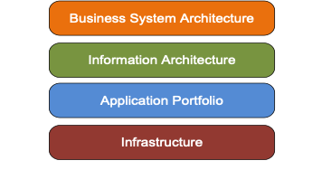

IAM Solution Architecture 
==========================

When approaching an IAM (identity and access management) project it is
important to consider the work as a process of creating change within the
organization. In some circumstances the change will be minimal, with
limited impact on resources. In other cases the change will be
significant, impacting both infrastructure and personnel across the
organization. It is highly recommended that a solution architecture for
IAM projects be developed. [HF: Why is a solution architecture important? Is it something that should be developed at the start of the process, or can it be done later? Perhaps: A solution architecture will act as the framework that ensures all components of the IAM project now and in the future are developed in an interoperable manner.]

Identity management within an organization touches virtually all systems that organization uses. Systems, in this context, comprise
computer systems that staff use in the performance of their job
responsibilities and physical systems such as a requirement to show a
driver license to gain access to a restricted area.

It is the task of an identity professional to ensure that, wherever and
whenever identity information is used within an enterprise, the
information is collected and used in an properly designed environment
that ensures efficiency, protects privacy, and safeguards integrity.
Applying an architectural approach will significantly raise the
likelihood that an IAM project will be completed consistently and
comprehensively with controlled impact on stakeholders.

There are four levels that should be addressed by a solution
architecture and two control topics to be considered:

Figure 1 - Enterprise Architecture Framework
