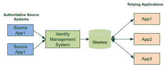
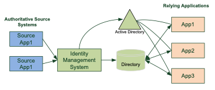
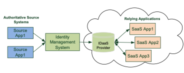
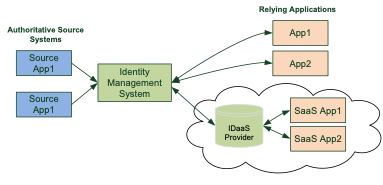

Technical
---------

The Technical Architecture (TA) defines the supported technology within the
organization. For instance: what is the predominant server infrastructure – is
it Linux or Windows or both? What server operating versions are supported? Are
VMs used? What is the support for cloud infrastructure – public, private,
hybrid? Is AWS, Azure or Google Cloud etc. supported?

The TA will define the computer system “patterns” to be supported by the IAM
environment within an organization. For young companies this will be web-based
patterns either “2-tier” or “n-tier”. Increasingly managed cloud environments
are being engaged, potentially with a micro-services approach. But for mature
organizations there will typically be legacy applications with a client-server
pattern, or even a mainframe ‘hub and spoke’ pattern, with PCs running terminal
emulator software.

The IAM environment must support the selected patterns and ensure a managed
approach that adheres to the organization’s governance and cyber security policy
is followed.

###Identity management environment
There are multiple IAM configurations and most organizations will require a
combination to support the requirements of newly deployed and legacy applications.

1)	Central directory
The “classic” model establishes a repository of identity data that acts as the
“source of truth” for any application requiring access to identity attributes
for authorization of users or for business purposes such as form-filling.

Figure 6 - Central Directory diagram

2)	Active Directory-centric
In organizations that operate applications that are mostly AD centric, i.e.,
that use AD groups for authorization, the AD environment should manage the AD
infrastructure and it should be incorporated into the IAM environment. It is
typically a good idea to maintain a separate LDAP directory to support
application requirements for identity attributes.

Figure 7 - Active Directory-centric diagram

3)	Cloud-based
Most organizations are experiencing development in the cloud. This makes it
important to establish an identity provider service in the cloud, to support
cloud-based applications. Synchronizing identity data from a corporate identity
data repository to multiple SaaS apps each night is not an acceptable practice.
Deploying a cloud-based identity provider service, or an IDentity-as a-Service
(IDaas) facility should be considered.

Figure 8 - Cloud-based Identity Service diagram

4)	Hybrid
It is often a requirement to support both on-premise and cloud-based
applications.

There are multiple ways in which this can be achieved. The cloud-based identity
provider service should ideally be provisioned directly by the identity
management system. In legacy systems the identity manager will provision to a
local AD and synchronize to the cloud identity provider via a connector.

Figure 9 - Cloud-based Identity Service diagram

###Identity data repositories
If there is any topic that’s unique to each IAM environment it’s the identity
storage infrastructure. There is no best-practice that fits all situations; the
solution will be largely based on the application portfolio. If most application
are AD ready

A directory will typically suit the storage of identity data best, because of
their capacity to store millions of identity records and retrieve records
quickly. But many larger corporate applications, e.g., ERP applications, utilize
internal databases for identity information.

Most organizations use Active Directory for authentication purposes and some
rely on AD as an identity data repository. This is not ideal because AD is
mission-critical infrastructure that should not be modified unless absolutely
necessary. Modifying the AD schema to accommodate a business unit requirement is
not to be done lightly. A directory, on the other hand, should be modifiable to
accommodate business requirements.

The identity management professional must decide how best to work with
constraints posed by the unique characteristics of each organization.

####Directories
The preferred technology for the storage of identity data is a directory because
of the optimized interface that can lookup an individual’s record across
millions of entries and return a result in milliseconds; it is also configurable
with schema changing to suit the organizations requirements. Directories store
data in hierarchies that align with a company’s organization chart and can be
replicated across geographies quite easily. For instance, a multi-national
organization might split the directory along regional lines with the directory
replication managing the updates between regions.

#####LDAP
In the past directories have been very hierarchical with identity data stored in
OUs (organizational units) that parallel the company’s organizational structure.
This was first standardize in the X.500 specification with a recommended schema
called InetOrgPerson. The lightweight directory access protocol (LDAP)
specification became the most widely-used directory interface for querying a
directory and the LDAP data interface format (LDIF) became the de facto standard
for bulk uploads to a directory.

#####S/LDAP
One of the deficiencies of LDAP in the modern age is its ease-of-use. Unless a
directory is properly architected, anyone with knowledge of the directory can
use an LDAP filter, to bind to the directory and retrieve data from it. One of
the ways to make directory access secure is to use S/LDAP. This requires the
directory bind to be made on a reserved port and for an authentication mechanism
to be utilized. Public key infrastructure (PKI) is often used for this purpose.
For companies with a functioning LDAP directory that requires improved security
of access, S/LDAP might be a good option.

#####Relational Database
Most applications maintain one or more internal databases for the storage of
application data and there will often be a table for identity data that will be
used to determine access control to application facilities. For instance, a
staff member’s entitlement to access the accounts payable ledger will typically
be held in a table within the financial management system. The identity
management professional must determine whether there is an approval workflow API
to write to the permissions table, whether an exposed SQL interface with write
permissions is available or whether a service desk interface must be used.

#####Query optimization
There are several reasons why database administrators (DBAs) are so well paid.
Working with a complex database is an art more than a skill. A good DBA will be
able to optimize a query by ensuring the table structure is well designed and
queries across multiple tables are well constructed to minimize the time (and
processing power) required to return a result. DBAs will also enable the
requisite security to be constructed, since limitations on access to data is
paramount.

#####Replication limitations
Few large organizations have a single campus. Most corporations are spread
across multiple locations either on a single continent or globally. This
provides a challenge for organizations with corporate applications with an
internal database. Replicating databases is not for the faint-hearted.
Fortunately cloud infrastructure is making this easier, Azure, AWS and other
purveyors of public cloud infrastructure provide services that will replicate
databases between multiple locations and maintain data integrity. Typically the
identity management professional will select a master location for identity data
and rely in the underlying cloud technology to replicate this data to other
locations.

#####NoSQL databases
As with many developments today there is a move away from hard work such as
setting up servers, configuring firewalls or writing code. We want the servers
to auto-scale, the network discovery to document access permissions and the
development environment to write our apps. So is is with databases. Why
laboriously set up table strictures when all you need to do is write the data to
the database. NoSQL databases provide this facility – the directory determines
how to store your data and will respond when you request it. But when it comes
to identity data we would like a little more, this is where graph interfaces
become attractive.

#####Graph databases
With the development of identity management environments, the propensity to
adopt cloud infrastructure and the increased focus on relationships, graph
databases are increasingly being used for the storage of identity information.
Rather than using a rigid schema a graph database stores identity information in
a relationship “mesh”. This means that standard queries such as “is Sally in the
Finance department?” can be extended to “does Sally know Bob in Purchasing?”,
which might be a probity issue. The database query construction is important and
determining the number of “hops” in a query will significantly affect its
efficiency.

#####Virtual Directories
One potential solution for the situation in which there are multiple identity
repositories in an organization is to use virtual directory technology. A virtual
directory exposes a single service for relying applications, usually using the
LDAP protocol, but it has connectors to the main identity repositories in the
organization that allow look-ups, and in some cases data writes, to the various
applications it supports.

When a directory query is received the virtual directory service (VDS) performs
a real-time lookup on one or more of the connected data repositories, joins the
data that is returned into a single records and responds to the query.

The main benefit to a virtual directory service  approach is: a single interface
is exposed to relying applications, if a technology update is made to a data
store only one interface needs to be modified, not each relying application.

#####Identity Provider (IdP) Trends
The future of IdPs is being forged in the shadow of major trends in identity
management:

-	Relationships – identity providers need to be able to not only provide
 	identity attributes but to provide detail on relationships between identities
 	(or entities for that matter) as well.

-	Dynamic authentication – risk-based access control means that additional data
 	is required when a person requests access to a service. While a traditional
 	data store might know my credit card number, it won’t know if I’ve used it
 	locally recently, which could be useful information to support a
 	high-assurance authentication.

-	Staff costs - organizations are hesitant to engaged expensive staff such as
 	DBAs. If a secure and functioning data storage facility can be purchased and
 	deployed relatively easily this becomes the preferred option.

While LDAP directories are not dead the trend is to deploy identity storage
infrastructure that supports modern interfaces such as Graph.

#####Distributed Ledger (Blockchain)
There is significant development in the deployment of blockchain technology for
identity provider services. A person’s identity in a particular domain (context)
will be substantiated via attributes that attest to their identity. In many
cases the authoritative source for an attribute will be distributed. Academic
credentials are a cases in point. To establish education credentials as part of
a job application recruiters will want to verify applicant credentials.
Blockchain is the ideal technology to support this requirement, i.e., universities
will contribute graduate records to a distributed data store to which the
recruiter can be granted access.

The Distributed Identity Foundation is proposing the use of Decentralized
IDentifiers (DIDs) for identities with attributes in a distributed ledger. If an
identity has a registered DID with one Blockchain it should be recognized/used
by another Blockchain on which credentials might be stored. A universally
accessible DID Resolver will support the use of Decentralized Identities across
multiple Blockchains, i.e., there is no need for a centralized authoritative
source for credential assurance. A number of mainstream Blockchain suppliers
have indicated their support for this approach.
