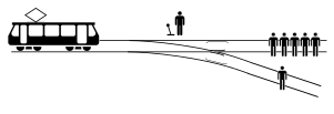

By Henk Marsman

© 2024 IDPro, Henk Marsman

*To comment on this article, please visit our [GitHub
repository](https://github.com/IDPros/bok) and [submit an
issue](https://docs.github.com/en/github/managing-your-work-on-github/opening-an-issue-from-code).*

Introduction
============

Technology has impacted every day since the beginning of human history.
It has changed power balances, helped to promote or restrict freedom of
speech, and either advanced or reduced human rights. For example, the
printing press changed society by providing knowledge to anyone who
could read. If it is true that “knowledge is power” then putting
information into the hands of more people changed the power balance.
However, information was not equitably distributed and there were fewer
benefit to those who could not read. Furthermore, not everything that
was written was truthful (you heard it here first!). Technological
advancements create opportunities not only for those who mean well, but
also for those who mean to cause harm.

Digital technology - and specifically digital identity (and IAM) - are
evolving rapidly. These developments do not just affect how
organizations manage their workforce (identity and access), their
customer interactions (customer authentication), or how identity
providers offer federation services. Globally, nations are developing
digital identity solutions for their national identification schemes. In
Europe, for example, there is the amended eIDAS Regulation that
stipulates every EU citizen to be able to use a digital identity wallet
by 2026 (note: these are member state digital wallets and identities –
there will not be a European identity or wallet). In other regions,
biometrically-linked national identities are more commonly stored in
centralized databases. Meanwhile, some nations reject the notion of a
mandatory federally-issued identity altogether – they may be more
inclined to follow the progress of ISO’s Mobile Driver’s License (MDL)
set of standards.

Are these developments good? Should we even ask that ourselves that
question? Yes we should. Why? Because technically perfect solutions can
lead to harm when they are used in practice. A very good facial
recognition solution that is used to recognize users’ emotions and
deliver better service may also be used for surveillance systems or to
exert undue influence on a population. It it is our professional
responsibility to give these risks an appropriate level of attention.
This is ethics.

Ethics is time spent on thinking about and talking about the impact of
something and whether it is good or bad. Ethics is about what we value,
and whether this has been adequately addressed in the design, roll-out,
or operation of (in the case of IDPro members) a digital identity
solution.

Identity professionals need to include ethical discussions and value
conversations in their work, not just as a moral imperative but also
because this leads to better solutions. This article lays out the
foundations of ethical thought, proposes and defines a set of values for
Digital Identity practitioners, and some high-level tools for engaging
in ethical discussion. A second article, “Ethics for Digital Identity
and Identity-Driven Algorithms” by Mike Kiser, delves into ethics
related to Digital Identity and Algorithms and offers a deeper look at
the Ethical Canvas tool for
practitioners.<a href="#fn1" id="fnref1" class="footnote-ref">1</a>

Ethics vs Law
=============

Ethics and law are not the same – and despite some assertions by vendors
out there, a solution cannot be “ethically compliant.” The realm of law
is where, depending on locality, polity and legal system, clear (well,
ideally clear) rules are enshrined regarding what is acceptable,
unacceptable, and what penalties apply to unacceptable behaviour. Law is
continually updated because of changes in the world - especially changes
to what we value. For example: long time ago voting by women was not
valued, now it is, so the law has changed. Our laws are a result of
ethics, but that statement cannot be reversed. Being lawful does *not*
automatically mean being ethical: upholding the law and staying within
the boundaries of the law can still be combined with morally despicable
behaviour.

The realm of ethics involves discussion and thought about what is right
and wrong, and why these are right and why those are wrong. While some
ethical paradigms, namely Duty Ethics (which will be explored below),
may seem law-like, it is still the moral discussion that is more
important than the rule itself.

As stated above, laws often result from the practice of ethics: when
society reaches a normative conclusion that something is ethically right
or wrong, it may be enshrined in law, regulations, trust frameworks,
contracts, or other institutional controls. For example, it is not
uncommon for individuals that hold a degree, obtain an accreditation or
join an association to underwrite a statement that they will conduct
themselves professionally including applying ethical guidelines in their
work, for example for software engineers in Canada that are member of
the order of
engineers.<a href="#fn2" id="fnref2" class="footnote-ref">2</a>
IDPro also has this in their value
statement.<a href="#fn3" id="fnref3" class="footnote-ref">3</a>

Examples of Identity Ethics
===========================

Ethics become practical very fast in use cases. For example, when an
organization deploys a passwordless authentication solution to its
workforce and makes use of a swipe function app, how will this impact
people with disabilities? Are they able to use it, or will they be
excluded? Do they need to use another, more cumbersome, authentication
tool? How will the solution affect those with visual or motor
differences ? Are they able to use it? Or doesn’t the organization care,
because the product is perfectly designed, and these are so-called “edge
cases” (get to them in the infamous “Phase 2”)? What is important to the
organization? What values are at stake here?

The same applies to customer identity management (CIAM) solutions. The
way they are designed and how they operate impacts which customers are
able to access services. An ethical discussion includes whether all
people have an equal opportunity to become a customer and interact. So
for example a CIAM solution may offer benefits to customers that buy in
the app. But that means excluding, or at least disallowing benefits, for
those users who do not have a smartphone (either because they cannot
afford one or cannot use it). These discussions inevitably lead into the
realm of the real world, where not all individuals are able-bodied,
high-earning urban natives. These conversations force organizations to
consider people outside their target demographic – those who do not
regularly use digital technologies or those who need to get by on a
minimum wage or allowance. These trade-offs are discussed later in this
article.

Trade-offs become even more impactful in relation to government services
and national identity. For example, refugees that want to register in
their host country may be asked to use a registration tool that contains
a drop-down list of nationalities: what if the one the refugee wants to
select is not available? This was the case when Rohingya refugees fled
to Bangladesh: they were not able to register the nationality they
wanted.<a href="#fn4" id="fnref4" class="footnote-ref">4</a>

The long-standing Aadhaar system in India is also worth observing to
highlight ethical
tensions.<a href="#fn5" id="fnref5" class="footnote-ref">5</a>
Aadhaar is a unique identity registration and identification system in
India, where it has been incredibly successful. One of the system’s
founding values was voluntary use: that an Aadhaar account would not be
obligatory or compulsory in order to access services. After a decade in
use, however, its adoption has grown and service providers have
gravitated towards its substantial benefits (e.g. strong authentication
and de-duplication). Aadhaar is now integrated into other services, like
mobile telephony and banking. The result is that in practice Indians
increasingly miss out on benefits, or need to put in additional effort,
when they do not want, or cannot use Aadhaar. It is arguably less
optional, therefore, as a citizen. Is this an ethical development? And
who should pay attention to these shifts in use?

These examples demonstrate why technology itself is not good or bad ...
but is also never
neutral.<a href="#fn6" id="fnref6" class="footnote-ref">6</a>
They exemplify a few core tenets at the heart of this article:

1.  Design choices lead to (ethical) consequences in the real world.

2.  There are inevitable trade-offs between values that must be weighed
    and prioritized.

3.  These evaluations are subject to cultural differences in values and
    ethics.<a href="#fn7" id="fnref7" class="footnote-ref">7</a>

4.  That technology never operates in isolation and should be designed
    with respect to its interfaces with business, operational, legal,
    and societal context (in the case of the Rohingya, the context of
    legal identity and humanitarian law).

Because "when you are assigning identity, you are exercising power, and
you are defining their
possibilities."<a href="#fn8" id="fnref8" class="footnote-ref">8</a>

Ethics
======

Ethics or moral philosophy is concerned with what is right and what is
wrong. It is about discussions of values and what is important, how
values can be compared, and ultimately reach a conclusion about what is
right or wrong. We distinguish between the main ethical theories, the
main ethical values, and the process of ‘doing ethics’. To be clear,
this paragraph can never do justice to the wide and depth of moral
philosophy, it should be considered a very high level and brief
introduction.

<table>
<colgroup>
<col style="width: 50%" />
<col style="width: 50%" />
</colgroup>
<thead>
<tr class="header">
<th>The most common used example to explain ethics – the <strong>trolley problem</strong></th>
<th></th>
</tr>
</thead>
<tbody>
<tr class="odd">
<td>Almost every introductory textbook in ethics uses the famous trolley problem. This problem starts with a trolley going down the track and the brakes malfunction. The trolley will hit five persons that are standing down the track and they will all die (in this example). But you can flip a switch that will make the trolley switch tracks, and on the other track there is only one person (that will get hit and die). Should you flip the switch? And in a next version there is a terminally ill person standing on the bridge over the tracks. If you push this person of the bridge onto the tracks the trolley will stop before it hits the five persons. Would you do that?<a href="#fn9" id="fnref9" class="footnote-ref">9</a></td>
<td>

<em>Image from <a href="https://en.wikipedia.org/wiki/Trolley_problem">wikipedia</a>.</em>
</td>
</tr>
</tbody>
</table>

Ethical theories
----------------

Ethical theories are rooted in society, history and culture and are
always in development, just like humanity itself. Perhaps the closest to
a global agreement on ethics are the declarations on human rights (the
Universal Declaration of Human Rights (UN), the International Covenant
on Civil and Political Rights, the Charter of Fundamental Rights of the
European Union and the Convention on the Rights of the
Child<a href="#fn10" id="fnref10" class="footnote-ref">10</a>).
Importantly, despite centuries of efforts by philosophers, there is no
one universal & globally acceptable theory of ethics (note that ethics
is not religion, most religions claim to have moral truth). The
following section describes four major schools of ethical thought,
humbly noting that one article can never do justice to all ethical
philosophies: there are many that contain elements of these four
‘mainstream’ ethical theories and there are others focusing on specific
disciplines, such as Environmental Ethics and or political
theories.<a href="#fn11" id="fnref11" class="footnote-ref">11</a>

The four theories that are detailed in this article are utilitarianism,
duty ethics, virtue ethics and communal
ethics.<a href="#fn12" id="fnref12" class="footnote-ref">12</a>

| Ethical theories |             |               |                 |
|------------------|-------------|---------------|-----------------|
| Utilitarianism   | Duty Ethics | Virtue Ethics | Communal Ethics |

### Utilitarianism

This is the ethics of usefulness. It is a form of
consequentialism,<a href="#fn13" id="fnref13" class="footnote-ref">13</a>
meaning the result of an action determines whether the action is
right.<a href="#fn14" id="fnref14" class="footnote-ref">14</a>
Utilitarianism states that when something is useful, it is right. The
most common philosopher of utilitarianism is Jeremy [Bentham](https://plato.stanford.edu/entries/bentham/)
(1748-1832), and one typical statement he made was saying that
utilitarianists want *the greatest happiness of the greatest number*.
Utilitarians could say that when lying brings about good results, lying
is good.

The challenges with utilitarianism relate to the distribution of utility
or happiness and the potential for harms. Criticisms are often boiled
down to “who values the outcome” and “who determines what is
valuable?”.<a href="#fn15" id="fnref15" class="footnote-ref">15</a>
It may be extremely difficult to measure “utility.” For example, saying
‘if it brings more revenue, it is good’ is clearly Utilitarian. However,
when it comes with costs to the health of employees or customers, or
even lives, it is ethically unjust. Or is it? Who gets to do this math?

A modern example of this playing out is self-driving technology: given
that self-driving cars will be safer in future, does the utility of
future lives saved justify unfettered testing on today’s
roadways?<a href="#fn16" id="fnref16" class="footnote-ref">16</a>

### Duty Ethics

Other philosophers consider duties (adherence to an adopted moral code)
to be more important than the result of an action. One of the leading
philosophers of Duty Ethics (also known as Deontology) is
Immanuel [Kant](https://plato.stanford.edu/entries/kant/) (1724-1804),
who described the ‘categorical imperative’ that determines whether an
action is permissible based on whether it can be applied universally –
i.e. asking the question “what if everyone did that?”. Importantly a
Duty may mean that certain actions are right to do – even when they do
not result in utilitarian benefits (i.e. even if they make no one any
happier). When the rule is ‘you should always speak the truth’ then that
guides the decision on whether something is right or wrong. Duty
Ethicists say that lying is never good, because we have a duty to be
upright and honest all the time. They care less for the consequences, as
long as the rules were followed or the duties are
fulfilled.<a href="#fn17" id="fnref17" class="footnote-ref">17</a>
This can give rise to conflicts, for example, in situations where lying
could save someone’s life or the variations on the Trolley Problem.

This means that, while a Utilitarian may consider torture to obtain
critical information, a Duty Ethicist will always disapprove of torture
and instead apply the so-called Golden Rule that mandates “do unto
others what you would want to be done to yourself.” And because these
are universal rules, according to duty ethicists, they are often in a
framework that guides ethical decisions and ensures that everyone is
aware of the moral expectations. Critics of Duty Ethics might suggest,
however, that there are many acts for which universality cannot be
easily established in the real world. Furthermore, there are certainly
cases in which Duties come into conflict and a rigid adherence to
doctrine may induce harms. Duty Ethics does not wholly enable
technologists to navigate trade-offs.

In the Digital Identity industry, many agree with Article 6 of the
United Nations Universal Declaration on Human Rights: that we have a
duty to ensure that all people have a right to legal personhood before
the law. If a vendor deploys a Digital Legal Identity system that is
later used by malevolent government actors to commit human rights
abuses, Duty Ethics asserts that the deployment was still moral as long
as it was motivated by that duty – even if those abuses would have been
preventable (e.g. by implementing privacy-by-design best practices). On
another level, similarly, meeting a deadline by delivering an identity
management solution without some critical controls would be rejected by
the Duty Ethicist, as the duty of delivering quality would be violated
(although the buyer might not even notice and the goal of timelines
(utilitarian) can be achieved).

### Virtue Ethics

Philosophers of Virtue Ethics consider the ultimate objective to be a
moral life of virtuous habits. The virtuousness of an action (not the
result!) determines whether it is right or wrong. When it is a virtue to
help each other, then helping each other is the right thing to do
regardless of whether it was motivated by duty (as in Duty Ethics) or
whether it achieves positive results (Utilitarianism). Obviously this
raises the question, similar as with duties: “what are the virtues?”,
“who decides what is virtuous?”, and “what is the end-goal?” [Aristotle](https://plato.stanford.edu/entries/aristotle/),
Plato, and Socrates are considered the main thinkers that developed this
theory. In their time (ancient Greek civilization) their formulation of
Virtue Ethics also included a clear view on what humans were meant to
be, what their objective is (their ‘teleos’ in Greek) and that all
actions to achieve that were good. Some examples of virtues are courage,
compassion, modesty, honesty and kindness. Kant’s main critique of
Virtue Ethics included the notion that a person with virtuous habits but
malevolent intent would lead to a very effective malevolence (e.g. a
really good thief). And, of course, utilitarians would agree since
thievery does not optimize the total amount of happiness (unless that
thief is Robin
Hood<a href="#fn18" id="fnref18" class="footnote-ref">18</a>
or otherwise philanthropically inclined…).

Taking the same Digital Identity System example above, Virtue Ethicists
would consider it moral, not if driven by the duty to provide identity
for all, but instead if it has been designed virtuously. In order to
cultivate the virtue of autonomy with individuals they could propose a
self-sovereign identity (SSI) solution that supports more autonomy than
another (central or federated) type of identity management solution
(where third parties, like institutions, play a determining role in
controlling the identity and data). This may also cover virtues of
inclusion, a process of ethical reckoning, etc.

### Communitarianism

This more modern theory of Communitarianism considers the communal
aspects and suggests that, in fact, ethics cannot be separated from its
socio-historic context. One of the proponents is [Alasdair
MacIntyre](https://en.wikipedia.org/wiki/Alasdair_MacIntyre) (1929) who
wrote ‘After Virtue’ (1981). It rejects the Virtue Ethics practice of
separating the ends (outcomes) from the means (virtues in this case). In
this paradigm, the community is the source of meaning, values, and
therefore ethical practice. This occurs via community sense-making,
which is a function of language, meaning, history, religion. Ethics in
this theory includes the impact on the society and the community, not
just what a development does in a community (but also what it does to
it).

There is some critique on the communitarianism theory. Individual values
like self-determination, moral autonomy, right to privacy (including
control over your data) can sometimes conflict with accountability and
obligations towards others (which are more relational and societal) and
the responsibility for ones actions, as values more related to
communitarianism<a href="#fn19" id="fnref19" class="footnote-ref">19</a>.

### Overview and Example

The overview of the four theories also gives examples of probable
statements made, using these theories. In addition an example is given
to further clarify what type of arguments and reasoning are associated
with the various theories.

| Overview of Ethical Theories                                                               |                                                                                                                 |                                                                                                          |                                                                                                 |
|--------------------------------------------------------------------------------------------|-----------------------------------------------------------------------------------------------------------------|----------------------------------------------------------------------------------------------------------|-------------------------------------------------------------------------------------------------|
| Utilitarianism                                                                             | Duty Ethics                                                                                                     | Virtue Ethics                                                                                            | Communal Ethics                                                                                 |
| Result, outcome, consequence. It is right if the result is right. The means serve the end. | Duty, principle. Even when it lands you in trouble you carry out your duty.                                     | Character building, virtue development. Whatever makes us a better person.                               | Community and relations. What makes a better society, creates a stronger social fabric.         |
| ‘It is OK to cut a few corners and hide some mistakes to get the product launched on time’ | ‘We have to be transparent with regards to the risks of our product, it is our duty to inform every user fully’ | ‘This design forces the user to active consider options, we want to cultivate this behavior in the user’ | ‘This feature brings people together based on similarities instead of creater bigger divisions’ |

Using Artificial Intelligence as an example the four theories could view
the developments related to AI like this:

-   Utilitarianism: good because it speeds up production processes,
    helps students deliver essays more quickly, allows doctors to
    diagnose patients quicker and better

-   Duty ethics: worrisome since AI is going to take over some of the
    human duties, yet technology can never be held accountable

-   Virtue ethics: good because it allows humans to focus more on
    cultivating virtuous habits, yet bad because it is used for creating
    essays, yet bad when it makes humans lazy (as an example)

-   Communitarism: bad because of the impact on society, the ‘race for
    the brain stem’ and the destabilization of democratic processes,
    fake news, etc.

So was it useful, did you do your duty, or were you to develop a virtue,
or consider the community/society? Having philosophers thinking and
discussing this for centuries is at least a sign that we won’t be able
to come to a definite answer this decade. (just kidding)

If we want to have maximum positive impact in the world through our work
as identity professionals, we need to be conscious of these ethical
theories and make sure we bring the right (design) reasons to the table
before we make choices. Outcomes matter, so too do the values and the
virtues that have been selected to achieve those outcomes. And,
embracing communitarianism means that valuable outcomes and practices
may differ around the world. With this said, this paper recommends that
Identity professionals - and really any professional - begin with
understanding the difference between ‘but this will provide a good
result’ and ‘but this is what we ought to do’ and ‘but this is what
professional with integrity would build’ and ‘but this is what our
community needs’, followed by a clear articulation of the values their
work is designed to uphold.

Values to Uphold (or not)
-------------------------

When grappling with ethics on a project, the key questions are about

1.  What is valued?,

2.  How those values relate to each other

3.  How can the project honour and reflect those values more than
    before.

This section proposes and explains several values relevant to Digital
Identity. Note that IDPro is releasing another article, “Ethics for
Digital Identity and Identity Driven Algorithms” by Mike Kiser, in which
a slightly differing set of values is
discussed.<a href="#fn20" id="fnref20" class="footnote-ref">20</a>
There is a large overlap to be expected in values that differing authors
hold and discuss, and at the same time each individual will bring their
own emphasis, based on their context, background, culture, technical
specialism and experience. This shows that in ethics the conversation is
essential, and not having a final definitive exhaustive list of values
(as that does not exist).

In practice, ethics is a process of discussing, weighing, navigating,
documenting, and measuring values. Rather than adopting one or the
other, the authors and the BoK Editorial Committee encourage
practitioners to use these and other best-practice inputs to develop
contextually appropriate value-sets. Further resources are highlighted
at the end of both articles.

### Well-Being

Human well-being is also expressed in the Hippocratic oath: “do no
harm,” but the concept must involve more than a mere defensive approach.
This is a widely accepted assertion, also found in the various human
rights instruments. But what does it mean? And whose well-being?

Well-being for one group may mean it comes at the expense of another.
Especially in the global supply and production chains there is growing
recognition for a fair distribution of benefits and a fair distribution
of the costs of production (not just financially, but also in terms of
pollution, waste, etcetera). Also, the question arises what exactly is
well-being: is it more income, or perhaps less income but more freedom?
Perhaps it is privacy… but perhaps it is strong counter-fraud controls
in the ecosystem. Are those two aspects of well-being sometimes in
tension? This means exploring and documenting the interplay of interests
for all parties. Key is the conversation to a) at least recognize this
value and b) discuss the questions of what well-being, whose well-being
and impact on well-being c) identify the requisite trade-offs. Some
research in this area has been done by Women in
Identity.<a href="#fn21" id="fnref21" class="footnote-ref">21</a>

### Autonomy

Autonomy refers to individuals having the freedom to decide what to do
and exercising control over their own life. Most often defined as
“freedom from external control or influence,” this applies within the
boundaries that are set in society. Importantly, autonomy does not mean
individuals can steal or abuse others. Autonomy can also include the
autonomy of making up one’s mind. Often, legal frameworks (like Europe’s
General Data Protection Regulation) and Digital Identity implementations
uphold this value through the concept of consent.

The book *Beyond Data* by Elizabeth
Renieris<a href="#fn22" id="fnref22" class="footnote-ref">22</a>
considers where the usefulness of consent ends and further regulation is
required. A car offers a tangible example: you can’t buy one without
brakes and a seatbelt, but you can select the brand, the horsepower and
the color. What should be regulated (brake, seatbelt) and what should be
for the user to decide? And a similar discussion starts related to the
digital identity wallet that every citizen of EU Member States can use
to authenticate and share data, where full control by the user realizes
(a form of) self-sovereign identity (SSI) and on the other hand we know
how easy users share data online or click ‘accept’, so where should
control be augmented with restrictions? How should regulators address
the risk of oversharing
data<a href="#fn23" id="fnref23" class="footnote-ref">23</a>?

### Agency

Agency is the capacity to act under one’s own free will. Everybody is
influenced continuously, but when technologies enable manipulation and
coercion, it deprives people of autonomy and agency: people lose their
‘free will’, either knowingly or unknowingly (e.g., in cases of
misinformation or algorithmic
manipulation<a href="#fn24" id="fnref24" class="footnote-ref">24</a>),
then this is generally considered unethical.

### Equality

Equality is the state of being equal, especially in status, rights and
opportunities. Equality means each individual or group of people is
given the same resources and opportunities, regardless of their
circumstances. Digital technologies can create more opportunity for
equality by expanding the ways that people can interact when digital is
offered as an additional channel. However, just as easily, digital
technologies can create more inequality through their design by
targeting mainstream users, which can make it more difficult for those
outside of the mainstream to participate. For instance, this ca an occur
via prerequisites, such as digital literacy, devices, connectivity, or
power.

### Transparency

For users to hold practitioners accountable for decisions in design,
development of solutions and their implementation(s), the reasons must
be transparent to end users. True transparency not only answers the
question of why, *but it breaks down the how* in a simple way. When
applying this to identity, it is critical to use language that is easily
understandable to the end user, as technical jargon can quickly become
complex.

This transparency is more than just disclosure for disclosure’s sake —
it enables autonomy of individuals by having clear visibility on what is
happening and why. It enables the stakeholders to timely identify
necessary changes to the system when the purpose changes of over time or
when the operations of the solution do not meet the purposes anymore. It
minimizes the risk of ending up in the sitation where ‘this is just how
the system works, we do not know why exactly but we can’t change it’,
leading to unintended results (and potentially including harm).

### Fairness (Lack of Bias)

For Identity Systems to promote fairness, it must expose its own biases.
Detection is successful only when the full range of bias is understood,
and organizations such as IBM have helpfully provided a taxonomy of
bias, ranging from bias due to doing too much, too quickly (shortcut
bias) — to false assumptions of sound judgement (impartiality bias) — to
more direct prejudices (self-interest bias).
<a href="#fn25" id="fnref25" class="footnote-ref">25</a>

The value of fairness can also include that those who put in effort also
should get reward (either through income or other benefits).

Principles for Digital Identity
-------------------------------

Various frameworks of principles and guidelines for the development of
national Digital Identity solutions have appeared in the early 2020s.
This article will not explore these but merely mention the many
principles<a href="#fn26" id="fnref26" class="footnote-ref">26</a>
and a study on how principles and values differentiate based on the
sociopolitical
configurations<a href="#fn27" id="fnref27" class="footnote-ref">27</a>.

Applied Ethics
==============

With some background on the main ethical theories and a set of values,
this paper turns its attention to how to ‘do ethics.’ This section
describes several methods that have been developed to include ethics in
technological design processes. When abstracted, every approach
generally contains at least these four main elements:

1.  Consider the context and the use case (what do we have here)

2.  Identify all stakeholders (who do we have here)

3.  Discuss the use case (what values are impacted)

4.  Adjust the design/operation of the solution.

The scope for this evaluation should not be limited to technical
functionality and, instead, should extend to the end-to-end experience
of the actors in the eco-system. This broad view is essential in
facilitating a holistic ethical discussion. This is true whether
implementing a commercial authentication solution or a national Digital
Identity eco-system that integrates with global payments.

Having completed those stages, the changes can be implemented. However,
ethics needs to be continuously practiced. For example, when asbestos
was invented it was great because it was so fire-resistant; only later
did we find out it was a carcinogen. Another example is DDT, which was
an insect repellent that worked really well to increase crop yields …
until we found out it also poisoned ground
water.<a href="#fn28" id="fnref28" class="footnote-ref">28</a>

This could also happen to Digital Identity and Access Management
solutions as solutions take root in the real world and technologies move
on (e.g. encryption practices will need to move on with quantum
computing), so continuous assessment of their impact on individual and
society is required.

Value Sensitive Design
----------------------

Value Sensitive Design (VSD) is a framework to systematically integrate
values of ethical importance into technological designs, described by
[Batya Friedman et
al.](https://dl.acm.org/doi/pdf/10.1145/242485.242493) In 1996, and
expanded in the following years. The methodology has three parts that it
addresses: empirical, conceptual and technical. The empirical part
identifies relevant stakeholders and their values and priorities, the
conceptual part explores these values and their trade-offs, and the
technical part clarifies how the technology either gives rise to value
issues, or can ‘implement’ values in the design of technology. For
technology that continues to change (i.e., it does not remain fixed
after go-live) reflexivity is added as a fourth aspect, which
periodically reflects on the technological design, its operation, and
the values of ethical importance that play a
role.<a href="#fn29" id="fnref29" class="footnote-ref">29</a>

Guidance Ethics
---------------

The [guidance ethics approach
(GEA)](https://ecp.nl/publicatie/guidance-ethics-approach/) positions
the ethical observer not as a judge to a process or a result, but as a
guide and consultant. This has evolved as a method where a workshop is
conducted to discuss a new technology (such as digital wallets for
digital identity and attributes). Facilitators gather all relevant
stakeholders, discuss the use case, and deep dive into the impact of
this technology. This is a guided value conversation during which the
group discusses what values are impacted and, towards the end of the
workshop, the actionable items and deliberations for the (design of the)
technology are formulated. For example: when applying Digital Identity
wallets for age verification (for buying alcohol online) the value of
health was identified, but **also** the safety (of the cashier),
autonomy and ease of use. In this approach theorists, designers and
practitioners are jointly discussing the technology and the use
case(s).<a href="#fn30" id="fnref30" class="footnote-ref">30</a>

Ethics Canvas
-------------

The [ethics
canvas](https://link.springer.com/chapter/10.1007/978-3-319-99605-9_23)
is based on the value proposition
canvas,<a href="#fn31" id="fnref31" class="footnote-ref">31</a>
but adds the dimension of impact (the consequence space), where impact
on the individual and society is described. Choices and outcomes may be
explored and centrally documented using an ethics canvas. Identification
of the affected individuals, their relationships, and worldviews help to
give concrete insight into what groups might be in conflict and what
trade-offs are being implicitly agreed to with each
decision/implementation choice. This allows for all participants — from
designers to implementers — to contemplate the ramifications of their
decisions, and to embed a mindset that seeks to underscore the morality
of their actions more clearly. This central document establishes the
ethical standard that all participants agree to abide by; it is a
guiding force throughout the rest of the
process.<a href="#fn32" id="fnref32" class="footnote-ref">32</a>

Example of Applied Ethics in Digital Identity
---------------------------------------------

The 2013 process for the development of the British Columbia (BC)
Services
Card<a href="#fn33" id="fnref33" class="footnote-ref">33</a>
reports how this process successfully realized civil participation to
discuss values and impact. The lessons learned were that the forum,
panel and survey worked well. The clarity of the need and the aspect of
‘reporting back’ to those who provided input (do not merely use them for
input at the start), painted a clear picture of what was to be achieved
and how it will look like (practical and concrete). Lastly, it will make
sure everyone is heard, including those groups in the population with a
‘softer’ voice.

Another example is the Horizon2020 IMPULSE (“Identity management in
public services”) project that developed an innovative digital wallet
for citizens to assess SSI and blockchain based approach to digital
identity could be implemented into the public administration. The
project [published](https://doi.org/10.1007/s44206-024-00113-2) on the
assessment of ethical societal and legal issues. IMPULSE used a
decentralised and SSI management system based on a verifiable credential
(VC) model (using blockchain). Users request identity verifiable
credentials through a digital onboarding process with biometric face
recognition and document validation. From there the users present
identity verifiable credentials for authentication to online public
services. The ethical assessment was done with a deontological approach
and a Value Sensitive Design approach.

Finally
=======

It takes time and dedicated conversation to create ethical identity
solutions that have been built to express a clear set of values. One of
the values most business hold is that a good cost-benefit analysis is
done before expending resources on a project. The cost-benefit analysis
for ‘being ethical’ seems hard to make, and isn’t it something that
everyone should be? Who wants to be unethical? In addition there is
evidence of a a positive business case. Inclusive solutions that take
more time and effort to develop can result in more revenue/use because
they achieve higher adoption. In general, businesses with an ethical
approach to doing business outperform comparable companies by 12,3
percentage points in 5 years on the Large Cap
Index.<a href="#fn34" id="fnref34" class="footnote-ref">34</a>

Ethical behavior affords premium pricing, attracts ethical employees and
associates – so the whole network becomes more ethical (investors,
business partners, etc.).

For identity professionals it is important and possible to create
solutions that contain the results of ethical and value-driven
conversations. This leads to better results, whether working on
enterprise IAM solutions, customer and market solutions, or even
national solutions and global standards.

Other sources
=============

The whitepaper [“Human-Centric Digital Identity: for Government
Officials,”](https://openid.net/human-centric-digital-identity-whitepaper/)
co-branded by 13 non-profits (including UNHCR) describes the connection
between Human Rights and Digital Identity Initiatives, specifically
Legal Identity, and includes five paradigms on digital identity.

A book on [Ethics for People Who Work in
Tech](https://www.routledge.com/Ethics-for-People-Who-Work-in-Tech/Steen/p/book/9780367542436),
detailing more on the ethical thoughts and the various approaches to
applying ethics.

More on ethics at the ‘e’ in the [Stanford Encyclopedia of
Philosophy](https://plato.stanford.edu/contents.html#e).

A a 4 page workshop report on ‘ethical digital identities’
(<https://dl.acm.org/doi/abs/10.1145/3526073.3527586>) with a problem
description and a specific definition of an ethical digital identity
(EDI) - a digital identity of an object (e.g. unique identifier) that
also states what ethical ‘level of assurance’ is given.

------------------------------------------------------------------------

1.  

    Kiser, M. (2024) “Ethics for Digital Identity and Identity-Driven
    Algorithms.” IDPro Body of Knowledge 1(14) doi:
    <https://doi.org/10.55621/idpro.105>.<a href="#fnref1" class="footnote-back">↩︎</a>

    

2.  

    Engineers Canada. “Public Guideline on the Code of Ethics \|
    Engineers Canada,” n.d.
    <https://engineerscanada.ca/guidelines-and-papers/public-guideline-on-the-code-of-ethics#-the-code-of-ethics>.
    \[Accessed 31 July
    2024\]<a href="#fnref2" class="footnote-back">↩︎</a>

    

3.  

    IDPro. “IDPro® Mission, Vision, Values, Services - IDPro,” n.d.
    <https://idpro.org/mission-vision-services>. \[Accessed 31 July
    2024\]<a href="#fnref3" class="footnote-back">↩︎</a>

    

4.  

    Covered in
    <https://msf.org.au/rohingya-worlds-largest-stateless-population>,
    but more complex than mentionable in one
    sentence<a href="#fnref4" class="footnote-back">↩︎</a>

    

5.  

    Government of India, Unique Identification Authority of India.
    “Aadhaar,” n.d. <https://uidai.gov.in/en/>. \[Accessed 31 July
    2024\]<a href="#fnref5" class="footnote-back">↩︎</a>

    

6.  

    Melvin Kranzberg, “Technology and History: Kranzberg’s Laws,”
    *Technology and Culture* 27.3 (1986):
    547.<a href="#fnref6" class="footnote-back">↩︎</a>

    

7.  

    Note that public and private actors may hold and promote different
    values, but values vary across cultures as well as
    well.<a href="#fnref7" class="footnote-back">↩︎</a>

    

8.  

    Francesca Morpurgo, “Panel: Human Rights by Design for a
    Fast-Changing World.” European Identity & Cloud Conference 2024,
    https://www.kuppingercole.com/sessions/5564/2.<a href="#fnref8" class="footnote-back">↩︎</a>

    

9.  

    See a Yale lectured on the Trolley Problem (lectures 14-15) at
    <https://oyc.yale.edu/philosophy/phil-181/> and assess your own
    morality versus others at
    moralsensetest.com<a href="#fnref9" class="footnote-back">↩︎</a>

    

10. 

    Respectively
    <https://www.un.org/en/about-us/universal-declaration-of-human-rights>;
    <https://www.ohchr.org/en/instruments-mechanisms/instruments/international-covenant-civil-and-political-rights>;
    <https://eur-lex.europa.eu/legal-content/EN/ALL/?uri=OJ:C:2007:303:TOC>;
    and
    <https://www.ohchr.org/en/instruments-mechanisms/instruments/convention-rights-child>
    See more Human Rights Instruments at
    https://www.ohchr.org/en/instruments-listings<a href="#fnref10" class="footnote-back">↩︎</a>

    

11. 

    See [Environmental Ethics (Stanford Encyclopedia of
    Philosophy)](https://plato.stanford.edu/entries/ethics-environmental/)
    for example<a href="#fnref11" class="footnote-back">↩︎</a>

    

12. 

    The book by Michael Sandell on Theories of Justice provides an
    excellent further exploration of these
    theories.<a href="#fnref12" class="footnote-back">↩︎</a>

    

13. 

    “Consequentialism (Stanford Encyclopedia of Philosophy),” October
    4, 2023. <https://plato.stanford.edu/entries/consequentialism/>.
    \[Accessed 31 July
    2024\]<a href="#fnref13" class="footnote-back">↩︎</a>

    

14. 

    Another type of consequentialism is hedonism, which basically states
    that when it gives pleasure, it is
    right.<a href="#fnref14" class="footnote-back">↩︎</a>

    

15. 

    “Bernard Williams (Stanford Encyclopedia of Philosophy),” January
    28, 2023. <https://plato.stanford.edu/ENTRIES/williams-bernard/>.
    \[Accessed 31 July
    2024\]<a href="#fnref15" class="footnote-back">↩︎</a>

    

16. 

    “‘Elon Musk’s Appetite for Destruction.’” Narrated by James Cronin.
    The New York Times, February 26, 2023.
    https://www.nytimes.com/2023/02/26/podcasts/the-daily/elon-musk-tesla-self-driving.html.<a href="#fnref16" class="footnote-back">↩︎</a>

    

17. 

    Furthermore, they believe that the duty itself must be the
    motivation for the act. For more on Duty Ethics see “BBC - Ethics -
    Introduction to Ethics: Duty-based Ethics,” n.d.
    <https://www.bbc.co.uk/ethics/introduction/duty_1.shtml>.<a href="#fnref17" class="footnote-back">↩︎</a>

    

18. 

    Vincenti, Alexander. “Hero or Thief: Evaluating the Morality of
    Robin Hood’s Actions.” The Glen Echo, May 25, 2021.
    <https://theglenecho.com/2021/05/25/hero-or-thief-evaluating-the-morality-of-robin-hoods-actions/>.
    \[Accessed 31 July
    2024\]<a href="#fnref18" class="footnote-back">↩︎</a>

    

19. 

    Mattei, Luca, Francesca Morpurgo, Carmela Occhipinti, Lorenzo Maria
    Ratto Vaquer, and Tetiana Vasylieva. “Self-Sovereign Identity Model:
    Ethics and Legal Principles.” *Digital Society,* vol. 3, no. 2 (June
    7, 2024).
    https://doi.org/10.1007/s44206-024-00113-2.<a href="#fnref19" class="footnote-back">↩︎</a>

    

20. 

    Kiser,
    https://doi.org/10.55621/idpro.105.<a href="#fnref20" class="footnote-back">↩︎</a>

    

21. 

    Women in Identity. “Code of Conduct: The Human Impact of Identity
    Exclusion,” n.d.
    <https://www.womeninidentity.org/cpages/code-of-conduct>. \[Accessed
    31 July 2024\]<a href="#fnref21" class="footnote-back">↩︎</a>

    

22. 

    Renieris, Elizabeth M. *Beyond Data: Reclaiming Human Rights at the
    Dawn of the Metaverse*. MIT Press,
    2023.<a href="#fnref22" class="footnote-back">↩︎</a>

    

23. 

    Identified in this study
    https://pure.tudelft.nl/ws/portalfiles/portal/136174101/soups2022\_korir.pdf
    and in one Member States’ political debates (the Netherlands)
    <https://www.tweedekamer.nl/kamerstukken/detail?id=2024Z03994&did=2024D09367>
    and
    <https://open.overheid.nl/documenten/ronl-0662761f27b090409a5b68476bf4e550c69c9562/pdf>.<a href="#fnref23" class="footnote-back">↩︎</a>

    

24. 

    Wong, Julia Carrie. “The Cambridge Analytica Scandal Changed the
    World – but It Didn’t Change Facebook.” *The Guardian*, March
    19, 2019.
    <https://www.theguardian.com/technology/2019/mar/17/the-cambridge-analytica-scandal-changed-the-world-but-it-didnt-change-facebook><a href="#fnref24" class="footnote-back">↩︎</a>

    

25. 

    Jones, M. Tim. “Machine learning and bias.” IBM Developer, August
    27, 2019.
    <https://developer.ibm.com/articles/machine-learning-and-bias/>.
    \[Accessed 31 July
    2024\]<a href="#fnref25" class="footnote-back">↩︎</a>

    

26. 

    Henkmarsman. “Principles and Codes of Conduct.” ThroughIdentity -
    Henk Marsman, March 23, 2023.
    <https://henkmarsman.wordpress.com/2023/03/23/principles-and-codes-of-conduct/>.<a href="#fnref26" class="footnote-back">↩︎</a>

    

27. 

    Whitley, Edgar A., and Emrys Schoemaker. “On the Sociopolitical
    Configurations of Digital Identity Principles.” *Data & Policy* 4
    (2022): e38.
    <https://doi.org/10.1017/dap.2022.30>.<a href="#fnref27" class="footnote-back">↩︎</a>

    

28. 

    Wikipedia. 2024. "DDT." Wikimedia Foundation. Last modified July
    23, 2024.
    https://en.wikipedia.org/wiki/DDT.<a href="#fnref28" class="footnote-back">↩︎</a>

    

29. 

    Friedman, Batya. “Value-sensitive Design.” *Interactions* 3, no. 6
    (December 1, 1996): 16–23.
    <https://doi.org/10.1145/242485.242493>.<a href="#fnref29" class="footnote-back">↩︎</a>

    

30. 

    ECP \| Platform Voor De InformatieSamenleving. “Guidance Ethics
    Approach - ECP \| Platform Voor De InformatieSamenleving,” February
    28, 2022.
    https://ecp.nl/publicatie/guidance-ethics-approach/.<a href="#fnref30" class="footnote-back">↩︎</a>

    

31. 

    B2B International. “What Is the Value Proposition Canvas? - B2B
    International,” March 7, 2024.
    <https://www.b2binternational.com/research/methods/faq/what-is-the-value-proposition-canvas/>.<a href="#fnref31" class="footnote-back">↩︎</a>

    

32. 

    Reijers, Wessel, Kevin Koidl, David Lewis, Harshvardhan J. Pandit,
    and Bert Gordijn. “Discussing Ethical Impacts in Research and
    Innovation: The Ethics Canvas.” In *IFIP Advances in Information and
    Communication Technology*, 299–313, 2018.
    <https://doi.org/10.1007/978-3-319-99605-9_23>.<a href="#fnref32" class="footnote-back">↩︎</a>

    

33. 

    British Columbia, Ministry of Technology, Innovation and Citizens’
    Services. “DIGITAL SERVICES CONSULTATION: Fall 2013 \| Minister’s
    Response.” *govTogetherBC*, March 2014.
    <https://engage.gov.bc.ca/govtogetherbc/engagement/digital-services-consultation-results/>.<a href="#fnref33" class="footnote-back">↩︎</a>

    

34. 

    Ethisphere \| Good. Smart. Business. Profit.®. “World’s Most Ethical
    Companies - Ethisphere \| Good. Smart. Business. Profit.®,” May
    3, 2024. <https://ethisphere.com/worlds-most-ethical-companies/>.
    \[Accessed 31 July
    2024\]<a href="#fnref34" class="footnote-back">↩︎</a>

    

