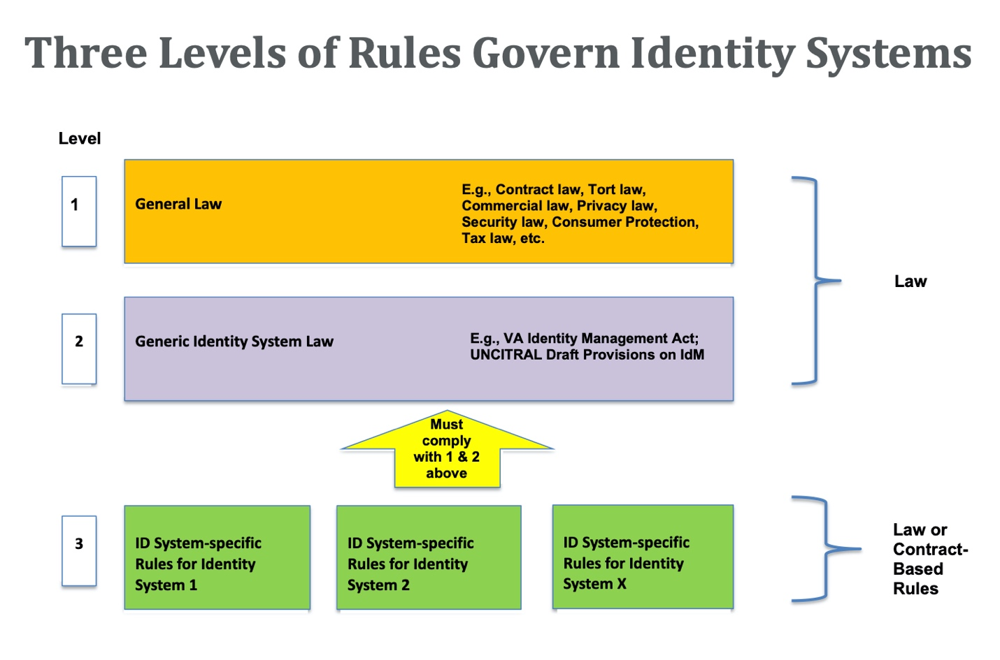

# Laws Governing Identity Systems (v2) 

Thomas J. Smedinghoff

© 2021, IDPro, Thomas J. Smedinghoff

Abstract
========

Identity systems and their participants are governed by a myriad and
complex set of laws, regulations, and contractual requirements. This
article offers a high-level overview of the legal environment that
governs identity systems, focusing on three different levels of legal
rules: General Law, Generic Identity System Law, and Individual Identity
System Rules.

Introduction
============

What are the legal rules that govern identity systems? What obligations
do those rules impose on the participants involved?

The reality is that identity systems and their participants are governed
by a myriad and complex set of laws, regulations, and contractual
requirements, and the obligations they impose are not always clear. To
make sense of it all, it is best to focus first on the legal environment
that governs identity systems.

Terminology
-----------

-   Consumer Protection Law - laws and regulations that are designed to
    protect the [rights](https://en.wikipedia.org/wiki/Rights) of
    individual [consumers](https://en.wikipedia.org/wiki/Consumers) and
    to stop unfair, deceptive, and fraudulent business practices.

-   Contract Law – laws that relate to making and enforcing agreements
    between or among separate parties.

-   Fraud Law – laws that protect against the intentional
    misrepresentation of information made by one person to another, with
    knowledge of its falsity and for the purpose of inducing the other
    person to act, and upon which the other person relies with resulting
    injury or damage.

-   Identity Theft Law – laws governing crimes in which the perpetrator
    gains access to sensitive personal information belonging to the
    victim (such as birth dates, passwords, email addresses, driver’s
    license numbers, social security numbers, financial records, etc.),
    and then uses this information to impersonate the victim for
    personal gain, such as to commit fraud, establish credit in the
    victim’s name, or access the victim’s accounts.

-   Privacy Law - laws that regulate the collection, use, storage, and
    transfer of personal data relating to identified or identifiable
    individuals.

-   Tort Law - the body of law that covers situations where one person’s
    behavior causes injury, suffering, unfair loss, or harm to another
    person, giving the injured person (or the person suffering damages)
    a right to bring a civil lawsuit for compensation from the person
    who caused the injury. Examples include battery, fraud, defamation,
    negligence, and strict liability.

The Identity System Legal Environment
=====================================

At a high level, the legal environment that governs the operation of any
identity system consists of three different levels of legal rules,
categorized as follows:

-   <u>Level 1: General Law</u>: The first level is law that applies
    generally to all business and personal activities. This law covers a
    wide variety of subjects and is not written with identity systems in
    mind, although it is frequently applied to identity system
    activities where appropriate. Examples of general law that might
    affect the operation of an identity system include contract law,
    tort law, privacy law, warranty law, and consumer protection law.

-   <u>Level 2: Generic Identity System Law</u>: The second level of
    legal rules consists of law written specifically to govern identity
    systems generally. Level 2 identity management laws typically apply
    to all identity systems within a jurisdiction and are often
    relatively high level in nature. At present, however, very few such
    Level 2 laws exist. Examples of such generic identity system law
    include Virginia’s Electronic Identity Management Act[1] and the
    Draft Provisions on the Cross-border Recognition of IdM and Trust
    Services[2] being developed by the UN Commission on International
    Trade Law (UNCITRAL). In many jurisdictions, Level 2 law for
    identity systems does not yet exist.

-   <u>Level 3: Individual Identity System Rules</u>: The third level of
    legal rules consists of the set of system-specific rules written to
    govern the operation of a particular identity system. These rules
    provide the technical, business, and operational specifications and
    rules for the identity system, specify the rights and
    responsibilities of the participants and govern the relationships
    between the various parties. They can be quite detailed but apply
    only within the confines of the identity system they were written to
    govern.

For private sector identity systems, these legal rules are typically
contract-based, are often referred to as a trust framework or system
rules, and apply only to those system participants who have
contractually agreed to be bound to them. Examples include the SAFE
Identity Trust Framework (previously the SAFE-BioPharma Trust
Framework),[3] the Sovrin Governance Framework,[4] and the SecureKey
Concierge Trust Framework.[5]

For government identity systems, these Level 3 legal rules are often
embodied in a law or regulation enacted by the government and thus
automatically apply to all those who participate in the identity system.
Examples include the eIDAS Regulation in the European Union,[6] the
Identity Documents Act in Estonia,[7] and the Aadhaar Act in India.[8]
In some cases, however, government identity systems also use
contract-based trust frameworks, such as the Trusted Digital Identity
Framework (TDIF)[9] for the Australian national federated identity
system.

The Level 3 portion of the legal environment for any identity system is
under the control of the developers of that identity system (government
or private sector). That is, the operators of a private sector identity
system are free to make up the Level 3 system rules and design them in
the manner best suited to meet the goals of that specific identity
system. However, where such rules are contract-based, they will apply
only to the participants that agree to be bound by them, and they may be
supplemented (and in some cases overruled) by existing laws and
regulations at Levels 1 or 2. In other words, the Level 3 rules designed
for any specific identity system must comply with existing law – a
challenge made all the more difficult for identity systems that cross
jurisdictional boundaries.

The structure of this identity system legal environment

is summarized on the diagram below.

This structure of the identity system legal environment is very similar
to that which governs a credit card system (such as Amex®,
Discover®, MasterCard®, or Visa®). Each
credit card system is governed by Level 3 system rules developed by the
operator of that system (e.g., the MasterCard Rules[10] and the Visa
Core Rules and Visa Product and Service Rules[11]). Those rules provide
the technical, business, and operational specifications for the specific
credit card system and govern the relationships between the various
parties. They are made binding on the parties that participate in the
system (e.g., credit card holders, merchants, issuing banks, processors,
etc.) by contract.

Those Level 3 credit card system rules and the associated contracts are
also governed by: (1) Level 1 general law (e.g., the law of contracts,
the law of negligence, etc.), and (2) Level 2 generic credit card system
law written to regulate all credit card systems (e.g., Regulation Z[12]
in the US). Like the legal environment governing identity systems, this
combination of Level 3 system rules and contracts and Level 1 and 2 law
forms the legal environment in which each credit card system operates.

The Legal Rules Governing Identity Systems 
==========================================

Level 1 – General Law 
---------------------

Currently, most law applicable to identity systems is general law (Level
1). Typically, this law was written for a purpose completely unrelated
to identity management (e.g., tort law, contract law, warranty law,
privacy law, etc.) and without considering how it might apply to
identity systems. In fact, in many cases it was written before the
concept of identity systems even existed. And in some cases, the law
developed over hundreds of years via common law and court decisions.
Nonetheless, such general law often applies to identity system-related
activities, often in ways that were unanticipated at the time of its
original adoption.

Identity systems primarily deal in information. Thus, the Level 1 law
that applies to identity systems will typically include those laws that
address various aspects of transactions involving information. This
primarily includes law governing the following aspects of information:

> -- Collection, Use, and Transfer of Identity Information

Identity information about individuals is personal data, and identity
system processes typically involve the collection and processing (by an
identity provider, attribute provider, or its agents) and disclosure (to
a relying party) of such personal data about a subject. Thus,
***privacy*** laws will regulate the collection, storage, use, and
transfer of identity information and will have a major impact on all
identity system participants and all identity system transactions. This
may include, for example, imposing limits on what data may be collected,
requirements regarding notices of collection practices, limits on the
use that may be made of such data, and restrictions on the transfer of
such data to third parties and/or across country boundaries.

> -- Accuracy of Identity Information

A key concern of all participants in an identity system relates to the
accuracy and reliability of the identity information they are
communicating or relying upon. Inaccurate identity data can cause a
variety of problems for persons who rely on that data, as well as
liability for those who provide it.

Laws governing providing false or incorrect information, whether
intentionally or negligently, will be relevant in the evaluation of the
rights, obligations, and liabilities of the participants in identity
systems, including identity providers, attribute providers, and data
subjects.

Key among them are ***fraud*** laws and ***identity theft*** laws. Fraud
involves a representation of fact (or material omission of fact) that is
intended to deceive another to their material detriment. Identity theft
occurs when a party acquires, transfers, possesses, or uses someone’s
personal information in an unauthorized manner, with the intent to
commit, or in connection with, fraud or other crimes.

Even in the absence of fraud, the tort of ***negligent
misrepresentation*** can create liability for communicating false
information. This occurs where the information is intended for the
guidance of others in their business transactions, but the information
provider did not exercise reasonable care in determining the accuracy of
the information prior to the communication. Thus, in certain
circumstances, an incorrect assertion of one or more identity attributes
might qualify as a negligent misrepresentation.

This tort of negligent misrepresentation creates a duty to exercise
reasonable care or competence to verify facts and creates liability for
incorrect representations made without exercising reasonable care about
the accuracy of the facts asserted. However, it does not make the
supplier of information (e.g., the identity provider) a guarantor of the
accuracy of an identity assertion. Generally, the information provider
does not have liability for inaccurate or “false” information unless the
provider failed to exercise reasonable care in obtaining or
communicating the information.

To the extent that incorrectly communicated identity information damages
the reputation of the data subject, the tort of ***defamation*** may
also be relevant. Defamation involves a false or disparaging statement
of fact about a person that is published to a third party causing the
person to suffer harm. It is possible that incorrect identity or
attribute assertions could be considered defamatory in certain
situations. For example, asserting an inaccurate attribute – e.g., age,
medical information, sexual orientation, political affiliation, or
employment -- might be considered defamatory in certain cases where the
named person suffered harm as a result.

The accuracy or reliability of identity attribute information
communicated to a relying party by an identity provider or attribute
provider may also be governed by ***warranty*** law. A warranty is
an assurance, promise, or guaranty by one party to another party that
facts or conditions are true and may be relied upon by the other party.

A warranty may be either express or implied. An *express warranty*
arises from specific statements made by one party to another. Such
statements may be made in writing, such as in a contract or
advertisement, or may be made orally, such as by a sales representative.
For example, an identity provider’s published processes may include a
warranty regarding the quality of the information it provides to relying
parties.

An *implied warranty* is an unspoken, unwritten promise created by law
that arises from the nature of the transaction and the inherent
understanding by the recipient rather than from the express
representations of the provider. Implied warranties are based upon the
common law principle of “fair value for money spent.” Thus, for example,
a court could conceivably conclude that identity providers make implied
warranties regarding the reasonableness of the processes they used to
collect and verify identity attribute data.

Finally, it is important to note that some privacy laws also regulate
the accuracy of personal data. The EU GDPR, for example, requires that
personal data maintained by data controllers (such as identity
providers) must be “accurate and, where necessary, kept up to date” and
that “every reasonable step must be taken to ensure that personal data
that are inaccurate … are erased or rectified without delay.” Article
5(1)(d). In addition, it provides that “The data subject shall have the
right to obtain from the controller without undue delay the
rectification of inaccurate personal data concerning him or her.”
Article 16.

> -- Availability, Retention, and Deletion of Identity Information

In the case of identity systems where an identity provider, relying
party, or other identity system participant retains data about a data
subject, the availability, retention, and deletion of such identity
information can be regulated by a variety of Level 1 laws.

***Privacy law*** (e.g., GDPR and the California Consumer Privacy Act
(CCPA)[13]) often regulates the availability of personal data (and hence
identity data) to the data subject. In particular, such laws often
impose on identity providers a duty to provide individual data subjects
with access to the data it has collected about them, as well as
information regarding the purposes for which it collects and processes
such data, and the recipients or categories of recipients to whom the
data are disclosed

Numerous laws also impose ***data retention*** obligations on companies
regarding their corporate records. These laws may apply to and require
both identity providers and relying parties to retain certain identity
data for a particular period of time.

Finally, however, ***privacy*** laws (such as the GDPR) may impose
limits on the retention of personal data. And increasingly, privacy laws
(such as GDPR and CCPA) grant data subjects are right to request that
data about them be deleted or erased.

> -- Security of Identity Information and Processes

Many ***data security laws*** and regulations impose obligations on
companies with respect to the security of personal data and other
information in their possession or under their control. To the extent
that a participant in an identity system is collecting, using, storing,
or transferring personal data, such data security laws may have a
significant impact on its obligations and potential liability. This is
particularly true for identity providers and relying parties.

Data security laws are sometimes incorporated into privacy laws, but
regardless of form, they generally impose two key obligations: (1) a
duty to *provide reasonable security* for personal data, and (2) a duty
to *disclose breaches* of security of personal data to the persons
affected and to regulators. Although not written specifically to address
identity system activities, such laws will undoubtedly apply to the
personal data used by identity systems as well.

Level 2 – Generic Identity System Law
-------------------------------------

The application of existing general law to identity systems is often not
a good fit, frequently ambiguous, and in many cases leads to arguably
inappropriate results. This is further complicated by the fact that the
Level 1 laws applied to identity systems can vary considerably across
jurisdictions. Thus, there have been several attempts to address these
concerns.

Some jurisdictions have proposed, and some have enacted, legislation or
regulations expressly governing all identity systems within their
jurisdiction. However, there is not yet agreement on the desirability or
goals of such generic legislation, much less on how to achieve them. Key
questions yet to be resolved include whether such legislation should be
designed to: (1) simply remove legal barriers (actual and perceived) to
identity systems, (2) encourage and assist the development of identity
systems, or otherwise help establish the “trust” and the
“predictability” needed by parties engaged in online identity
transactions, or (3) regulate and control identity systems, such as by
protecting the privacy of personal information, ensuring the security
and trustworthiness of identity transactions, or imposing or limiting
the liability of identity providers.

At present, very little Level 2 law exists. Nevertheless, some
noteworthy efforts to develop Level 2 law governing identity systems
include the following:

<u>Virginia</u>. The state of Virginia became the first US state to
adopt Level 2 identity legislation by enacting the Virginia Electronic
Identity Management Act in 2015. That legislation is focused primarily
on the issue of liability. To do that, it provides for the creation of a
Virginia Identity Management Standards Advisory Council, which was
tasked with developing Identity Management Standards. Identity providers
and trust framework operators that comply with the requirements of those
Identity Management Standards are then granted immunity from civil
liability. In other words, the Virginia Act provides a safe harbor from
liability for identity providers and trust framework operators.

<u>UN Commission on International Trade Law (UNCITRAL)</u>. In the
Spring of 2015, both the American Bar Association Identity Management
Legal Task Force, and a group of EU countries (Austria, Belgium, France,
Italy, and Poland, with support from the EU Commission), submitted
proposals to UN Commission on International Trade Law (UNCITRAL)
regarding identity management legislation. Those proposals recommended
that UNCITRAL undertake a project to develop “a basic legal framework
covering identity management transactions, including appropriate
provisions designed to facilitate international cross-border
interoperability.” UNCITRAL has since agreed to move forward with such a
project.[14]

UNCITRAL provides an international forum capable of developing a
harmonized set of globally accepted law governing identity management.
Such law can be adapted domestically by individual countries to promote
a universal approach to identity management law and can be extended
globally (to facilitate cross-border identity transactions) through an
international treaty or convention.

In September 2019, UNCITRAL produced the second version of its Draft
Provisions on the Cross-border Recognition of IdM and Trust Services.
Issues currently being considered include the:

-   Rights and responsibilities of various identity system roles

-   Determination of the reliability of identity systems

-   Liability of identity providers

-   Legal recognition of identity credentials.

-   Cross-border recognition of identity credentials.

Level 3 – Individual Identity System Rules 
------------------------------------------

Both Level 1 and Level 2 law provides general rules applicable to all
identity systems. But because each identity system is unique, it also
requires its own tailored set of more detailed rules to govern its
operations.

In fact, having predictable and enforceable rules designed to ensure
that it functions properly and is trustworthy is key to any identity
system. Unique system rules (e.g., a trust framework) will ideally
provide such a structure to govern the operation of an identity system,
much like the Visa or MasterCard rules (including the payment card industry data security standard or PCI-DCSS) that govern credit card systems.
Such rules include the technical specifications and operational rules
and requirements necessary to make the system functional and trustworthy
and the legal rules that define the rights and legal obligations of the
parties and facilitate enforcement where necessary.

These individual identity system rules are the Level 3 law that governs
an identity system. For private sector identity systems, these rules
typically take the form of a so-called trust framework and are made
enforceable against the various system participants by contract.
Accordingly, those rules must comply with any restrictions at Levels 1
and 2 law.

In the case of public sector identity systems (such as a national ID
system), these rules usually take the form of legislation or regulations
adopted by the government to govern the system. Many countries,
including most notably Estonia and India, have adopted laws to govern
their specific national ID systems. In some cases, a country may
establish an identity system based on a set of rules that participants
voluntarily agreed to by contract. The Australian Trusted Digital
Identity Framework (TDIF), and the UK GOV. UK Verify program takes this
approach.

Regardless of whether an identity system is public or private, the
issues addressed by the Level 3 system rules/trust framework often
include the following:

-   technical specifications that will govern the system

-   rights and obligations of participants in each system role

-   data subject registration and enrollment processes

-   identity verification process requirements

-   credential issuance requirements

-   authentication process requirements

-   rules governing reliance by relying parties

-   data security requirements (over and above requirements of
    applicable law)

-   privacy requirements (over and above requirements of applicable law)

-   audits, assessments, and certification requirements

-   allocation of liability risk among roles

-   termination rights and obligations

-   dispute resolution

-   enforcement of rights and obligations

Where such rules are embodied in laws or regulations issued by a
government, they are of course binding on all system participants by
force of law. But in the case of a trust framework (typically used in a
private-sector system), the system rules are binding on the participants
only to the extent they agree by contract to be bound to comply with the
rules. In all cases, however, the Level 3 law is comprised of system
rules written for a specific identity system, and thus its applicability
is limited to that system.

Author Bio
==========

Thomas J. Smedinghoff is Of Counsel at Locke Lord, LLP, and Chair of the
American Bar Association Identity Management Legal Task Force. He can be
reached at <Tom.Smedinghoff@lockelord.com>

Change Log
==========

| Date       | Change            |
|------------|-------------------|
| 2021-06-30 | Editorial updates |

[1] Code of Virginia - Chapter 50. Electronic Identity Management Act.
2015. <https://law.lis.virginia.gov/vacode/title59.1/chapter50/>.

[2] “Draft Provisions on the Cross-border Recognition of IdM and Trust
Services,” revision A/CN.9/WG.IV/WP.160, United Nations Commission on
International Trade Law, last revised 16 September 2019,
<https://uncitral.un.org/sites/uncitral.un.org/files/media-documents/uncitral/en/wp-160-e.pdf>.

[3] “Greater Security via the SAFE Identity Trust Framework,” accessed
18 May 2021, SAFE Identity,
https://makeidentitysafe.com/trust-framework/.

[4] “Sovrin Governance Framework,” accessed 18 May 2021, Sovrin,
https://sovrin.org/library/sovrin-governance-framework/.

[5] “SecureKey Concierge Trust Framework,” accessed October 10, 2019,
SecureKey,
https://securekey.com/resources/trust-framework-securekey-concierge-in-canada/.

[6] eIDAS
Regulation\[EU\]: <https://eur-lex.europa.eu/legal-content/EN/TXT/?uri=uriserv:OJ.L_.2014.257.01.0073.01.ENG>

[7]  Identity Documents Act
\[Estonia\]: <http://www.unhcr.org/refworld/docid/4728ab1b2.html>    

[8] Aadhaar Act
<https://uidai.gov.in/images/targeted_delivery_of_financial_and_other_subsidies_benefits_and_services_13072016.pdf>.

[9] “Trusted Digital Identity Framework,” accessed 18 May 2021,
Australian Government Digital Transformation Agency,
https://www.dta.gov.au/our-projects/digital-identity/trusted-digital-identity-framework.

[10] “Mastercard Rules,” accessed 18 May 2021, Mastercard,
<https://www.mastercard.us/en-us/about-mastercard/what-we-do/rules.html>.

[11] “Visa Core Rules and Visa Product and Service Rules,” 15 October
2013, accessed 18 May 2021, Visa,
<https://usa.visa.com/dam/VCOM/download/merchants/visa-international-operating-regulations-main.pdf>.

[12] Ҥ 1026.1 Authority, purpose, coverage, organization, enforcement,
and liability,” 12 CFR Prt 1026 (Regulation Z), Consumer Financial
Protection Bureau, accessed 18 May 2021
https://www.consumerfinance.gov/rules-policy/regulations/1026/.

[13] “California Consumer Privacy Act of 2018,” Title 1.81.5, Section
1798.100, Part 4 of Division 3, State of California, accessed 18 May
2021,
https://leginfo.legislature.ca.gov/faces/codes\_displayText.xhtml?division=3.&part=4.&lawCode=CIV&title=1.81.5.

[14] UNCITRAL, “Colloquium on Identity Management and Trust Services,”
21-22 April 2016, accessed 18 May 2021,
<https://uncitral.un.org/en/colloquia/electronic_commerce/2016>.

[15] PCI Security Standards Council, Standards Overview, website, <https://www.pcisecuritystandards.org/standards/>. 
