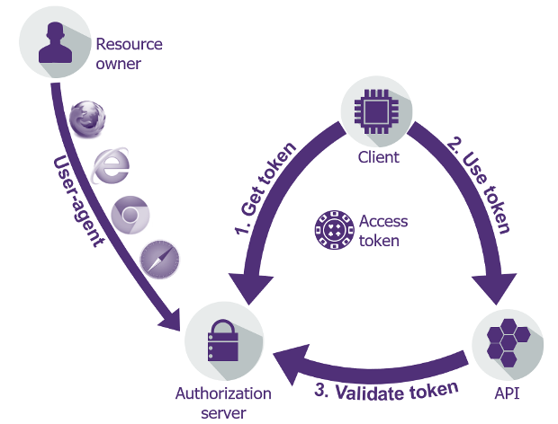
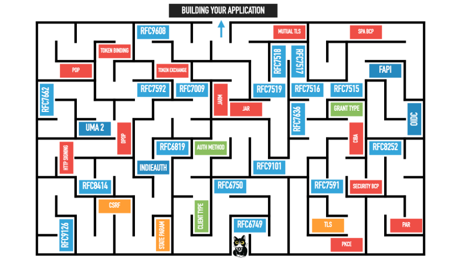

By Bertrand Carlier

© 2023 IDPro, Bertrand Carlier

*To comment on this article, please visit our [<u>GitHub
repository</u>](https://github.com/IDPros/bok) and [<u>submit an
issue</u>](https://docs.github.com/en/github/managing-your-work-on-github/opening-an-issue-from-code).*

About OAuth2
============

In a nutshell, this standard protocol aims to allow access from a
**client application** (a website, a mobile application, an
Internet-connected device, etc.) to a **protected resource** (e.g., an
API), possibly on behalf of a **resource owner** (e.g., the end-user).
It can be associated with several transport protocols but has been very
popular to secure REST web services.

This article will focus on the current published standards; work is
underway in the [<u>OAuth working
group</u>](https://datatracker.ietf.org/wg/oauth/about/) in the IETF to
update some of this material. For more information on how OAuth came
about and its relationship with other authentication protocols, see
Pamela Dingle’s IDPro Body of Knowledge article, “Introduction to
Identity - Part 2: Access Management.”[1]

OAuth2 can be considered a three-step protocol:

1.  Get an access token

2.  Use the access token

3.  Validate the access token

Figure 1: High-level diagram of OAuth2 flows

When looking into the OAuth2 specification space, you are quickly
surrounded with many documents, making it difficult to determine the
easiest path to follow.

Let’s see where to start the journey and where to head.

Terminology
-----------

|                           |                                                                                                                                                          |
|---------------------------|----------------------------------------------------------------------------------------------------------------------------------------------------------|
| **Term**                  | **Definition**                                                                                                                                           |
| Client                    | A client application consuming an API                                                                                                                    |
| Protected Resource        | An API in the OAuth2 terminology                                                                                                                         |
| Resource Owner            | An end-user using the client application and granting it access to the protected resource                                                                |
| Authorization Server (AS) | The OAuth2 server is able to authorize a client, issue tokens, and potentially validate tokens                                                           |
| Scope                     | A string designating a (part) of a protected resource that a client is authorized to access                                                              |
| Bearer token              | A token whose possession is sufficient to enable access to a protected resource                                                                          |
| Sender constrained token  | A token whose possession is not sufficient to enable access to a protected resource (additional proof of identity by the client application is required) |
| Access token              | The OAuth2 token that allows a client to get access to a protected resource                                                                              |
| Refresh token             | The OAuth2 token that allows a client to renew an access token when it is expired without the user’s presence                                            |

**Where to start**
==================

OAuth2 is defined through a series of IETF RFC documents that each
describe a specific aspect, use case, or profile of use of the protocol.

Figure 2: An artistic rendering of OAuth and related standards, courtesy
of Aaron Parecki

Everything starts with two RFC documents:

-   [<u>RFC 6749 - The OAuth 2.0 Authorization
    Framework</u>](https://www.rfc-editor.org/info/rfc6749) defines four
    ways for a client application to obtain a token from an
    authorization server (two of those are now deprecated). Those are
    called flows or authorization grants.[2]

-   [<u>RFC 6750 - The OAuth 2.0 Authorization Framework: Bearer Token
    Usage</u>](https://www.rfc-editor.org/info/rfc6750) defines the way
    for a client application to use a token in a subsequent request to a
    protected resource.[3]

-   Later on, different documents would help with the validation step:

    -   [<u>RFC 7662 - OAuth 2.0 Token
        Introspection</u>](https://www.rfc-editor.org/info/rfc7662)
        defining token introspection against the authorization server,
        which can be used to verify token validity and extract data from
        the token.[4]

    -   or [<u>RFC 9068 - JSON Web Token (JWT) Profile for OAuth 2.0
        Access Tokens</u>](https://www.rfc-editor.org/info/rfc9068)
        defining a JWT profile for the access token.[5]

Let’s use this breakdown to see what OAuth2 offers.

**Get a Token:**
----------------

This step can be seen as a two-step process: first, the client must be
authorized for an access token, then the client will perform a token
request.

-   As mentioned above, of the four initial ways to obtain a token, two
    are deprecated following
    [<u>OAuth2.1</u>](https://datatracker.ietf.org/doc/draft-ietf-oauth-v2-1/)
    (currently draft):

    -   Resource Owner Password Credentials, which encouraged an
        anti-pattern of sharing end-user credentials with the client
        application

    -   Implicit flow, which made extensive use of the browser’s front
        channel and therefore introduced security issues

-   The two recommended flows remaining are the following:

    -   **Authorization code flow** is the recommended way to obtain a
        token when a resource owner is present and needs to authenticate
        first and then consent to delegate access for the client
        application to the protected resource. This flow uses
        redirections within a user-agent, typically the user’s browser,
        as well as a back-channel request to eventually obtain the
        OAuth2 Access Token.

> There is a first step to authorize the client to get an access token
> and then a second step where the client actually gets the token.
>
> An additional protection to the original Authorization Code flow is
> now recommended in order to tighten the security of OAuth2
> authorization and deliver the Access Token to the legitimate client
> that initiated the request. The name of this additional protection is
> PKCE (for Proof Key Code Exchange, pronounced “pixie,” as defined in
> [<u>RFC 7636</u>](https://www.rfc-editor.org/info/rfc7636)) and is
> considered a good approach to handle public clients.[6]

-   **Client credentials** aim to authenticate the client application
    only to deliver the access token (in that case, the AT is not linked
    to an end user’s identity but only to the client application
    identity). This flow is suited for application-to-application
    access.

**Use the Token**
-----------------

This step aims to use the access token while calling the protected
resource.

RFC 6750 describes how an access token should be conveyed to a protected
resource. In a very brief summary, and in order of preference, the token
should be passed as:

-   An HTTP header as a bearer token (Authorization: Bearer &lt;access
    token&gt;)

-   A POST parameter

-   A GET parameter (aka Query String parameter)

**Validate the Token**
----------------------

Finally, the protected resource receiving a token needs to check the
token’s validity. This token validation was, for a long time, left to
implementations to define how to proceed:

-   The token format is not specified and can be anything from a
    randomly generated opaque string acting as a reference token to a
    quite frequently witnessed JWT signed value token ([RFC
    7519](https://www.rfc-editor.org/info/rfc7519)), but it can be
    anything that would fit the designers of any given
    implementation.[7]

-   If the token is opaque to the client as per the RFC, no specific
    instructions are defined regarding how the protected resource should
    validate it. It relies on an out-of-band and
    beyond-the-scope-of-the-specification process to agree between
    protected resource and authorization server on how to validate a
    token: digital signature validation and possibly decryption of a
    self-contained token (see RFC 9068 for standardization of this
    approach using JWT as the token format) or introspection of a
    reference token against an Authorization Server (AS) endpoint (see
    RFC 7662 for standardization of this approach).

It is generally recommended to rely on one of those two documents to
help with interoperability between the protected resource and the
authorization server

**Beyond the Basics**
---------------------

This section of the article now gives additional details on more aspects
of the OAuth2 protocol and additional specification documents.

**Scopes** 
----------

OAuth2 does not allow a client application to access any resource
without restriction once it has an access token. An authorization
request and, ultimately, the issued token holds a scope (which is a list
of space-delimited, case-sensitive strings) that will allow the
protected resource to determine if the authorization was indeed given to
access it.

**Get a Token (Also)**
----------------------

A few additional ways to obtain an access token were later provided
through additional specifications:

-   [<u>SAML profile</u>](https://www.rfc-editor.org/info/rfc7522) and
    [<u>JWT profile</u>](https://www.rfc-editor.org/info/rfc7523) will
    allow the delivery of an access token in exchange for, respectively,
    a SAML token or a JWT token issued for a specific end-user or
    crafted by the client application itself in order to authenticate
    itself.[8]

-   [<u>Device flow</u>](https://www.rfc-editor.org/info/rfc8628) will
    allow Internet-connected devices to retrieve an access token even if
    they can’t display a browser or are input-constrained.[9] This flow
    will rely on the end-user using another device (e.g., a browser on a
    smartphone) to complete part of the sequence.

-   [<u>Token exchange</u>](https://www.rfc-editor.org/info/rfc8693)
    will enable an access token to be issued in exchange of any other
    security token and will provide guidelines to correctly implement
    delegation or impersonation.[10]

**Tokens**
----------

Until now, only the access token was mentioned. It is the core token
that OAuth2 provides to client applications. This token is generally a
bearer token, meaning that any entity that gets access to it can use it
to access the protected resource. This characteristic has several
security implications:

-   The protected resource cannot be sure that the client application
    currently requesting access is the same one that initially obtained
    the token

-   The end user that may have had to be authenticated to allow the
    token to be generated may not be present anymore

Access tokens, therefore, can have different characteristics to mitigate
those implications:

-   Time-limited tokens. The specification recommends that the access
    token has a limited lifetime.

-   Sender-constrained tokens. Recent specifications (<u>mTLS</u>,
    [<u>DPoP</u>](https://www.rfc-editor.org/info/rfc9449), etc.) allow
    that access tokens can be bound to the initial client application
    using various mechanisms, generally involving proof-of-possession of
    a cryptographic key both at the token request and at the token usage
    and that the token is linked to that key material (through a public
    key thumbprint for instance).[11] As a consequence, a
    sender-constrained token can only be used by the application that
    requested the token. It is worth noting that while approaches like
    DPoP can protect against a stolen token, they do not protect against
    a stolen client ID/secret for a client\_credential grant.

OAuth2 also defines the concept of a **refresh token** issued by the
Authorization Server and shared with the client app. This refresh token
will allow the client app to request a fresh AT (e.g., once it expires)
and potentially a refreshed refresh token without having to involve the
end-user, for instance. This can be used to maintain a decent UX in a
single-page application (SPA) or to allow for offline access when the
user is not present anymore, but the client app needs access to the
protected resource.

**Discovery**
-------------

In order to help clients dynamically register against an authorization
server or programmatically get information about the authorization
server features and level of support, some discovery and dynamic
registration specifications are also available:

-   Client dynamic registration ([<u>RFC
    7591</u>](https://www.rfc-editor.org/info/rfc7591))[12]

-   Authorization Server Metadata ([<u>RFC
    8414</u>](https://www.rfc-editor.org/info/rfc8414))[13]

**Beyond OAuth2**
=================

Now that most OAuth2 specifications have been introduced, you can easily
imagine how difficult it can sometimes be to navigate through them and
ensure one’s implementation is solid and secure. OAuth2 working group
members created additional documents to help:

-   [RFC 6819](https://www.rfc-editor.org/info/rfc6819) - OAuth 2.0
    Threat Model and Security Considerations[14]

-   [<u>OAuth 2.0 Security Best Current
    Practice</u>](https://datatracker.ietf.org/doc/html/draft-ietf-oauth-security-topics)
    (currently draft)

-   [<u>OAuth
    2.1</u>](https://datatracker.ietf.org/doc/draft-ietf-oauth-v2-1/)
    (currently draft) is a minor but important revision to the standard
    that incorporates security best practices

-   [RFC 8252](https://www.rfc-editor.org/info/rfc8252) - OAuth 2.0 for
    Native Apps for best practices around native application clients on
    different platforms[15]

-   [<u>OAuth 2.0 for Browser-Based
    Apps</u>](https://datatracker.ietf.org/doc/html/draft-ietf-oauth-browser-based-apps)
    (currently draft) for best practices around Single Page Applications

OAuth2 is also a foundation upon which other protocols were developed,
the most known among these being OpenID Connect.

-   [<u>OpenID
    Connect</u>](https://openid.net/specs/openid-connect-core-1_0.html),
    as described in the specification, is a “simple identity layer on
    top of the OAuth 2.0 protocol.”[16] Contrary to OAuth2, which
    focuses on authorization delegation, OIDC focuses on authentication.
    It introduces another token (**ID Token**), which is shared between
    the Authorization Server (or OpenID provider) and the client (or
    Relying Party). This token is a JWT formatted token. It conveys
    information about the authenticated identity through
    standard-defined claims and information about the authentication
    itself (time of authentication, method used, etc.).

-   [<u>User-Managed Access
    2.0</u>](https://docs.kantarainitiative.org/uma/wg/rec-oauth-uma-grant-2.0.html)
    is another protocol defined on top of OAuth2 (as a new authorization
    grant).[17] It introduces additional tokens, but most importantly,
    it does introduce a new player in the picture: the **requesting
    party,** which can be different from the resource owner (in OAuth2,
    the resource owner is the requesting party).

Additional Reading
==================

For additional information on implementing OAuth2, these resources may
be of assistance:

-   Richer, Justin, and Antonio Sanso. 2017. *OAuth 2 in Action*.
    Manning.

-   Parecki, Aaron. 2018. *OAUTH 2.0 Simplified*. Lulu.com.

Author
======

Bertrand Carlier is a senior manager in the Cybersecurity & Digital
Trust practice at Wavestone consultancy with 20 years of experience. He
has been leading major Identity & Access Management projects, working
with many client companies in a variety of industries.

He is devoted to promoting and encouraging the use of open standards and
has done so through leading projects and talks at various international
conferences.

He likes nothing more than to tackle the newest problems in the Identity
and Access Management space: API & microservices security, IAM of
Things, AI for IAM and IAM for AI, and, of course, the longstanding
problem of “how to cope with both the legacy and the ever more shiny
(and accumulating) new toys?”

[1] Dingle, P., (2020) “Introduction to Identity - Part 2: Access
Management”, *IDPro Body of Knowledge* 1(2). doi:
<https://doi.org/10.55621/idpro.45>

[2] Hardt, D., Ed., "The OAuth 2.0 Authorization Framework", RFC 6749,
DOI 10.17487/RFC6749, October 2012,
&lt;https://www.rfc-editor.org/info/rfc6749&gt;.

[3] Jones, M. and D. Hardt, "The OAuth 2.0 Authorization Framework:
Bearer Token Usage", RFC 6750, DOI 10.17487/RFC6750, October 2012,
&lt;https://www.rfc-editor.org/info/rfc6750&gt;.

[4] Richer, J., Ed., "OAuth 2.0 Token Introspection", RFC 7662, DOI
10.17487/RFC7662, October 2015,
&lt;https://www.rfc-editor.org/info/rfc7662&gt;.

[5] Bertocci, V., "JSON Web Token (JWT) Profile for OAuth 2.0 Access
Tokens", RFC 9068, DOI 10.17487/RFC9068, October 2021,
&lt;https://www.rfc-editor.org/info/rfc9068&gt;.

[6] Sakimura, N., Ed., Bradley, J., and N. Agarwal, "Proof Key for Code
Exchange by OAuth Public Clients", RFC 7636, DOI 10.17487/RFC7636,
September 2015, &lt;https://www.rfc-editor.org/info/rfc7636&gt;.

[7] Jones, M., Bradley, J., and N. Sakimura, "JSON Web Token (JWT)", RFC
7519, DOI 10.17487/RFC7519, May 2015,
&lt;https://www.rfc-editor.org/info/rfc7519&gt;.

[8] Campbell, B., Mortimore, C., and M. Jones, "Security Assertion
Markup Language (SAML) 2.0 Profile for OAuth 2.0 Client Authentication
and Authorization Grants", RFC 7522, DOI 10.17487/RFC7522, May 2015,
&lt;https://www.rfc-editor.org/info/rfc7522&gt; and Jones, M., Campbell,
B., and C. Mortimore, "JSON Web Token (JWT) Profile for OAuth 2.0 Client
Authentication and Authorization Grants", RFC 7523, DOI
10.17487/RFC7523, May 2015,
&lt;https://www.rfc-editor.org/info/rfc7523&gt;.

[9] Denniss, W., Bradley, J., Jones, M., and H. Tschofenig, "OAuth 2.0
Device Authorization Grant", RFC 8628, DOI 10.17487/RFC8628, August
2019, &lt;https://www.rfc-editor.org/info/rfc8628&gt;.

[10] Jones, M., Nadalin, A., Campbell, B., Ed., Bradley, J., and C.
Mortimore, "OAuth 2.0 Token Exchange", RFC 8693, DOI 10.17487/RFC8693,
January 2020, &lt;https://www.rfc-editor.org/info/rfc8693&gt;.

[11] Campbell, B., Bradley, J., Sakimura, N., and T. Lodderstedt, "OAuth
2.0 Mutual-TLS Client Authentication and Certificate-Bound Access
Tokens", RFC 8705, DOI 10.17487/RFC8705, February 2020,
&lt;https://www.rfc-editor.org/info/rfc8705&gt; and Fett, D., Campbell,
B., Bradley, J., Lodderstedt, T., Jones, M., and D. Waite, "OAuth 2.0
Demonstrating Proof of Possession (DPoP)", RFC 9449, DOI
10.17487/RFC9449, September 2023,
&lt;https://www.rfc-editor.org/info/rfc9449&gt;.

[12] Richer, J., Ed., Jones, M., Bradley, J., Machulak, M., and P. Hunt,
"OAuth 2.0 Dynamic Client Registration Protocol", RFC 7591, DOI
10.17487/RFC7591, July 2015,
&lt;https://www.rfc-editor.org/info/rfc7591&gt;.

[13] Jones, M., Sakimura, N., and J. Bradley, "OAuth 2.0 Authorization
Server Metadata", RFC 8414, DOI 10.17487/RFC8414, June 2018,
&lt;https://www.rfc-editor.org/info/rfc8414&gt;.

[14] Lodderstedt, T., Ed., McGloin, M., and P. Hunt, "OAuth 2.0 Threat
Model and Security Considerations", RFC 6819, DOI 10.17487/RFC6819,
January 2013, &lt;https://www.rfc-editor.org/info/rfc6819&gt;.

[15] Denniss, W. and J. Bradley, "OAuth 2.0 for Native Apps", BCP 212,
RFC 8252, DOI 10.17487/RFC8252, October 2017,
&lt;https://www.rfc-editor.org/info/rfc8252&gt;.

[16] Sakimura, N., Bradley, J., Jones, M., de Medeiros, B., Mortimore,
C. “OpenID Connect Core 1.0 incorporating errata set 1,” OpenID
Foundation, November 2014,
<https://openid.net/specs/openid-connect-core-1_0.html>.

[17] Maler, E. (ed.), Machulak, M., Richer, J. “User-Managed Access
(UMA) 2.0 Grant for OAuth 2.0 Authorization,” Kantara Initiative,
January 2018,
<https://docs.kantarainitiative.org/uma/wg/rec-oauth-uma-grant-2.0.html>.
