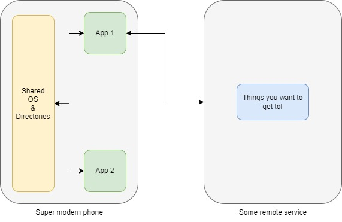
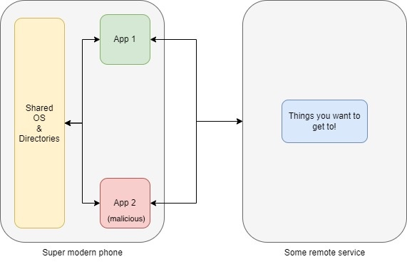
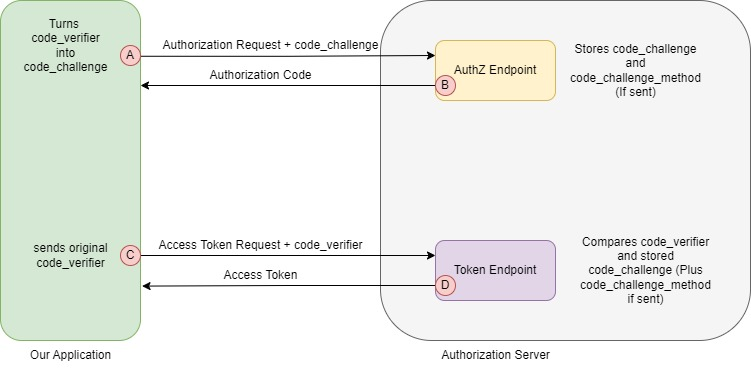

# PKCE: Proof Key for Code Exchange

© 2025 IDPro, Rusty Deaton

*To comment on this article, please visit our [GitHub
repository](https://github.com/IDPros/bok) and [submit an
issue](https://docs.github.com/en/github/managing-your-work-on-github/opening-an-issue-from-code).*

Introduction
============

OAuth has been a transformative standard in the field of Identity and
Access Management. Being an open standard, OAuth has risen to challenges
proposed by the nature of interconnected systems and adapted to emergent
issues. For instance, OAuth v1.0 had a session fixation attack that,
when discovered, had an advisory put out about it and a revision
published to help address the issue. Through this process, standards get
closer to being "alive" in nature; each release iteration (such as OAuth
v1.0 and OAuth v1.0a) addresses concerns in the specification. The wide
adoption gives developers a shared framework when designing systems that
need to handle delegated authorization. This commonality is important,
as it allows systems to understand who should have access to what
quickly.

As of this writing, OAuth v2.0 is the latest approved specification.
OAuth 2.0 is tied to RFCs 6749 ("The OAuth 2.0 Authorization
Framework")<a href="#fn1" id="fnref1" class="footnote-ref">1</a>
and 6750 ("The OAuth 2.0 Authorization Framework: Bearer Token
Usage")<a href="#fn2" id="fnref2" class="footnote-ref">2</a>,
both released in October 2012. Since the inception of OAuth 2.0, the RFC
Editor has published numerous RFCs that address additional concerns or
extend functionality. In light of this, OAuth v2.1 is in
draft<a href="#fn3" id="fnref3" class="footnote-ref">3</a> as
of this writing and intended to replace OAuth 2.0 – it will contain a
roll-up of many of the released RFC materials as well as the best common
practices released for OAuth. The new elements being integrated into the
base OAuth spec for 2.1 are important— from the removal of the resource
owner password credentials grant flow to the considerations around OAuth
for browser-based applications— and all could merit their own articles.
We focus in this article on RFC 7636 ("Proof Key for Code Exchange by
OAuth Public
Clients.”)<a href="#fn4" id="fnref4" class="footnote-ref">4</a>

Terminology
-----------

<table>
<colgroup>
<col style="width: 50%" />
<col style="width: 50%" />
</colgroup>
<thead>
<tr class="header">
<th><strong>Term</strong></th>
<th><strong>Description</strong></th>
</tr>
</thead>
<tbody>
<tr class="odd">
<td>OAuth</td>
<td>Refers to the standards-based delegation protocol, described in several RFCs, that facilitates the transmission of authorization decisions between HTTP-aware services.</td>
</tr>
<tr class="even">
<td>Proof of Key Code Exchange (PKCE)</td>
<td>Proof of Key Code Exchange (pronounced "Pixy"), initially defined in RFC 7636, is a technique to mitigate an attack that may occur through a malicious actor intercepting the authorization code using OAuth 2.0's authorization code grant. A verification process is performed through the use of a single-use key sent to the authorization server. This verification process is such that the client that makes the initial request, assuming OAuth's security premises hold true, must be the requester.</td>
</tr>
<tr class="odd">
<td>Hash (Cryptographic hash)</td>
<td>A hash is the output of a cryptographic hash function for a given input.</td>
</tr>
<tr class="even">
<td>Cryptographic Hash Function</td>
<td>A cryptographic hash function is a function that takes a given input of an unspecified length and returns an output of a fixed length. Given an input, the hash function should always output the same hash. 
 
Provided an adequately constructed hash function, the resultant hash should be difficult to reverse (Commonly called preimage resistance), and it should be difficult to find another input that produces the same hash (Collision resistance).</td>
</tr>
<tr class="odd">
<td>Transport Layer Security ("TLS")</td>
<td>A cryptographic protocol designed to provide confidentiality and integrity of communications between two endpoints.</td>
</tr>
</tbody>
</table>

What Are We Solving?
====================

Proof Key for Code Exchange or PKCE (pronounced "Pixy") initially came
about to solve for a common scenario with an increasingly exposed attack
vector.

Let us pretend we have a smartphone with two applications on the device.
Both applications are run by the same user and have effectively the same
general permissions on the local system. In this scenario, both
applications connect to the broader internet, and no special sandboxing
or advanced file access mechanisms are in play.

In an ideal world, there are no issues here. However, what if one of the
applications were malicious?

The malicious application, having access to the same local resources as
the good application, fulfills one of the conditions necessary to
perform an authorization code interception attack. These preconditions
are spelled out directly in the spec, but it is worthwhile to go over
them in more detail.

1.  The malicious application needs to be able to register a custom URI
    scheme that mimics the good application. For instance, if we use a
    banking app with a custom URI scheme of com.example.banking://oauth/
    the malicious app can also register to utilize this.

2.  OAuth 2.0's authorization code grant is used.

3.  The attacker can access the OAuth 2.0 client\_id and client\_secret
    if one is set. We should understand that this requirement is
    relatively trivial for a dedicated attacker—public-facing
    applications expose client\_id readily. If Shannon's Maxim holds, we
    can expect that any client\_secret embedded in any application on a
    smartphone will not be secret for very
    long.<a href="#fn5" id="fnref5" class="footnote-ref">5</a>
    The spec itself notes this, but it is a point to remember.

4.  Either one of two conditions must be met:

    1.  The attacker can observe only responses from the authorization
        endpoint.

    2.  The attacker can observe requests from the good application as
        well as responses from the authorization endpoint. This second
        condition, specifically the addition of observability into
        requests from other applications, is a fault of the operating
        system (OS) and can result in information placed in logs by the
        OS or the application, or some other condition within the OS
        that makes information available across applications, available
        to the malicious application. The spec indicates that in this
        scenario, the attacker would not be able to act as a man in the
        middle—which, if they were already executing an MITM attack, the
        countermeasures here would not be able to help. Indeed, RFC 6819
        ("OAuth 2.0 Threat Model and Security
        Considerations")<a href="#fn6" id="fnref6" class="footnote-ref">6</a>
        assumes that a secure transport-layer protocol, such as *TLS*,
        is being used.

Assuming these preconditions are met, an attacker can, at minimum,
observe responses from the authorization endpoint by way of the
malicious app. This ability, in turn, would give the malicious
application the capability to procure a valid token to do whatever it
wanted to do within the scope of the API it sought to access.

This scenario may offer unapproved access into a sensitive application,
which could result in unapproved actions taken on behalf of the user-
such as the transferring of money from a bank account, wholesale
transfer of private emails to the controller of the malicious
application, and so on depending on what exactly the authorization
request would have allowed for.

It should be noted that while this is the use case in the spec, there
are many other scenarios where authorization code injection attacks can
occur. RFC 9700 ("Best Current Practice for OAuth 2.0
Security")<a href="#fn7" id="fnref7" class="footnote-ref">7</a>
discusses authorization code injection attacks more broadly. As Aaron
Parecki and Micah Silverman discussed and demonstrated elsewhere, a path
to authorization code injection exists without a connection between a
client-provided state parameter and the authorization
code.<a href="#fn8" id="fnref8" class="footnote-ref">8</a>

The PKCE Fix
============

PKCE aims to fix this by requiring a client-side piece of information to
be passed to the authorization server. The authorization server then
remembers this information, as it must be used in order to request an
access token (alongside anything else required during the authorization
code grant flow). This state information mitigates the attack described
above, as well as a range of other authorization code injection attacks.
The flow looks like this at a high level per the spec:

It behooves us to understand the new pieces that PKCE brings forward in
this flow. Namely, we should understand the code verifier and code
challenge components, as well as how the introduction of PKCE modifies
requests.

All of this assumes that the authorization server has implemented PKCE
and thus will understand the information we give it around PKCE and what
to do with it. The key thing we care about in this example is that when
we hand the authorization server the code\_challenge and
code\_challenge\_method values, it will hold on to them and use them for
verification through the steps.

The Code Verifier
=================

The first step to mitigate the above attack is through the use of a
dynamic, single-use key, which they call a code verifier. This key is
not just any key, however; per spec, it needs to meet a few
requirements:

-   It must be a "High-entropy cryptographic random string"; the means
    of generating this value are not prescribed but must be suitably
    random to be usable for cryptographic purposes.

-   The characters used in this string must be US-ASCII unreserved
    characters; that is to say uppercase/lowercase letters, decimal
    digits, as well as the special characters hyphen, period,
    underscore, and tilde.

-   The string needs to be at least 43 characters and no longer than 128
    characters.

The spec goes on to give recommendations on generation methods. It is
recommended that a cryptographically secure pseudorandom number
generator (CSPRNG) be used to create a 32-octet sequence, and then that
sequence be Base64 URL-Encoded to create a URL-safe string to use as the
code verifier. Once this generation process is performed, we move on to
building the code challenge.

The Code Challenge
==================

This code verifier can be sent one of two ways: it can either be sent as
it is (plain), or it can be *hashed*. Whether it is plain or hashed is
known as the code challenge method.

So, for instance, let's say generate a string for the code verifier as
so:

7.zNCb.ENi-zKmyyt3DvNt8-mAkynWE\~k.p6UWd4B.DrLu2XNHCuobRddpkCHg2s

A "PLAIN" code challenge would be that string, and the client could
either send no code\_challenge\_method parameter (which the server
should then assume is "PLAIN") or send the code\_challenge\_method
parameter with a value of "PLAIN". By doing this, we mitigate cases
where an attacker can observe responses from the authorization endpoint,
which is great but not a complete fix.

To fully resolve the issue, we can hold on to the "PLAIN" string, but
when transmitting it, we can hash it, and tell the authorization
endpoint it is hashed. Per the spec, we must base64 URL-encode the raw
bytes of the SHA-256 hash generated from our code verifier input. The
code\_challenge\_method in this case would be "S256". Once we have done
that, we get:

sQY\_rBb7KxD-oqW\_FrlskCHdUQbxTxoLPju4-C1jfXU

This result is now the code challenge. It is then passed to the
authorization endpoint, along with the code challenge method.

Sending the Code Challenge
==========================

An example URL might look something like this (with line breaks after
every parameter for readability):

https://www.example.com/auth?

response\_type=code&

client\_id=someValue&

redirect\_uri=someURI&

scope=profile&

state=someStateValue&

code\_challenge= sQY\_rBb7KxD-oqW\_FrlskCHdUQbxTxoLPju4-C1jfXU&

code\_challenge\_method=S256

With this, the stage is set. The server returns the authorization code,
and the process can move forward. We should note that it now becomes the
authorization server's duty to remember the code\_challenge and the
code\_challenge\_method. This need not be a long time; indeed, it should
persist as long as the authorization code is allowed to persist. The
time this should persist is dictated by RFC 6749; a maximum lifespan of
10 minutes is recommended, but in practice, it should be much shorter.
Due to the linked nature of the authorization code, the code\_challenge
and the code\_challenge method having different timeout values for those
settings would not make sense.

Requesting the Token
====================

The code authorization flow proceeds as normal until we move to exchange
the authorization code for a token. The resulting data in the POST to
receive a token will look something like this (again, line breaks for
readability):

grant\_type=authorization\_code&

code=someCode&

redirect\_uri=someURI&

client\_id=someValue&

code\_verifier=7.zNCb.ENi-zKmyyt3DvNt8-mAkynWE\~k.p6UWd4B.DrLu2XNHCuobRddpkCHg2s

We are sending the code verifier – but why? Let's go back to our
assumptions, specifically point 4:

1.  The attacker can observe responses from the authorization endpoint.

2.  The attacker can observe requests from both the good application and
    responses from the authorization endpoint.

If, in our initial response, we have sent a hashed value of the
code\_verifier (which is again the code\_challenge post-transformation
via hash), and this is somehow logged or otherwise made observable by a
malicious application, they will not know what the code\_verifier
actually is. It will be available only to the application that should
rightfully be performing this series of requests. By sending the
code\_verifier, the token endpoint can perform the hashing on its side
with the previously noted hashing algorithm and perform a comparison.
Since the code\_verifier should generally not be stored outside of
memory and should be single-use, a malicious application should not have
access to it. Assuming the code\_verifier is rightfully verified, the
code authorization flow continues as normal.

Additional Points
=================

A person reading the spec (or indeed this article) may ask themselves,
"Why only SHA-256"? As of this writing, SHA-256 is currently "safe" —
there are no documented collision attacks (as there are with SHA-1).
While SHA-256 is a part of FIPS 180-4, which means it is largely trusted
by the US federal government, there may be reasons a particular
organization may not want to use SHA-256. This is to say an enterprising
organization could support RIPEMD-160 if they choose; nothing directly
in the spec keeps them from building this hashing method into the
application and extending their authorization server to know how to deal
with RIPEMD-160. However, we should understand the role the hash serves
(when hashing is used) and why, even if SHA-256 collisions were
feasible, it may not be a huge issue from a security perspective.

If we look back to the security assumptions that drive PKCE, the value
of the code\_challenge is that it helps ensure a malicious application
or service cannot derive anything meaningful from our requests or
responses. Assuming we take the OAuth spec at its word, a
code\_challenge has an effective maximum lifespan of 10 minutes (from
generation to token). This means if the code\_challenge is hashed and
the hash is leaked into a space that a malicious application can access,
it has 10 minutes to work out what the pre-hashed string was.

Ten minutes of time, at max, is not a trivial constraint! A malicious
application either needs to directly attack using the resources
available to it on the device, or it needs to exfiltrate the hash to be
attacked "offline" by a system with more computing resources. Reducing
this time to a minute, or 30 seconds, increases the required computing
power to perform an attack like this tremendously — an attack, it should
be noted, that does not currently exist.

SHA-256 adequately and admirably serves its purpose of making it
computationally infeasible to derive the initial input from the hashed
value. PKCE, and SHA-256 used within the context of PKCE, are likely
safe for the near to moderate term.

In Conclusion
=============

PKCE, as an addition to OAuth, solves a whole range of issues. Not just
the issue we outlined above for native phone applications, but for more
traditional websites that may rely on OAuth's code authorization flow,
single-page applications, and other HTTP-aware clients (Such as thick
clients on a PC). Because of how impactful this change is, there is
little to wonder about why it was brought forward into the draft for
OAuth 2.1 and why PKCE is widely adopted despite being (until retired
and made officially a part of the spec) a standalone RFC. It is
tremendous to see OAuth as a standard evolve and rise to operational and
security concerns, and to see organizations embrace these changes to
drive meaningful security impact for their users.

Acknowledgements
----------------

The author would like to thank those individuals who have been directly
a part of the standards creation process, not just for OAuth and the
RFCs related to it, but all work done in service towards fostering
interoperability and plain dealing in technical endeavours. Related to
OAuth standards, the author would like to thank Nat Sakimura, John
Bradley, and Naveen Agarwal for their significant work on PKCE. He would
also like to thank Aaron Parecki, Dick Hardt, and Torsten Lodderstedt
for their significant work on the OAuth 2.1 standard.

 

Author Bio
----------

Rusty Deaton has been in Identity and Access Management for over a
decade. He began in technology as a technical support engineer for a
Broker-Dealer and has since worked across many industries, carrying
forward a passion for doing right by people. When not solving problems,
he loves to tinker with electronics and read. 

------------------------------------------------------------------------

1.  

    Hardt, D., Ed., "The OAuth 2.0 Authorization Framework", RFC 6749,
    DOI 10.17487/RFC6749, October 2012,
    &lt;https://www.rfc-editor.org/info/rfc6749&gt;.<a href="#fnref1" class="footnote-back">↩︎</a>

    

2.  

    Jones, M. and D. Hardt, "The OAuth 2.0 Authorization Framework:
    Bearer Token Usage", RFC 6750, DOI 10.17487/RFC6750, October 2012,
    &lt;https://www.rfc-editor.org/info/rfc6750&gt;.<a href="#fnref2" class="footnote-back">↩︎</a>

    

3.  

    Hardt, D., A. Parecki and T. Lodderstedt, “The OAuth 2.1
    Authorization Framework,” Work In Progress, Internet-Draft,
    draft-ietf-oauth-v2-1-12, 15 November 2024, &lt;
    https://datatracker.ietf.org/doc/html/draft-ietf-oauth-v2-1-12&gt;.<a href="#fnref3" class="footnote-back">↩︎</a>

    

4.  

    Sakimura, N., Ed., Bradley, J., and N. Agarwal, "Proof Key for Code
    Exchange by OAuth Public Clients", RFC 7636, DOI 10.17487/RFC7636,
    September 2015,
    &lt;https://www.rfc-editor.org/info/rfc7636&gt;.<a href="#fnref4" class="footnote-back">↩︎</a>

    

5.  

    Wikipedia contributors, "Kerckhoffs's principle," Wikipedia, The
    Free Encyclopedia,
    https://en.wikipedia.org/w/index.php?title=Kerckhoffs%27s\_principle&oldid=1267497269
    (accessed March 26,
    2025).<a href="#fnref5" class="footnote-back">↩︎</a>

    

6.  

    Lodderstedt, T., Ed., McGloin, M., and P. Hunt, "OAuth 2.0 Threat
    Model and Security Considerations", RFC 6819, DOI 10.17487/RFC6819,
    January 2013,
    &lt;https://www.rfc-editor.org/info/rfc6819&gt;.<a href="#fnref6" class="footnote-back">↩︎</a>

    

7.  

    Lodderstedt, T., Bradley, J., Labunets, A., and D. Fett, "Best
    Current Practice for OAuth 2.0 Security", BCP 240, RFC 9700, DOI
    10.17487/RFC9700, January 2025,
    &lt;https://www.rfc-editor.org/info/rfc9700&gt;.<a href="#fnref7" class="footnote-back">↩︎</a>

    

8.  

    OktaDev. 2020. “OAuth Happy Hour - Authorization Code Injection Demo
    and Live Q&A.”
    https://www.youtube.com/watch?v=moQidjdV5cw.<a href="#fnref8" class="footnote-back">↩︎</a>

    

