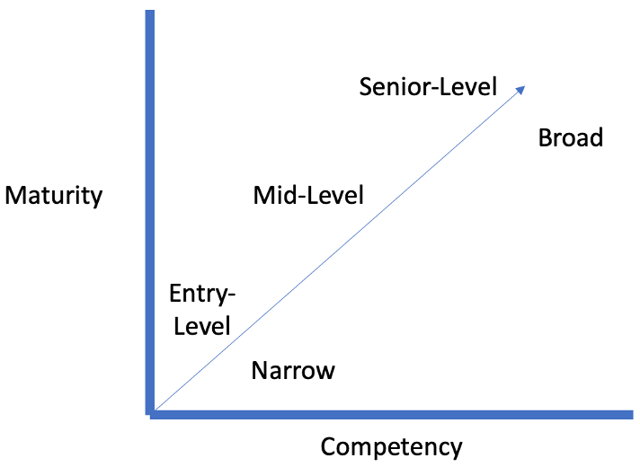
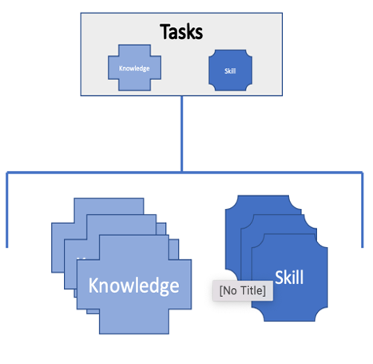
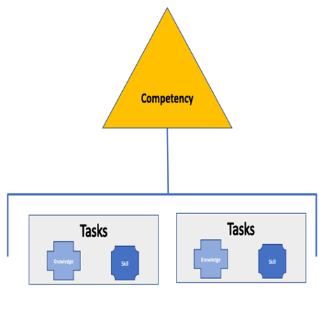
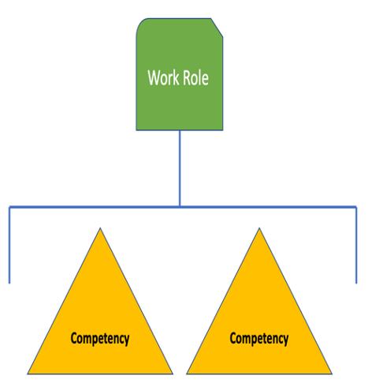
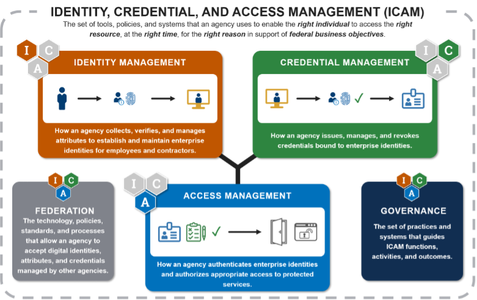

**Identity and Access Management Workforce Planning**

Put identity at the center of your cybersecurity workforce.
===========================================================

By Kenneth M. Myers

© 2022 IDPro, Kenneth M. Myers

Introduction
============

Identity and Access Management (IAM) is a challenging profession. An
identity process is usually the first interaction a new employee or
customer experiences with an organization and is often not smooth. These
interactions may include:

1.  Filling out a job application multiple times for identity
    verification.

2.  Creating a username and password at almost every website for
    authentication.

3.  Making requests across multiple help desks asking for user access
    and sometimes waiting days or weeks for approval.

Identity and access management are fundamental to digital transactions.
When non-identity professionals are responsible for everyday identity
tasks, organizations may see misconfigurations, suboptimal user
experience, or potential data leakage. Most importantly, organizations
put themselves at an increased risk due to a lack of a holistic view of
user access and security across the organization. To clarify job
responsibilities and required skills, organizations should use a
cybersecurity workforce framework for workforce planning.

-   A workforce framework is **a set of tasks, knowledge, and skills
    (TKS)** for someone to be effective in their job.

-   Workforce planning ensures an organization **has the right talent**
    to execute business and technical objectives.

While workforce planning and a workforce framework are primary tasks of
human resources personnel, IAM practitioners need to be active
participants in providing the TKS required for a workforce framework in
order for a workforce planning effort to be successful. A workforce
framework can also be an effective tool to allow practitioners to
identify skill and knowledge gaps. A workforce framework consists of
multiple parts.

1.  Competency – A method to assess someone. A competency is comprised
    of TKS statements.

2.  Task – an activity toward an achievement.

3.  Knowledge – A retrievable set of concepts within memory. Multiple
    statements may be required to complete a task.

4.  Skill – The capacity to perform an observable action. There is a
    many-to-1 or 1-to-many relationship between skill statements and
    task accomplishment.

5.  Work Role – A consistent method to describe the competencies and TKS
    needed to perform a responsible work area.

It’s worth noting a few clarifying points.

1.  A competency model is a set of TKS needed for effective job
    performance. A competency model is part of a workforce framework.

2.  In terms of workforce planning, a maturity model is a method to
    measure capabilities to a specific seniority or optimization level.

3.  A work role is not the same as a job title. A job title is usually
    organizationally set, while a work role is a consistent way to
    describe a type of work. A title may be specific to an organization,
    but a work role should be consistent across organizations.

A maturity model can incorporate a competency model to outline a
collection of TKS per level of seniority, from entry-level to
senior-level.

Figure 1. Example of the interrelation of a competency model and
maturity model

This article offers a practical approach to help identity and access
management practitioners and managers understand how to advise
organization leadership on identity and access management workforce
planning. The next section outlines why the IAM profession needs its own
workforce planning and competency model.

Terminology
-----------

-   **Access Management** – Use identity information to provide access
    control to protected resources such as computer systems, databases,
    or physical spaces.

-   **Attributes** – Key/value pairs relevant to the digital identity
    (username, first name, last name, etc.).

<!-- -->

-   **Authenticator** – The means used to confirm the identity of a
    user, processor, or device, such as a username and password, a
    one-time pin, or a smart card.

-   **Binding** – Associating an authenticator with an identity.

-   **Competency Model** – A collection of tasks, knowledge, and skills
    (TKS) needed for effective job performance. A competency model is
    part of a workforce framework.

-   **Credential** - A credential allows for the authentication of an
    entity by binding an identity to an authenticator.

-   **Credential Management** – How to issue, manage, and revoke
    authenticators bound to identities. Credential Management roughly
    corresponds to the IDPro term for Credential Services; we use the
    term Credential Management here to correlate to the Federal
    Identity, Credential, and Access Management (FICAM) initiative’s
    terms.
    <a href="#fn1" id="fnref1" class="footnoteRef">1</a>

-   **Identity and Access Management** – The discipline that enables the
    right individuals to access the right resources at the right times
    for the right reasons.
    <a href="#fn2" id="fnref2" class="footnoteRef">2</a>

-   **Identity and Access Management Workforce Planning** – Activities
    involved in ensuring an enterprise identity and access management
    team are staffed with the right talent to execute business and
    technical objectives.

-   **Identity Management** – A set of policies, procedures, technology,
    and other resources for maintaining identity information.

-   **Identity, Credential, and Access Management** – Programs,
    processes, technologies, and personnel used to create trusted
    digital identity representations of individuals and non-person
    entities, bind those identities to credentials that may serve as a
    proxy in access transactions, and leverage the credentials to
    provide authorized access to an organization’s resources.
    <a href="#fn3" id="fnref3" class="footnoteRef">3</a>

-   **Workforce Framework** – An outline of the job categories, work
    roles, and competency models needed to execute workforce planning.

-   **Workforce Planning** –     Activities that
    ensure an organization has the right talent to execute business and
    technical objectives.

Acronyms
--------

-   CISM - Certified Information Security Manager

-   FICAM – Federal Identity, Credential, and Access Management

-   IAM – Identity and Access Management

-   ICAM – Identity, Credential, and Access Management

-   MFA – Multi-factor authentication

-   NICE – National Initiative for Cybersecurity Education

-   NIST – National Institute of Standards and Technology

-   TKS – Tasks, Knowledge, and Skills

Problem Statement
=================

    While various research and frameworks
exist on general cyber workforce planning, there is a lack of specific
information for IAM workforce planning. The U.S. Federal Government has
many publicly available documents that help see the evolution of
cybersecurity workforce planning in large organizations with diverse
cybersecurity workforce and enterprise architecture. The Office of
Personnel Management, the head human resources organization for the U.S.
Federal Government, identified identity management as a technical
cybersecurity competency and references the National Institute of
Science and Technology (NIST) National Initiative of Cybersecurity
Education Framework (NICE) as the primary source for identifying and
defining cybersecurity roles.
<a href="#fn4" id="fnref4" class="footnoteRef">4</a> However,
the NIST NICE Framework does not include specific IAM roles.
<a href="#fn5" id="fnref5" class="footnoteRef">5</a>

Outside of the U.S. government, various frameworks may be adapted for
general use. Additionally, there are a variety of vendor-specific
training materials available, including:

-   Mastering Identity and Access Management with Microsoft Azure
    <a href="#fn6" id="fnref6" class="footnoteRef">6</a>

-   Identity, Authentication, and Access Management in OpenStack
    <a href="#fn7" id="fnref7" class="footnoteRef">7</a>

-   Oracle Identity and Access Management
    <a href="#fn8" id="fnref8" class="footnoteRef">8</a>

-   Securing the Perimeter (using Gluu)
    <a href="#fn9" id="fnref9" class="footnoteRef">9</a>

This focus on vendor-specific training is one potential reason why there
appears to be a growth in knowledge around specific products versus a
focus on the underlying standards and technologies that enable IAM. The
[2021 IDPro Skills, Programs, and Diversity
Survey](https://idpro.org/2021-idpro-skills-programs-diversity-survey-the-results-are-in/)
also highlighted this finding in the context of the [Dunning-Kruger
Effect](https://en.wikipedia.org/wiki/Dunning%E2%80%93Kruger_effect) .

-   The survey noted that 16% of respondents are interested in
    vendor-neutral training leading to certification. The IDPro
    addressed this need with the new [Certified Identity
    Professional](https://idpro.org/cidpro/) vendor-neutral
    certification.

-   The survey noted a Dunning Kruger effect to describe why someone
    proficient in a particular vendor product could create a belief that
    they are experts in IAM overall.

Major cybersecurity certifications include Identification and
Authentication or Identity and Access Management as a knowledge domain
and include overviews on access, authentication, and authorization
principles. While important, including IAM as a sub-topic in the field
of cybersecurity is insufficient to help IAM practitioners learn what
they need to know to work effectively in their roles. The next section
outlines why IAM practitioners should be involved in workforce planning.

Why is IAM Workforce Planning Necessary?
========================================

This paper asserts that organizations need IAM workforce planning to
ensure they hire and train their IAM staff and decrease potential
IAM-related attack vectors. Without knowledge and training, IAM
processes may be implemented by individuals with only a basic
understanding of IAM best practices, resulting in regularly exploited
attack vectors. For example, the top two exploit actions in the 2021
Verizon Data Breach Investigation Report included phishing and stolen
credentials.
<a href="#fn10" id="fnref10" class="footnoteRef">10</a> One
of the primary mechanisms to reduce the successful use of phishing and
stolen credentials is to implement multi-factor authentication (MFA).
Using MFA is a known best practice among IAM professionals, but is it
known to software developers or system administrators? We can help
address this competency gap by creating and growing a professional IAM
workforce through workforce planning and a competency model.

Using the same example from above, implementing MFA is the top
mitigation technique, but not all MFA is the same.
<a href="#fn11" id="fnref11" class="footnoteRef">11</a> An
untrained professional may recommend a non-phishing-resistant option
that is more robust than just a username and password. A more
experienced professional may additionally suggest a combination of
phishing-resistant and non-phishing options with the risk and cost of
each approach. The next section outlines how IAM practitioners can get
involved in workforce planning.

Define Your IAM Team
====================

The Federal Identity, Credential, and Access Management (FICAM)
architecture is a U.S. government reference architecture designed for
federal agencies.
<a href="#fn12" id="fnref12" class="footnoteRef">12</a> (See
Figure 2 for a depiction of the FICAM architecture.) This paper takes
the U.S. Federal ICAM architecture as a starting point for IAM workforce
planning, including building a competency model. A workforce framework
and competency model are guidelines, usually managed by your human
resources office but developed by practitioners.

Figure 2. Knowledge and Skill combine to encompass a task. Multiple
tasks encompass a competency. Multiple competencies define a work role.

Even though the FICAM architecture was developed for the U.S.
Government, many of the capabilities and services are common for all
organizations in that all organizations should manage identities,
credentials, and access. Organizations can adopt and adapt this approach
to their specific identity reference architecture as well.

Figure 3. FICAM Architecture

The FICAM architecture defines five domain areas:

1.  identity management

2.  credential management

3.  access management

4.  (programmatic) governance

5.  federation

After defining your IAM architecture, the next step is to use the NIST
NICE Framework to convert the FICAM architecture capabilities into TKS.
The NIST NICE Framework uses a simple formula to develop easy-to-read
and understandable statements.

-   Task – an activity toward an achievement.

-   Knowledge – A retrievable set of concepts within memory. Multiple
    statements may be required to complete a task.

-   Skill – The capacity to perform an observable action. There is a
    many-to-1 or 1-to-many relationship between skill statements and
    task accomplishment.

Table 1 contains an example of an ICAM Competency Model from the
Identity Governance Framework.
<a href="#fn13" id="fnref13" class="footnoteRef">13</a> This
ICAM Competency Model is only an example and can be modified or altered
to fit your organization’s needs. One distinct difference between the
FICAM architecture and other IAM architectures is including identity
proofing as part of the identity management service. In an enterprise
scenario, identity proofing may be a human resources task as part of
employee onboarding or a third-party business application task in
customer onboarding. The FICAM Architecture has primarily focused on
workforce identity use cases, and additional research is necessary to
add customer or non-person TKS.

<table>
<colgroup>
<col style="width: 25%" />
<col style="width: 25%" />
<col style="width: 25%" />
<col style="width: 25%" />
</colgroup>
<thead>
<tr class="header">
<th></th>
<th><strong>Identity Management</strong></th>
<th><strong>Credential Management</strong></th>
<th><strong>Access Management</strong></th>
</tr>
</thead>
<tbody>
<tr class="odd">
<td>Task</td>
<td><ol>
<li>
Perform identity proofing activities
</li>
<li>
Develop an identity directory maintenance plan
</li>
<li>
Review identity information for currency and accuracy
</li>
<li>
Install, update, and maintain identity directory services
</li>
<li>
Conduct role and group modeling
</li>
<li>
Create and automate workflows for provisioning, entitlements management, and identity records management
</li>
</ol></td>
<td><ol>
<li>
Enroll users in a credentialing process
</li>
<li>
Bind an authenticator to an identity
</li>
<li>
Perform Credential lifecycle management actions such as activate, renew, reset, suspend, revoke, renew, or terminate
</li>
<li>
Issue Public Key Infrastructure (PKI) and other types of credentials
</li>
</ol></td>
<td><ol>
<li>
Configure and manage single sign-on services
</li>
<li>
Configure directory and agent integration with Single Sign-On
</li>
<li>
Identify methods and integrate applications with Single Sign-On
</li>
<li>
Operate and Manage policy decisions and enforcement points
</li>
<li>
Configure applications
</li>
</ol></td>
</tr>
<tr class="even">
<td>Knowledge</td>
<td><ol>
<li><blockquote>

Knowledge of identity lifecycle management

</blockquote></li>
<li><blockquote>

Knowledge of identity proofing methods, strengths, and weaknesses

</blockquote></li>
<li><blockquote>

Knowledge of identity directory technology and services

</blockquote></li>
<li><blockquote>

Knowledge of identity aggregation techniques

</blockquote></li>
<li><blockquote>

Knowledge of privacy laws and impact on identity data collection and maintenance

</blockquote></li>
<li><blockquote>

Knowledge of entitlements management and workflows

</blockquote></li>
</ol></td>
<td><ol>
<li><blockquote>

Knowledge of credential lifecycle management

</blockquote></li>
<li><blockquote>

Knowledge of authenticator types, strengths, and weaknesses

</blockquote></li>
<li><blockquote>

Knowledge of authenticator binding techniques

</blockquote></li>
</ol></td>
<td><ol>
<li><blockquote>

Knowledge of authorization models

</blockquote></li>
<li><blockquote>

Knowledge of network and cloud authentication techniques

</blockquote></li>
<li><blockquote>

Knowledge of access policy lifecycle management

</blockquote></li>
<li><blockquote>

Knowledge of privilege access management

</blockquote></li>
<li><blockquote>

Knowledge of network routing

</blockquote></li>
</ol></td>
</tr>
<tr class="odd">
<td>Skill</td>
<td><ol>
<li><blockquote>

Skill in identifying an identity proofing process to an identity assurance level

</blockquote></li>
<li><blockquote>

Skill in configuring and maintaining an identity directory service

</blockquote></li>
<li><blockquote>

Skill diagnosing directory connection issues

</blockquote></li>
<li><blockquote>

Skill in performing identity lifecycle management

</blockquote></li>
<li><blockquote>

Skill in preparing and executing access reviews and recertifications

</blockquote></li>
<li><blockquote>

Skill in managing entitlements

</blockquote></li>
</ol></td>
<td><ol>
<li><blockquote>

Skill in identifying an authenticator to an authenticator assurance level

</blockquote></li>
<li><blockquote>

Skill in binding authenticators to directory records across various authenticators

</blockquote></li>
<li><blockquote>

Skill in performing credential lifecycle management

</blockquote></li>
</ol></td>
<td><ol>
<li><blockquote>

Skill in determining an appropriate authorization model based on the use case

</blockquote></li>
<li><blockquote>

Skill in implementing authentication techniques across multiple environments

</blockquote></li>
<li><blockquote>

Skill in managing access requirements using a policy decision and enforcement point

</blockquote></li>
<li><blockquote>

Skill in implementing and managing privileged access management tools

</blockquote></li>
</ol></td>
</tr>
</tbody>
</table>

Table 1. An IAM Competency Model aligned with the FICAM Architecture

An organization can now define the roles necessary to perform the tasks
with a competency model. The list below describes the most common
organizational roles to operate an enterprise identity infrastructure.
Smaller organizations may have fewer roles performing more tasks, while
larger organizations have more roles performing more fine-grained tasks.
The following table provides an example of how an identity task differs
between a large organization of multiple operating divisions and a small
organization of fewer operating divisions. For example:

| **Task**                                                      | **Large Organization with Multiple Operating Divisions**                                                                                                    | **Small Organization of Two or Fewer Operation Divisions.**                                                                                                                     |
|---------------------------------------------------------------|-------------------------------------------------------------------------------------------------------------------------------------------------------------|---------------------------------------------------------------------------------------------------------------------------------------------------------------------------------|
| Perform identity proofing activities                          | All identity proofing is outsourced to a 3 rd party with a system administrator configuring a federation with the 3 rd party.         | Human resource personnel typically perform workforce identity proofing. For business applications, may perform custom-coded knowledge-based questions to 3 rd party. |
| Issue authenticators and other types of credentials           | Multiple administrators for each type of credential. It may involve a dedicated PKI team.                                                                   | A small number of administrators perform this task for all credentials.                                                                                                         |
| Configure directory and agent integration with Single Sign-On | It may involve multiple teams and administrators depending on where a directory location and which office owns it (e.g., cloud, enterprise, or application) | It may involve one team or administrator.                                                                                                                                       |
| Provision accounts to endpoint services and applications      | Integrated solution with human resources and endpoints to keep attributes and entitlements synced.                                                          | Various system administrators perform manual tasks.                                                                                                                             |

Table 2. Sample IAM tasks based on organization size

The next section includes suggested NIST NICE work roles and an example
evolution of an IAM team.

Evolve Your IAM Team
====================

IAM-specific TKS now exist to define an overall IAM competency. This IAM
competency can now be added to NIST NICE-defined work roles. The seven
key roles, modeled after the NIST NICE Framework, within most IAM
programs include:

1.  [Program
    Manager](https://niccs.cisa.gov/workforce-development/cyber-security-workforce-framework/workroles?name=Program+Manager&id=All)
    – A managerial role responsible for leading, coordinating,
    communicating, and integrating the program’s efforts. This role is
    accountable for the program’s overall success, ensuring alignment
    with critical agency priorities. A program manager is the overall
    responsible party for the enterprise identity program. Depending on
    your organizational naming structure, this role may also be called a
    director, branch chief, or associate vice president. This person
    should report directly to an executive to ensure proper corporate
    support.

2.  [System
    Administrator](https://niccs.cisa.gov/workforce-development/cyber-security-workforce-framework/workroles?name=System+Administrator&id=All)
    – A purely operational role that installs, configures,
    troubleshoots, and maintains server configurations (hardware and
    software) to ensure confidentiality, integrity, and availability. A
    system administrator usually manages accounts, firewalls, and
    patches. They are responsible for access control, credential
    management, and account creation and administration, and their role
    may be shared with other departments outside of IAM. Their actual
    job title may likely align with specific vendors (“Vendor Name”
    Administrator) or a function (Directory Administer).

3.  [Software
    Developer](https://niccs.cisa.gov/workforce-development/cyber-security-workforce-framework/workroles?name=Software+Developer&id=All)
    – Generally either a system design or system operations role, this
    role is responsible for developing and writing new (or modifying
    existing) computer applications, software, or specialized utility
    programs following software assurance best practices. Most likely,
    software developers may code a login page or federation assertion
    for broader software development tasks.

4.  [Network
    Specialist](https://niccs.cisa.gov/workforce-development/cyber-security-workforce-framework/workroles?name=Network+Operations+Specialist&id=All)
    – A purely operational role that plans, implements, and operates
    network services/systems, including hardware and virtual
    environments. A network specialist may double as a system
    administrator or be responsible for establishing and maintaining
    network authentication and authorization services. This specialist
    is often shared with other departments outside of IAM.

5.  [Enterprise
    Architect](https://niccs.cisa.gov/workforce-development/cyber-security-workforce-framework/workroles?name=Enterprise+Architect&id=All)
    – Primarily a system design role that is responsible for developing
    and maintaining business, systems, and information processes to
    support enterprise mission needs. This includes developing
    information technology (IT) rules and requirements that describe
    baseline and target architectures. An identity enterprise architect
    may double as a security architect, or their work role is labeled a
    security architect.

6.  [System Security
    Analyst](https://niccs.cisa.gov/workforce-development/cyber-security-workforce-framework/workroles?name=Systems+Security+Analyst&id=All)
    – Often either a system design or system operations role responsible
    for analyzing and developing the integration, testing, operations,
    and maintenance of systems security. An analyst can be a technical
    or non-technical role that collaborates with application owners and
    other enterprise teams to translate business requirements into IAM
    workflows and processes. Sample tasks may include role mining,
    access requirements, attribute mapping, and similar IAM tasks.

7.  [System Testing and Evaluation
    Specialist](https://niccs.cisa.gov/workforce-development/cyber-security-workforce-framework/workroles?name=System+Testing+and+Evaluation+Specialist&id=All)
    – Often either a system design or system operations role responsible
    for planning, preparing, and executing systems tests to evaluate
    results against specifications and requirements and analyze/report
    test results. They develop and execute software and IAM process
    testing before being implemented in a production environment. This
    role may have a title of QA or Tester.

An organization should have the ICAM team report to an executive
steering or governance body to help integrate digital identity processes
into overall enterprise risk management.

Evolution of Team Development
-----------------------------

Most organizations follow a similar group development pattern that
aligns with Tuckman’s group development stages: Forming, Storming,
Norming, Performing, and Adjourning.
<a href="#fn14" id="fnref14" class="footnoteRef">14</a> This
paper looks at the first three stages on the way to a well-performing
IAM team.

### Forming

In the forming stage, an organization learns about the opportunities and
challenges of not having a dedicated IAM function. The organization
agrees on creating a dedicated position as the start of a broader IAM
function. Most organizations find that they need a central person to
track or liaison across the various identity functions within an
organization. This decision is usually precipitated by corporate events
such as an audit finding, a cyber incident, or a new security shift.
This role typically aligns with a **Program Manager** and may report to
either a CIO or CISO or one level below an executive position. The
primary function of the program manager in this stage is to identify,
track, and report on high-risk identity processes and recommend methods
to mitigate risk. They may not have a dedicated team or responsibility
at this stage.

### Storming

In storming, IAM responsibility is being established with broader
organization acceptance. Leadership supports help gain operating
division acceptance of some loss of IAM control for the greater good of
organizational efficiency and potential cost savings. At this stage, the
**Program Manager** has gained increased responsibility and can create a
primary identity team of existing **System Administrators** or
**Software Developers** depending on the organization’s enterprise
architecture. These administrators may specialize in a single product or
a specific technology, such as directories or authentication.
Centralizing the responsibility and team may coincide with a shift in
the technology approach. The Program Manager may identify additional
positions, such as an Identity Architect, otherwise known as an
Enterprise Architect, to develop rules and requirements for the desired
identity infrastructure target state. Smaller organizations can utilize
senior system administrators as an architect because they are most
familiar with the systems, vendors, and organization’s mission to
propose a target state. Larger organizations may choose an Architect
removed from the day-to-day technical challenges to focus on longer-term
planning.

### Norming

In the norming stage, the IAM function is established with a dedicated
team and established lines of responsibility. At this stage, the team is
working productively together. The Program Manager may identify a need
to expand organizational collaboration to an extended set of corporate
members, including physical security, legal, privacy, human resources,
information technology, and compliance offices. This comprehensive set
of members may create a governance body or steering committee to help
plan target state or organizational support to increase the return on
investment of identity systems. For example:

-   Collaborate with human resources to support remote identity
    proofing.

-   Collaborate with physical security to integrate physical access
    control decisions with enterprise access management tools.

-   Collaborate with the compliance office to automate compliance
    reporting.

  An organization may go
into the performing stage or circle around based on organizational needs
and direction. Identity is a critical component of enabling efficient
business processes but also an area of organizational risk. Program
managers may need to adapt to new initiatives such as cloud services
migration or zero trust architecture.

Conclusion
==========

Organizations need an IAM workforce framework to ensure they hire and
train their identity workforce. The most prevalent cybersecurity attack
vectors are identity-based. This article introduced an IAM workplace
planning model based on TKS aligned with a large organization’s IAM
enterprise architecture. It further aligned those tasks with how a
typical organization identifies and staffs an IAM workforce. An
organization can use the competency model to define consistent IAM roles
across organizations or tailor them to fit their needs.

Author Bio
==========

Kenneth Myers is a doctoral candidate with Marymount University and an
Information Security IT Specialist with the U.S. General Services
Administration. Reach him at <kmm57090@marymount.edu> or
<https://idmken.github.io> .

**  
**

Endnotes
========

------------------------------------------------------------------------

1.  

    Flanagan (Editor), H., (2021) “Terminology in the IDPro Body of
    Knowledge”, *IDPro Body of Knowledge* 1(8). doi:
    <https://doi.org/10.55621/idpro.41> . [↩](#fnref1)

    

2.  

    Gartner. (2021). *Gartner Glossary* . Retrieved from Gartner:
    <https://www.gartner.com/en/information-technology/glossary/identity-and-access-management-iam>
    . [↩](#fnref2)

    

3.  

    NIST. (2021b). *Glossary - ICAM* . Retrieved from Computer Security
    Resource Center:
    <https://csrc.nist.gov/glossary/term/Identity_Credential_and_Access_Management>
    [↩](#fnref3)

    

4.  

    OPM. (2015). *Guidance for Identifying, Addressing and Reporting
    Cybersecurity Work Roles of Critical Need.* Retrieved from CHCOC:
    <https://chcoc.gov/sites/default/files/Attachment%20to%20Memo%20-%20Guidance%20for%20Identifying%20Addressing%20Reporting%20Cyb.._.pdf>
    . [↩](#fnref4)

    

5.  

    Petersen, R., Santos, D., Smith, M., Wetzel, K., & Witte, G. (2020,
    November). *National Initiative for Cybersecurity Education (NICE)
    Cybersecurity Workforce Framework.* Retrieved from Computer Security
    Resource Center:
    <https://csrc.nist.gov/publications/detail/sp/800-181/rev-1/final>
    [↩](#fnref5)

    

6.  

    Nickel, J. (February 2019). Mastering Identity and Access Management
    with Microsoft Azure. Packt Publishing. [↩](#fnref6)

    

7.  

    Martinelli, S., Nash, H, and Topol, B. (December 2015). Identity,
    Authentication, and Access Management in OpenStack. O’Reilly Media.
    [↩](#fnref7)

    

8.  

    Ramey, K. (December 2016). Pro Oracle Identity and Access Management
    Suite. Apress. [↩](#fnref8)

    

9.  

    Schwartz, M. and Machulak, M. (December 2018). Securing the
    Perimeter. Apress [↩](#fnref9)

    

10. 

    Verizon Enterprise. (2021). *2021 Data Breach Investigations
    Report.* Retrieved from Verizon Enterprise:
    https://enterprise.verizon.com/resources/reports/dbir/2021/
    [↩](#fnref10)

    

11. 

    Grassi, P., Garcia, M., & Fenton, J. (2017). *800-63-3; Digital
    Identity Guidelines.* Retrieved from NIST Special Publication:
    <https://doi.org/10.6028/NIST.SP.800-63-3> [↩](#fnref11)

    

12. 

    GSA. (2020). *Federal ICAM Architecture* . Retrieved from FICAM
    Playbooks: <https://playbooks.idmanagement.gov/> [↩](#fnref12)

    

13. 

    GSA. (2021). Identity Governance Framework:
    <https://playbooks.idmanagement.gov/docs/playbook-identity-governance-framework.pdf>
    [↩](#fnref13)

    

14. 

    Stein, J. (n.d.). *Using the Stages of Team Development* . Retrieved
    from MIT Human Resources:
    https://hr.mit.edu/learning-topics/teams/articles/stages-development
    [↩](#fnref14)

    

