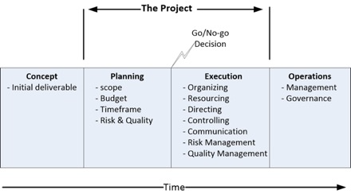

By Graham Williamson and Corey Scholefield

Abstract
========

This article serves as an introduction to the practice of project
management for an IAM project, describing basic project management
terminology and practices. Given the number of systems an IAM project
generally impacts, the requirements for project management and the
expectation of coordination across multiple teams, departments, or
organizations are particularly important for the stakeholders involved.

Importance of Project Management
================================

IAM practitioners may be familiar with the scenario of an IAM project
proceeding under the control of an IT systems group, without a formal
project manager. While this method of deploying a new product or service
may be considered an expedient way to get a system installed or updated,
it is likely to cost the organization more money in the long term. An
IAM service is connected to many critical systems within an
organization. To make changes to that service without considering the
possible impact on the various connected systems, without managing the
required resources, or without keeping all stakeholders advised of the
effort, will result in a substandard deployment.

Project management does have a cost: it is typically between 5-10% of a
project's total expenditure, but it represents the best return in
comparison to any other investment an organization is likely to be
afforded.

Terminology
-----------

-   Project - a time-limited activity to achieve a defined outcome(s)

-   Project Charter - documented authority for the project manager to
    proceed with a project; it will usually include a succinct statement
    of the project's purpose.

-   Schedule -- a document that defines the activity and resources
    required to achieve the planned deliverable(s) and outcome(s)

-   Gantt Chart - a popular schedule format that displays both activity
    and timeframes in a single chart

-   Project Plan - a document that describes a project; it will usually
    include a scope statement, schedule, resource plan, communications
    plan, and quality plan

-   Task - lowest-level of defined activity; multiple tasks will
    typically be grouped into stages of project phases

-   Agile project management - a framework that uses a continuous,
    iterative process to deliver a defined piece of functionality,
    typically a component of a product or service. Scrum is a popular
    framework
    ([[https://www.scrumalliance.org/about-scrum/overview]{.underline}](https://www.scrumalliance.org/about-scrum/overview))

Reference is made to the Project Management Institute (PMI)
Framework.[^1] The reader is referred to the PMI Body of Knowledge for
further information
([[https://www.pmi.org/]{.underline}](https://www.pmi.org/))

**Characteristics of a Project Manager**
----------------------------------------

In the IT sector, a project manager is often seen as a low-level
employee. They are expected to bring a project in on time and within
budget with minimal assistance from upper management and minimal
visibility within the organization. In reality, a project manager needs
sufficient authority and resources to allow them to monitor and manage
their project adequately. They also need regular communications with a
steering committee consisting of representatives from upper management.

There are two prime characteristics that are essential to a project
manager:

|  |  |
|---|---|
|  Predictability | Management doesn't like surprises. A project manager should determine and report on a project's duration and related costs to a defined degree of confidence. |
|  Flexibility | Gone are the days when a project manager slavishly followed an approved Gantt chart to the detriment of anyone who wants a change. IT projects will typically undergo several baseline changes during execution to accommodate scope changes, dependencies on other projects, and changes in resource availability. |

Project managers require competence in the five components of project
management:

-   Planning

-   Organizing

-   Resourcing

-   Directing

-   Controlling

**PMI Framework**
=================

By definition, a project must have a start and a finish.
Business-as-usual is never project work and does not require the skills
of a project manager. Before the start of a project, there will be some
preparatory work to define the concept. Between the commencement and
completion, there are discrete stages that define the project work.
After the project completion, the deliverable will enter an operational
status.

**Concept**
-----------

Projects come out of a need. In the IAM world, examples of such a need
include a need to reduce costs and improve security by better using
identity information for on-boarding and off-boarding staff or a need
for an enterprise LDAP directory upgrade. Such projects are typically
initiated by an IT resource rather than a business resource, though a
line-of-business resource might also initiate a project (e.g., to move
an application from an on-premises environment to the cloud to save
CAPEX budget). The project sponsor will communicate the requirement, set
the project charter, and commence evaluating the cost and duration of
the required activity. The sponsor will typically fund this stage and
then engage a project manager to complete the planning stage.

**Planning Stage**
------------------

Once approval to proceed has been received, the project manager will
engage with the stakeholders to define the project scope. It is usual
for the size and complexity of the project to increase at this point.
For an IAM project that might have initially been to deploy an identity
manager for the assignment of email accounts and AD account will expand
to include provisioning into corporate applications and possibly include
additional functionality such as periodic attestation reporting and
re-certification. The appropriate project stakeholders must be engaged
by this point to ensure the proper definition of the project scope.

The project manager will engage subject matter experts to quantify the
work required and construct the project schedule. The Planning Stage
will develop a Project Plan that will include:

| | |
| --- | --- |
| Schedule | A schedule is typically expressed via a Gantt chart in classic project management. A high-level Gantt chart is also recommended for agile project management.  The schedule will define the timeframe and resources required for the project to allow the cost to be calculated. |
| Stakeholder Analysis  | The project manager will construct a list of project stakeholders. This list should include the sponsor, finance manager, HR manager, system owners, and representatives from IT groups that will be engaged.   |
| Resource Plan | A basic tenet of project management is that the "best resources are never available," they are typically fully engaged in other activities. The project manager must negotiate with the appropriate stakeholders to get the assignment of the desired resources and must alter the project schedule accordingly.  |
| Communications Plan  | The project communications plan defines the "who" and the "how"    for a project manager to report on project progress. The project team will likely have a file folder, wiki, or SharePoint site for the project. The project manager will regularly email a project report to the Stakeholders and send meeting agendas and status summaries to the steering committee before the project review meetings. The Project Plan should include a Communications Register that logs all communications with the stakeholders and within the  project team.  |
| Quality Management  | A mechanism to ensure adequate quality in project deliverables should be defined. This mechanism should include management reviews of project documentation and properly constructed test and release procedures. |
| Risk Management  | A project manager constructs a risk register that identifies the anticipated risks and quantifies them in terms of probability and impact and includes appropriate risk mitigation activities.   |

At the end of the Planning Stage, there should be a good understanding
of the project activities, timeframe, and cost. Typically, the project
cost and duration will be known within a 10% margin.

This understanding of project costs, in terms of time and money, allows
the organization to make an informed decision as to whether or not they
want to dedicate the necessary resources to a project. A decision not to
proceed with a project is just as much a successful outcome for a
project manager as a decision to proceed. It means that the organization
has been spared the expenditure of resources on a project that they
might otherwise have prematurely terminated, resulting in associated
sunk costs.

**Deployment Stage**
--------------------

The project deployment will vary depending upon the project management
mechanism to be used.

### Classic Project Management

In classic project management, the project manager will manage all
project activities according to a detailed schedule that shows all the
individual tasks, assigned resources, and duration. The project team
will regularly hold meetings to review progress and discuss any issues
that the project manager may need to escalate to the steering committee.

The components of a classically managed project are:

| | |
| --- | --- |
| Team meetings | The project team should hold regular progress-review meetings (weekly or bi-weekly). These meetings allow everyone to mark progress against the Gantt chart and to determine if there are any issues to be escalated to the steering committee. |
| Steering committee | The project manager will periodically present to the steering committee to review progress to the project schedule and act on any issues that the team has identified. The project status report should include the progress made since the last meeting, any issues to be resolved by the steering committee, and the planned activities for the next period. |
| Phase transitions | The project schedule (Gantt chart) will show the phases that comprise the project. At the end of each phase, the steering committee will review the deliverables for that phase and determine whether a phase transition can be approved. |
| Deliverable acceptance |Each project deliverable should be formally accepted. This acceptance will typically involve the appropriate stakeholder(s) who must agree that the deliverable has been produced to the adequate quality level. |
| Project closure | A project should always include a proper project closure procedure. This procedure will typically involve a formal project review that will document the activities that went well and any learnings from the project. "Those who don't learn from history are doomed to repeat it." |

### Agile

Many organizations have now adopted agile project management for the
execution phase of their projects. Agile-run projects make it easier for
changes to be made in the way a project proceeds and avoids delays that
can occur in "classically" managed projects when issue-resolution is
held up awaiting a steering committee meeting. Agile projects divide a
project up into short tasks that are reviewed every few days in
"stand-up" meetings.

| | |
| --- | --- |
| Project wall | The essence of agile project management is visibility. The Project Wall provides a physical or virtual place where the project team can view the completed, current, and waiting tasks, as well as resource assignments. |
| Sprints & Scrum | These terms are used differently depending upon the context. Scrum is a framework that uses an iterative process to deliver a defined piece of functionality. It could be a product or service, or a new piece of functionality for an existing product, i.e., deploy a DBMS connector to the IAM environment. A sprint usually describes a scrum component, a time-limited activity that contributes to a scrum deliverable, i.e., 30 days for the development of the reporting module. |
| Deliverable acceptance | One area that can suffer when using an Agile project management approach is the review and acceptance of deliverables. A sprint team sometimes advises on the completion of a piece of work and moves to the next without formal acceptance of the deliverable. A mechanism to record acceptance of a module or deliverable is needed. Acceptance testing will verify that the requirements established for a viable product have been achieved and are demonstrable. |
| Project closure | In a classically managed project, a team meeting can be dedicated to the requisite project review. In an agile project, in which a diverse number of participants have contributed to the outcome, it is sometimes difficult to manage the project closure. A mechanism is required for all participants to agree that a project has been completed and to ensure the resources used can be reassigned. |

**PMO Issues**
==============

In organizations with a Project Management Office (PMO), an IAM project
must follow the corporate procedures. Typically a PMO will have defined
"gates" through which all projects must pass. For instance, there will
typically be a project approval gate in which the appropriate managers
will review the project plan and indicate their approval. There will
usually be a budget review to approve the assignment of resources. There
might be an architecture review to approve the solution architecture. A
review of the governance outcomes should also occur. The PMO should
orchestrate this activity.

One of the benefits of a PMO is the visibility it gives to projects
within an organization. This visibility is beneficial to the IAM team;
it provides them an opportunity to ensure any projects with an identity
component are properly identified and accommodated in the appropriate
program of work. For instance, if an authentication gateway is being
installed, any application undergoing development should be modified to
use the gateway rather than maintaining LDAP lookups. Without a PMO, it
is sometimes difficult for the IAM team to impact projects.

A PMO provides the opportunity to educate project managers on identity
issues and to insert IAM requirements into IT projects within an
organization. A project manager will use the PMO framework to:

1)  manage the project through the project "gates."

2)  communicate the project's progress to the organization's management.

3)  gain acceptance within the organization that the project goals were
    completed within the approved budget and schedule.

**IAM Projects**
================

Whereas there is a strong possibility that a good project manager can
keep a project on track regardless of the topic, if a project manager
for an IAM project is not competent in the subject, they need a project
lead who is. The single most important element for the project manager
is the project scope. To properly determine the scope requires an
understanding of the nature of the project and its impact on other
systems is required. The following questions are examples of those to be
asked in the planning phase of an IAM project:

**Identity Management**

-   How are user accounts created when a new staff member joins the
    organization? Are employees and contract staff provisioned
    differently?

-   How are user attributes collected/determined?

-   What is the business process surrounding end-users being granted
    entitlements to access given applications? Is user self-service
    supported? Is there an approval workflow to gather authorization for
    establishing user entitlements?

-   Is there a different process for privileged accounts (e.g., accounts
    with admin privileges)?

-   What repositories of identity information exist in the organization
    (e.g., LDAP directories, Databases, Active Directory) and what
    interfaces to the identity management environment are needed (e.g.,
    SCIM import, REST API, Webservices Gateway; CSV import)?

-   What is the business process for disabling an account and eventually
    deleting it?

**Access Control**

-   What authentication mechanisms are supported (e.g., local
    application database, corporate LDAP directory, Active Directory,
    RADIUS)?

-   Are multiple assurance levels supported (e.g., assurance elevation
    for sensitive resources)?

-   Is MFA supported (e.g., U2F, DUO, push authenticators)?

-   Is SSO supported? Is it only for web-apps, or are other applications
    supported as well?

-   How are SaaS apps supported (e.g., periodic synchronization of
    identity data, SAML)?

-   How are user entitlements within an application managed (e.g.,
    internally within the app, via an attribute passed in an HTTP header
    message, SAML assertion, AD group membership)?

-   How are application administrator rights managed (e.g., manually,
    via approval workflow)?

**Governance**

-   What governance processes (e.g., re-certification/attestation
    reporting) are required? What audit processes must be supported?

-   What governance interfaces are required to collect user account
    information from corporate applications (e.g., REST API, SCIM,
    Webservice gateway, service-bus messaging, CSV export)?

Conclusion
==========

Project management methodology should be applied to any IAM project,
even small ones. Project management ensures that a structured process is
applied to the activity and that the impact of the activity on affected
business units will be considered and, if necessary, included in the
planning. Failure to manage an IAM activity as a project will raise the
likelihood of mistakes being made and additional costs being incurred.

[^1]: Project Management Institute, "PMBOK® Guide and Standards -
    Practice Standards & Framework,"
    https://www.pmi.org/pmbok-guide-standards/framework
