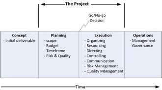

Introduction to Project Management for IAM Projects (v2)
========================================================

By Graham Williamson, Corey Scholefield

© 2021 Corey Scholefield, Graham Williamson, IDPro

*To comment on this article, please visit our [GitHub
repository](https://github.com/IDPros/bok) and [submit an
issue](https://docs.github.com/en/github/managing-your-work-on-github/opening-an-issue-from-code).*

Abstract
========

This article serves as an introduction to the practice of project
management for an IAM project, describing basic project management
terminology and practices. Given the number of systems an IAM project
generally impacts, excellent project management is essential for the
stakeholders involved.

Importance of Project Management
================================

IAM practitioners may be familiar with the scenario of an IAM project
proceeding under the control of an IT systems group without a formal
project manager. While this method of deploying a new product or service
may be considered an expedient way to get a system installed or updated,
it is likely to cost the organization more money in the long term. An
IAM service is connected to many critical systems within an
organization. To make changes to that service without considering the
possible impact on the various connected systems, without managing the
required resources, or without keeping all stakeholders advised of the
effort, will result in a substandard deployment.

Project management does have a cost: it is typically between 5-10% of a
project's total expenditure, but it represents the best return compared
to any other investment an organization is likely to be afforded.

Terminology
-----------

-   Project - a time-limited activity to achieve a defined outcome(s)

-   Project Charter - documented authority for the project manager to
    proceed with a project; it will usually include a succinct statement
    of the project's purpose.

-   Schedule -- a document that defines the activity and resources
    required to achieve the planned deliverable(s) and outcome(s)

-   Gantt Chart - a popular schedule format that displays both activity
    and timeframes in a single chart

-   Project Plan - a document that describes a project; it will usually
    include a scope statement, schedule, resource plan, communications
    plan, and quality plan

-   Task - lowest-level of defined activity; multiple tasks will
    typically be grouped into stages of project phases

-   Agile project management - a framework that uses a continuous,
    iterative process to deliver a defined piece of functionality,
    typically a component of a product or service. Scrum is a popular
    framework.[1]

Readers interested in pursuing information on project management should
review the Project Management Institute (PMI) Framework and the PMI Body
of Knowledge for further information.[2]

Characteristics of a Project Manager
------------------------------------

In the IT sector, a project manager is often seen as having little
authority over staff or project stakeholders. They are expected to bring
a project in on time and within budget with minimal assistance from
upper management and minimal visibility within the organization. In
reality, a project manager needs sufficient authority and resources to
monitor and manage their project adequately. They also need regular
communications with a steering committee consisting of representatives
from upper management.

Two prime characteristics are essential to a project manager:

|                |                                                                                                                                                                                                                                                                                                                                 |
|----------------|---------------------------------------------------------------------------------------------------------------------------------------------------------------------------------------------------------------------------------------------------------------------------------------------------------------------------------|
| Predictability | Management doesn't like surprises. Therefore, a project manager should determine and report on a project's duration and related costs to a defined degree of confidence.                                                                                                                                                        |
| Flexibility    | Gone are the days when a project manager slavishly followed an approved Gantt chart to the detriment of anyone who wants a change. These days, IT projects will typically undergo several baseline changes during execution to accommodate scope changes, dependencies on other projects, and changes in resource availability. |

Project managers require competence in the five components of project
management:

-   Planning

-   Organizing

-   Resourcing

-   Directing

-   Controlling

PMI Framework
=============

By definition, a project must have a start and a finish. “Business as
usual” is never project work and does not require the skills of a
project manager. Before the beginning of a project, there will be some
preparatory work to define the concept. Between the commencement and
completion, there are discrete stages that define the project work. It
is not until after project completion that the deliverable will enter an
operational status and become business as usual.

Figure 1 - The Project Lifecycle

Concept
-------

Projects come out of a need. In the IAM world, examples of such a need
include reducing costs and improving security by using identity
information more effectively for onboarding and offboarding staff or a
need for an enterprise LDAP directory upgrade. Such projects are
typically initiated by an IT resource rather than a business resource,
though a line-of-business resource might also initiate a project (e.g.,
to move an application from an on-premises environment to the cloud to
save capital expenditure budget). The project sponsor will communicate
the requirement, set the project charter, and evaluate the required
activity's cost and duration. The sponsor will typically fund this stage
and then engage a project manager to complete the planning stage.

Planning Stage
--------------

Once approval to proceed has been received, the project manager will
engage with the stakeholders to define the project scope. It is common
for the size and complexity of the project to increase at this point. A
project where the initial scope is to deploy identity management
software to establish AD records and email accounts might see a feature
request for including provisioning into corporate applications.
Alternatively, a stakeholder may try to introduce a request for
additional functionality such as periodic attestation reporting and
re-certification. The project manager must ensure that the appropriate
project stakeholders are engaged to define the full scope of the
project.

The project manager will engage subject matter experts to quantify the
work required and construct the project schedule. The Planning Stage
will develop a Project Plan that will include:

|                      |                                                                                                                                                                                                                                                                                                                                                                                                                                                                                                                                                     |
|----------------------|-----------------------------------------------------------------------------------------------------------------------------------------------------------------------------------------------------------------------------------------------------------------------------------------------------------------------------------------------------------------------------------------------------------------------------------------------------------------------------------------------------------------------------------------------------|
| Schedule             | A schedule is typically expressed via a Gantt chart in classic project management. A high-level Gantt chart is also recommended for Agile project management. The schedule will define the timeframe and resources required for the project to calculate the cost.                                                                                                                                                                                                                                                                                  |
| Stakeholder Analysis | The project manager will construct a list of project stakeholders. This list should include the sponsor, finance manager, human resources (HR) manager, system owners, and representatives from the IT groups that will be engaged in the project.                                                                                                                                                                                                                                                                                                  |
| Resource Plan        | A basic tenet of project management is that the desired resources are never available; they are typically fully engaged in other activities. The project manager must negotiate with the appropriate stakeholders to get the desired resources assignment and alter the project schedule accordingly.                                                                                                                                                                                                                                               |
| Communications Plan  | The project communications plan defines the "who" and the "how" for a project manager to report on project progress. The project team will likely have a file folder, wiki, or SharePoint site for the project. The project manager will regularly email a project report to the Stakeholders and send meeting agendas and status summaries to the steering committee before the project review meetings. The Project Plan should include a Communications Register that logs all communications with the stakeholders and within the project team. |
| Quality Management   | A mechanism to ensure adequate quality in project deliverables should be defined. This mechanism should include management reviews of project documentation and properly constructed test and release procedures.                                                                                                                                                                                                                                                                                                                                   |
| Risk Management      | A project manager constructs a risk register that identifies the anticipated risks, quantifies them in terms of probability and impact, and includes appropriate risk mitigation activities.                                                                                                                                                                                                                                                                                                                                                        |

At the end of the Planning Stage, there should be a good understanding
of the project activities, timeframe, and cost. Typically, the project
cost and duration will be known within a 10% margin.

In terms of time and money, this understanding of project costs allows
the organization to make an informed decision as to whether they want to
dedicate the necessary resources to a project. A decision not to proceed
with a project is just as much a successful outcome for a project
manager as a decision to proceed. It means that the organization has
been spared the expenditure of resources on a project that they might
otherwise have prematurely terminated, resulting in associated sunk
costs.

Deployment Stage
----------------

The project deployment will vary depending upon the project management
mechanism to be used.

### Classic 

In classic project management, the project manager will manage all
project activities according to a detailed schedule that shows all the
individual tasks, assigned resources, and duration. The project team
will regularly hold meetings to review progress and discuss any issues
that the project manager may need to escalate to the steering committee.

The components of a classically managed project are:

|                        |                                                                                                                                                                                                                                                                                                                                                                |
|------------------------|----------------------------------------------------------------------------------------------------------------------------------------------------------------------------------------------------------------------------------------------------------------------------------------------------------------------------------------------------------------|
| Team meetings          | The project team should hold regular progress-review meetings (weekly or bi-weekly). These meetings allow everyone to mark progress against the Gantt chart and determine what issues, if any, must be escalated to the steering committee.                                                                                                                    |
| Steering committee     | The project manager will periodically present to the steering committee to review progress to the project schedule and act on any issues that the team has identified. The project status report should include the progress made since the last meeting, any issues to be resolved by the steering committee, and the planned activities for the next period. |
| Phase transitions      | The project schedule (Gantt chart) will show the phases that comprise the project. At the end of each phase, the steering committee will review the deliverables for that phase and determine whether a phase transition can be approved.                                                                                                                      |
| Deliverable acceptance | Each project deliverable should be formally accepted. This acceptance will typically involve the appropriate stakeholder(s) who must agree that the deliverable has been produced to an adequate quality level.                                                                                                                                                |
| Project closure        | A project should always include a proper project closure procedure. This procedure will typically involve a formal project review that will document the activities that went well and any learnings from the project. "Those who don't learn from history are doomed to repeat it."                                                                           |

### Agile

Many organizations have now adopted Agile project management for the
execution phase of their projects. Agile-run projects make it easier for
changes to be made in the way a project proceeds and avoids delays that
can occur in "classically" managed projects when issue resolution is
held up awaiting a steering committee meeting. Agile projects divide a
project up into short tasks reviewed every few days in "stand-up"
meetings.

|                        |                                                                                                                                                                                                                                                                                                                                                                                                                                                                                          |
|------------------------|------------------------------------------------------------------------------------------------------------------------------------------------------------------------------------------------------------------------------------------------------------------------------------------------------------------------------------------------------------------------------------------------------------------------------------------------------------------------------------------|
| Project wall           | The essence of Agile project management is visibility. The Project Wall provides a physical or virtual place where the project team can view the completed, current, and waiting tasks and resource assignments.                                                                                                                                                                                                                                                                         |
| Sprints & Scrum        | These terms are used differently depending upon the context. Scrum is a framework that uses an iterative process to deliver a defined piece of functionality. It could be a product, service, or a new piece of functionality for an existing product (e.g., deploy a DBMS connector to the IAM environment). A sprint usually describes a scrum component, a time-limited activity that contributes to a scrum deliverable (e.g., 30 days for the development of the reporting module). |
| Deliverable acceptance | One area that can suffer when using an Agile project management approach is reviewing and accepting deliverables. A sprint team sometimes advises on completing a piece of work and moves to the next without formal acceptance of the deliverable. A mechanism to record acceptance of a module or deliverable is needed. Acceptance testing will verify that the requirements established for a viable product have been achieved and are demonstrable.                                |
| Project closure        | In a classically managed project, a team meeting can be dedicated to the requisite project review. In an Agile project, in which many participants have contributed to the outcome, it is sometimes difficult to manage the project closure. A mechanism is required for all participants to agree that a project has been completed and ensure the resources used can be reassigned.                                                                                                    |

PMO Issues
==========

In organizations with a Project Management Office (PMO), an IAM project
must follow the corporate procedures. Typically, a PMO will have defined
gating factors, or ‘gates,’ through which all projects must pass. For
instance, there will normally be a project approval gate in which the
appropriate managers will review the project plan and indicate their
approval. There will usually be a gate in the form of a budget review to
approve the assignment of resources. Similarly, there might be a gate in
the form of an architecture review to approve the solution architecture.
Finally, there should be a review of the governance outcomes as a
necessary gate to the project. The PMO should orchestrate all these
activities.

One of the benefits of a PMO is the visibility it gives to projects
within an organization. This visibility is beneficial to the IAM team;
it allows them to ensure any projects with an identity component are
properly identified and accommodated in the appropriate work program.
For instance, if an authentication gateway is being installed, any
application undergoing development should be modified to use the gateway
rather than maintaining LDAP lookups. Without a PMO, it is sometimes
difficult for the IAM team to impact projects.

A PMO provides the opportunity to educate project managers on identity
issues and to insert IAM requirements into IT projects within an
organization. A project manager will use the PMO framework to:

1.  manage the project through the project gates;

2.  communicate the project's progress to the organization's management;

3.  gain acceptance within the organization that the project goals were
    completed within the approved budget and schedule.

IAM Projects
============

It’s often said that a good project manager can keep a project on track
regardless of the topic. While this may be true, if a project manager
for an IAM project is not competent in the subject, they will be
disadvantaged. It is recommended that they engage a project lead who is
familiar with the components of an IAM environment and understands the
skills-base within the organization.

Example Project
---------------

Let’s assume the project is to replace the existing IAM processes used
to onboard a new staff member or contractor with a new system purchased
from an IAM solution vendor. The sections below work through the
different project stages for such a project.

Planning
--------

The single most important element to define for an IAM project is the
project scope. The IAM environment touches so many operational
components and processes within an organization; the PMs role means they
must clearly communicate to all stakeholders the full scope of the
project. To properly determine the scope of an IAM project requires a PM
an understand the nature of the IAM solution and its impact on other
systems in the organization. The
[Addendum](#addendum-questions-for-an-iam-project-manager-to-ask)
suggests some questions that should be asked in the planning phase of an
IAM project.

The PM is responsible for making certain the scope of the project is
clear. Too many IAM projects proceed with misunderstandings regarding
the project scope. The IAM project lead, for example, might think the
project is to implement a provisioning module, whereas the application
owner might think the goal is to provide better authentication
functionality. The auditor, in turn, might want improved governance.
Reaching a common agreement on the scope will focus all stakeholders on
the extent of the project.

The following items are often inside the scope of a project of this
nature: configuring and deploying the IAM tool, integrating with the
email system, integrating with the system(s) that provide enterprise
resource planning (ERP) functions (i.e., the computer systems that
support the organization's operations). The HR system and the financial
management system, however, are out of scope for this example project.
While tight integration with HR could improve both systems—the HR system
potentially able to increase its span-of-control and the IAM system
benefitting from tight integration with HR for better provisioning of
staff entitlements (e.g., training status, project membership, and
employment status of staff)—the HR department is often reticent to make
any changes to their onboarding and offboarding procedures.

The Finance department also has challenges that discourage them from
agreeing to anything that will impact their systems. They typically
maintain a fine-grained authentication capability within the financial
management system and often distrust any external entity’s capability to
do this. Externalizing access control to the IAM system will typically
be less expensive and improve security but working with Finance will
require its own focused effort.

In scope will be the applications that will rely on the IAM system. The
PM must communicate with the system owners of each of these systems and
determine what data attributes are required for users accessing each
system. For example, the email system will need to know a user’s first
and last names and, likely, middle initial, to construct their digital
identifier correctly. It might also need to know their department or
group memberships. Ideally, email systems should participate in a
company’s single-sign-on (SSO) solution (i.e., users will be
authenticated as part of the SSO solution used in the organization).

The computer applications that provide operational functionality to
users should also use the organization’s SSO solution. In the real
world, such applications might include a production machine, a process
control system, an asset control system, a learning management system, a
health monitoring facility, a vehicle registration, and so on. Any
computer system that must be protected via an access control mechanism
that ensures appropriate users only get access to the facilities to
which they are entitled should be tied into the organization’s SSO
solution. The project manager must ensure the requirements for these
applications are canvassed at the commencement of an IAM project.

Organizing
----------

The success of an IAM project depends upon how well it is organized.
This dependency relates to how well the PM utilizes the hierarchy within
the organization. All too often, the execution of an IAM project is left
to the people in the IAM unit within the company. This is poor practice
because the IAM unit has an operational role in maintaining the IAM
environment; an IAM project, however, is a time-limited initiative that
will stretch the ability of the IAM unit and divert resources from their
task of managing the IAM environment. While personnel with IAM
experience should be involved in the deployment project, if they are
seconded from the IAM unit, they should be backfilled with other
personnel while they are engaged on the IAM project.

The following activities are recommended for the successful ‘organizing’
of an IAM project:

-   Establish a steering committee – this should include the project
    sponsor, appropriately high-level personnel in the IT department,
    HR, Finance, Manufacturing, Sales & Marketing, and any other
    business unit directly impacted by the project. A steering committee
    will periodically review the project’s progress and respond to any
    issues raised by the PM.

-   Hold appropriate committee reviews – the PM must be aware of all
    gating factors and committees that can affect the project’s
    progress. These will include the PMO’s gating (phase exit) meetings,
    governance reviews to ensure audit compliance, enterprise
    architecture committees ensuring that IAM systems comply with
    supported technology platforms, and finance reviews ensuring budget
    support for the project.

-   Document a communications register – this should list to whom and
    via what mechanism the PMO will send their project progress reports.
    It should include the frequency (e.g., bi-weekly), the mechanism
    (e.g., email, website, or other notification tools), and the media
    (e.g., Word document, MS Project file, etc.).

-   Verify the support of a Quality Assurance (QA) program – responsible
    for the quality of project deliverables (such as the documents,
    milestones, or other deliverables). This program is particularly
    important to establish the accuracy (both in format and in content)
    of the data files that support the test plan. Identity data should
    be suitably anonymized for test purposes and must be restorable for
    regression testing.

-   Create a risk register - A risk register should be compiled by the
    project team that identifies the risks to the project’s ability to
    meet its schedule, cost, and quality constraints. Each risk should
    be assessed for probability and impact. An IAM project should not
    proceed with any risk evaluated as ‘high.’

Resourcing
----------

It’s a project management maxim that the preferred resources are never
available. Good staff are very busy and cannot be easily seconded to a
project. In an IAM project, it is essential that personnel with detailed
knowledge of the company’s identity management systems and policies be
involved. The PM must be able to negotiate the availability of critical
personnel and modify the project schedule accordingly.

As noted above, the project’s budget must accommodate backfilling
personnel seconded to the project. If it is necessary to ’buy-in’
resources, the steering committee will typically decide on the final
resourcing plan and may choose to use contractors for the maintenance
activity and assign experienced IAM staff to the IAM deployment project.

A perennial problem for an IAM project is how to build IAM staff
competence in a new IAM tool being acquired. The options include:

-   Send selected staff from the IAM unit for training prior to the
    deployment activities

It is unrealistic to expect, even experienced, IAM staff to develop
competence in the new package without hands-on experience.

-   Engage the vendor to do the deployment with IAM staff observing.

This is the most realistic option because it puts some onus on the
vendor to ‘make it work’ and ensure technology transfer to the IAM
staff.

-   Engage the vendor for a turn-key project with the IAM unit engaged
    to undertake acceptance testing on the transition to operational
    status.

This is not ideal since, without the active involvement of the IAM team,
the likelihood of successful integration of the IAM solution into the
organization’s operations will be difficult.

Since the PM of an IAM project typically has no functional authority
within the organization, they must use the steering committee to get the
right resources assigned to the project at the right time.

Directing
---------

The Directing element of an IAM project will vary greatly depending on
whether a classical or an Agile project management methodology is being
followed.

### Classic 

The Gannt chart becomes the main tool for directing the project. The PM
will ensure tasks are commenced on time and progress to plan. This will
be achieved via a review of the schedule in periodic team meetings,
typically held on a weekly basis. Team members will report on the
progress to plan for each task to which they are assigned. For tasks
behind schedule or expecting to encounter problems, the PM will attempt
to put a contingency in place. If a slip occurs, the PM must go back to
the steering committee with a recommended strategy and seek approval or
additional direction (for example, direction to accept the slip and
modify the Gantt chart or direction to invest the resources necessary to
restore the original schedule).

### Agile

The PM will establish regular ‘stand-up’ meetings, typically several
times a week, at which each ‘sprint’ is reviewed and moved on the
Project Wall from ‘waiting’ to ‘current’ to ‘completed.’ Each scheduled
task will be discussed and any impediments to completing a ‘sprint’ will
be noted by the PM and addressed with appropriate management. For
instance, transition to production might have to occur during
non-business hours, and coordination with HR may be required to ensure
the IAM data file is current.

The PM will raise unresolved issues at the next steering committee.

Controlling
-----------

Probably the PM function that is most often performed badly in IAM
projects is control.

Control is a function of project management that provides feedback to
the PM regarding the likelihood that the project will meet its schedule
and budget constraints. PMs will typically think that if they have
planned well, have organized the communication and quality assurance,
have adequately resourced their project, and are directing the project
tasks, nothing else is required. But the stories are legion that IAM
projects have overrun because they impact so many functions within an
organization. Managing this impact is where control comes in. Given that
you cannot manage something if you cannot measure it, monitoring
progress to plan is at the core of the control function. A
tried-and-true tool in the PMs toolkit is Earned Value Analysis (EVA).
EVA involves calculating the budgeted cost of work scheduled, the
budgeted cost of work performed, and the actual cost of work performed.
These calculations will compare the percent completion against budget
spent and quickly identify a project that is experiencing overspend or
over-budget issues.

Another tool to use to calculate the project’s performance indices is
the use of quick ratios to gauge the probability of an on-time and
in-budget project completion.

A third useful tool is the S curve that tracks the resource burn rate to
ensure the project expenditure reduces appropriately, particularly at
the end of a project. This careful management of the resource burn rate
is important for IAM projects since there are always additional tasks,
such as system documentation, that are often not properly accommodated
in the project schedule at project inception. These should not be added
to the scope of the project. Instead, they should preferably be
completed as part of standard operations (i.e., outside the project).

Conclusion
==========

Project management methodology should be applied to all IAM projects,
even small ones. Project management ensures that a structured process is
applied to the activity and that the impact of the activity on affected
business units will be considered and, if necessary, included in the
planning. Failure to manage an IAM activity as a project will raise the
likelihood of mistakes being made and additional costs being
incurred.[3]

Author Bios
===========

Graham Williamson

Graham
Williamson is an IAM consultant working with commercial and government
organizations for over 20 years with expertise in identity management
and access control, enterprise architecture and services-oriented
architecture, electronic commerce and public key infrastructure, as well
as ICT strategy development and project management. Graham has
undertaken major projects for commercial organizations such as Cathay
Pacific in Hong Kong and Sensis in Melbourne, academic institutions in
Australia such as Monash University and Griffith University, and
government agencies such as Queensland Government CIO’s office and the
Northern Territory Government in Australia and the Ministry of Home
Affairs in Singapore.

Corey Scholefield

Corey is
currently a Sr. Technical Product Manager with Workday, supporting
operations engineering service delivery for Workday's cloud-ERP
suite. Corey has a background in public-sector identity-management,
having spent over 15 years working in higher-education, with positions
at both University of Victoria and BCNET in British Columbia, Canada.

At BCNET, Corey led a federated-identity service bureau which supported
regional adoption of eduroam and SAML capabilities under the umbrella of
the Canadian Access Federation. At the University of Victoria, Corey's
team established an identity-management program that supported
campus-wide access-management needs. Corey has deployed many IDAM
technologies including OpenLDAP, CAS SSO, Sun IDM, Shibboleth IDP, and
SailPoint IdentityIQ.

Change Log
==========

| Date       | Change                                                           |
|------------|------------------------------------------------------------------|
| 2021-06-21 | Editorial updates; substantive revisions to IAM Projects section |

Addendum: Questions for an IAM Project Manager to ask
=====================================================

Identity Management
-------------------

-   How are user accounts created when a new staff member joins the
    organization? Are employees and contract staff provisioned
    differently?

-   How are user attributes collected/determined?

-   What is the business process surrounding end-users being granted
    entitlements to access given applications? Is user self-service
    supported? Is there an approval workflow to gather authorization for
    establishing user entitlements?

-   Is there a different process for privileged accounts (e.g., accounts
    with admin privileges)?

-   What repositories of identity information exist in the organization
    (e.g., LDAP directories, Databases, Active Directory), and what
    interfaces to the identity management environment are needed (e.g.,
    SCIM import, REST API, Webservices Gateway; CSV import)?

-   What is the business process for disabling an account and eventually
    deleting it?

Access Control
--------------

-   What authentication mechanisms are supported (e.g., local
    application database, corporate LDAP directory, Active Directory,
    RADIUS)?

-   Are multiple assurance levels supported (e.g., assurance elevation
    for sensitive resources)?

-   Is MFA supported (e.g., U2F, DUO, push authenticators)?

-   Is SSO supported? Is it only for web apps, or are other applications
    supported as well?

-   How are SaaS apps supported (e.g., periodic synchronization of
    identity data, SAML)?

-   How are user entitlements within an application managed (e.g.,
    internally within the app, via an attribute passed in an HTTP header
    message, SAML assertion, AD group membership)?

-   How are application administrator rights managed (e.g., manually,
    via approval workflow)?

Governance
----------

-   What governance processes (e.g., re-certification/attestation
    reporting) are required? What audit processes must be supported?

-   What governance interfaces are required to collect user account
    information from corporate applications (e.g., REST API, SCIM,
    Webservice gateway, service-bus messaging, CSV export)?

[1] Scrum Alliance, “Your Quick Guide to All Things Scrum,” accessed 29
June 2021, <https://www.scrumalliance.org/about-scrum/overview>.

[2] Project Management Institute website, <https://www.pmi.org/>,
accessed 29 June 2021.

[3] Project Management Institute, "PMBOK® Guide and Standards - Practice
Standards & Framework," accessed 29 June
2021, <u><https://www.pmi.org/pmbok-guide-standards/framework>.</u>
